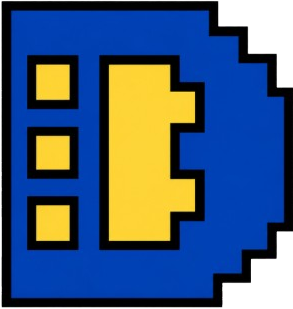

<p align="center">

</p>

<h1 align="center">DBYTE</h1>

<p align="center">
<b>A byte-level programming language, personal userland, and bare-metal kernel laboratory.</b>
</p>

<p align="center">
<b>[ <a href="https://dbytelang.site">Official Site</a> ]</b>
<b>[ <a href="https://dbytelang.site/docs/">Docs</a> ]</b>
<b>[ <a href="benchmarks/BENCHMARKS.md#perf-pass-11-zero-cost-inlining-argument-remapping">Benchmarks</a> ]</b>
<b>[ <a href="docs/DBYTEOS_KERNEL.md">Kernel Notes</a> ]</b>
<b>[ <a href="https://discord.gg/hWuwUbrujb">Discord</a> ]</b>
</p>

<p align="center">
<a href="https://github.com/Deadbytes101/DBYTE/releases/ISO">

</a>
<a href="https://github.com/Deadbytes101/DBYTE/blob/main/LICENSE">

</a>
</p>

> [!IMPORTANT]
> This repository is a public working snapshot. DBYTE is still moving fast, and the public source surface is not the final stable release surface.

> [!CAUTION]
> DByteOS and the Kernel Lab are experimental. Run VM and kernel builds in an isolated environment.

## What DBYTE Is

DBYTE is a compact systems-oriented project built around a custom language named **DByte**. The language is designed for binary work, low-level automation, typed integer processing, byte search, buffer patching, and tooling that should stay direct and predictable.

The repo currently contains three connected layers:

- **DByte language toolchain**: lexer, parser, type checker, tree interpreter, bytecode compiler, bytecode VM, project loader, test runner, shell, REPL, and embedding API.
- **DByteOS userland**: host-runnable `.dby` programs under `examples/dbyteos/` that model a personal operating environment, shell commands, config, diagnostics, security checks, workspace flows, and system tools.
- **DByteOS Kernel Lab**: a separate freestanding x86 Rust kernel sandbox under `kernel-lab/` for QEMU boot experiments, VGA output, serial logs, IDT and IRQ research, exception surfaces, PIC planning, and controlled runtime probes.

DBYTE is not trying to be a web framework or a general productivity language. It is built for inspecting bytes, moving data, testing low-level ideas, and turning rough system experiments into executable tools.

## Current Snapshot

- Snapshot version: **v10.62.1**
- Default branch: **main**
- Repository visibility: **public**
- License: **MIT**
- GitHub language policy: `.dby` files request the `DBYTE` language label through `.gitattributes`; non-DBYTE implementation and benchmark files are excluded from language statistics.

Tracked line counts are measured from `git ls-files`, so ignored build output, release zips, bundles, VM logs, and `target/` directories are excluded:

- Kernel Rust source: **15,530 lines** across `kernel-lab/src/*.rs`.
- Full Kernel Lab tracked files: **15,642 lines** across kernel sources, linker script, scripts, manifest, and lab README.
- Main tracked source and docs set: **63,301 lines** across **475 files** matching `*.rs`, `*.dby`, `*.toml`, `*.md`, `*.ps1`, and `*.ld`.
- Total tracked files in the repository: **795**.

## Language Stack

| Layer | Path | Purpose |
| --- | --- | --- |
| AST | `crates/dbyte_ast` | Shared syntax and typed node structures |
| Lexer and parser | `crates/dbyte_lexer`, `crates/dbyte_parser` | Source tokenization and grammar parsing |
| Type checker | `crates/dbyte_typeck` | Static checks for DByte programs |
| Tree runtime | `crates/dbyte_interp` | Direct interpreter runtime |
| Bytecode path | `crates/dbyte_bytecode`, `crates/dbyte_compiler`, `crates/dbyte_vm` | Compilation and VM execution |
| Modules and projects | `crates/dbyte_module`, `crates/dbyte_project` | Imports, packages, `Dbyte.toml` workflows |
| CLI | `crates/dbyte_cli` | `dbyte run`, `dbyte test`, REPL, shell, tools |
| Embedding | `crates/dbyte_embed` | Rust host integration |
| Kernel bridge | `crates/dbyte_kernel_vm` | Shared kernel VM probe support |

## What It Can Do

- Parse and run DByte scripts with Python-like block syntax.
- Work with typed integers, bytes, buffers, and binary-oriented standard modules.
- Patch buffers, search byte sequences, inspect binary files, and save modified outputs.
- Run DByte projects with `Dbyte.toml`.
- Execute tests with `dbyte test`.
- Launch a DByte REPL or shell.
- Embed DByte in Rust applications.
- Boot the Kernel Lab in QEMU for controlled freestanding kernel experiments.

## Quick Commands

```powershell
cargo check
cargo run -p dbyte_cli -- --version
cargo run -p dbyte_cli -- run examples/hello.dby
cargo run -p dbyte_cli -- test
```

Launch the DByte shell with the DByteOS userland profile:

```powershell
cargo run -p dbyte_cli -- shell --rc examples/dbyteos/.dbyterc
```

Build the Kernel Lab:

```powershell
cd kernel-lab
powershell -ExecutionPolicy Bypass -File .\scripts\build.ps1
```

Run the Kernel Lab in QEMU when QEMU is installed:

```powershell
cd kernel-lab
powershell -ExecutionPolicy Bypass -File .\scripts\run.ps1
```

## Binary Patch Example

```dbyte
import std.buffer as buf

let image: buffer = buf.load("firmware.bin")
let offset: int = buf.find(image, b"\xDE\xAD\xBE\xEF")

if offset >= 0:
    buf.replace(image, offset, b"\x90\x90\x90\x90")
    buf.save("firmware.patched.bin", image)
```

## Kernel Lab Status

The Kernel Lab is intentionally separate from the host-runnable DByteOS userland. It is a freestanding x86 research sandbox, not a production kernel.

Current kernel research areas include:

- Multiboot-compatible boot path.
- VGA text and graphics output.
- Serial logging.
- IDT and exception handling foundations.
- Page fault smoke surfaces.
- PIC and IRQ planning.
- Controlled IRQ0 and IRQ1 runtime experiments.
- Kernel-side DByte VM probe integration.

The guardrail is deliberate: hardware mutation paths stay controlled, documented, and testable.

## Repository Hygiene

Ignored local artifacts include:

- `target/`
- `kernel-lab/target/`
- release bundles and zip packages
- unpacked release directories
- scratch binaries
- temporary VM logs
- `test_release_v*/`

This keeps the repository focused on source, docs, scripts, and reproducible project state.

## Project Warning

DBYTE is alpha software. Interfaces can change. Kernel Lab behavior can break. Use a VM for OS experiments and keep real data away from unsafe test runs.

## Repository

- Repository: [Deadbytes101/DBYTE](https://github.com/Deadbytes101/DBYTE)
- Site: [dbytelang.site](https://dbytelang.site)
- Docs: [dbytelang.site/docs](https://dbytelang.site/docs/)
- Discord: [Join Community](https://discord.gg/hWuwUbrujb)

MIT licensed. See [LICENSE](LICENSE).
