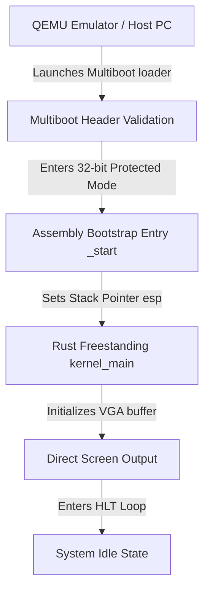

# DByteOS Kernel Direction & Architecture (v7.9.0)

> [!WARNING]
> **DByteOS Kernel Lab is a Bare-Metal Experiment.**
> It is not a bootable full OS nor a real production kernel. It is a freestanding sandbox prototype containing no memory allocator, process scheduler, interrupt controllers, or standard driver sets.

This document describes the architectural direction and research roadmap for the **DByteOS Kernel Lab**. It establishes a clear boundary between the production-grade host-runnable personal environment (DByteOS Userland) and the bare-metal kernel prototype experiments (Kernel Lab).

## Core Philosophy
1. **Pragmatic Sandboxing**: The kernel is designed as a standalone bootable laboratory environment. It is NOT integrated into the main `dbyteos` command shell runtime.
2. **Pedagogical Prototype**: We make zero claims of bare-metal production readiness. The Kernel Lab is a bootstrap system designed to run in virtualized environments like QEMU.
3. **No Bootloader Bloat**: We utilize the standard Multiboot specification, allowing modern virtualization engines (QEMU, VirtualBox) to boot the ELF kernel binary directly.

## Boot Pipeline

### Memory Layout
- **`0x00000000 - 0x000FFFFF`**: Real Mode IVT, BIOS Data Area, and VGA Framebuffer (`0x000B8000`).
- **`0x00100000` (1MB)**: Kernel entry point (`_start`) and `.multiboot_header`.
- **`0x00101000 - ...`**: Read-only segments (`.text`, `.rodata`).
- **`0x... - 0x00500000`**: Read-write segments (`.data`, `.bss`) and the 16 KiB execution stack.
