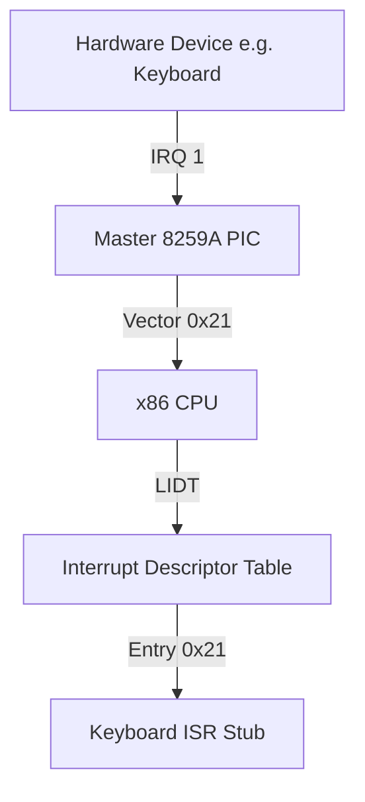

# DByteOS Kernel Interrupt Architecture Foundation (v9.0.0)

This document details the layout, data structures, and cascade configuration for standard **x86 Interrupt Handling** under freestanding and zero-allocation constraints.

---

## 1. Architectural Overview

In a protected-mode x86 operating system kernel, handling processor exceptions and hardware interrupts requires configuring two central components:
1. **Interrupt Descriptor Table (IDT)**: A table of up to 256 gate descriptors loaded via the `LIDT` instruction.
2. **Programmable Interrupt Controller (8259A PIC)**: A pair of cascaded chips mapping external hardware lines (IRQs) to CPU interrupt vectors.



---

## 2. The Interrupt Descriptor Table (IDT)

The IDT tells the CPU where to jump when an exception or hardware interrupt occurs. In standard 32-bit x86, the table contains **Gate Descriptors** packed tightly inside a `[IdtEntry; 256]` array.

### Gate Descriptor Structure (`IdtEntry` - 8 Bytes)
Each descriptor is defined as follows:

| Offset | Size | Name | Description |
| :--- | :--- | :--- | :--- |
| `0..1` | 2 Bytes | `offset_low` | Low 16 bits of the ISR entry point address. |
| `2..3` | 2 Bytes | `selector` | GDT Code Segment Selector (typically `0x08`). |
| `4` | 1 Byte | `zero` | Reserved, must always be `0`. |
| `5` | 1 Byte | `type_attr` | Type and attributes (Present, DPL, Gate Type). |
| `6..7` | 2 Bytes | `offset_high` | High 16 bits of the ISR entry point address. |

### The IDT Pointer (`IdtPtr` - 6 Bytes Layout)
To notify the CPU of the IDT location, the standard `lidt` assembly instruction accepts a pointer to a packed 6-byte register layout block in memory:
- **`limit`** (Offset `0..1`, 2 Bytes): Size of the IDT table in bytes minus 1 (typically `(256 * 8) - 1` = `0x7FF` bytes).
- **`base`** (Offset `2..5`, 4 Bytes): Linear 32-bit base address pointing directly to the contiguous `[IdtEntry; 256]` table array in memory.

During execution, loading this pointer register structure into the processor's IDTR register configures the memory address bounds for CPU exception vectors.

### Exception Handler Status Table
The following table summarizes the currently registered (active) and planned CPU exception vectors in the IDT:

| Vector | Type | Name | Status | Description |
| :--- | :--- | :--- | :--- | :--- |
| `0` | Fault / Trap | Divide-by-Zero | **Active** | Controlled via `int 0` trap for shell diagnostics. |
| `3` | Trap | Breakpoint | **Active** | Standard software breakpoint via `int3`. |
| `14` | Fault | Page Fault | **Active Smoke** | Controlled real fault via `pf-smoke` with CR2 and error-code diagnostics. |

### Breakpoint Exception Behavior (`int3` Trap - Vector 3)
When the CPU executes the one-byte `int3` instruction (`0xCC`), the following hardware sequence is performed:
1. **Execution Suspension**: CPU suspends current instruction pipeline execution.
2. **Hardware Stack Push**: The CPU pushes the EFLAGS register, GDT Code Segment Selector (`CS`), and the return instruction pointer (`EIP`) pointing to the instruction *immediately following* `int3` onto the kernel stack. Note that the Breakpoint exception does *not* push an error code.
3. **Descriptor Gate Jump**: CPU looks up entry 3 in the IDT, verifies the present bits, jumps privilege levels if necessary (remains Ring 0), and transfers execution control to `breakpoint_handler_asm`.
4. **General Registers Preservation**: Our assembly stub wrapper executes `pushad` to push all 8 general-purpose registers (32 bytes) onto the stack: `EAX`, `ECX`, `EDX`, `EBX`, `ESP`, `EBP`, `ESI`, and `EDI`.
5. **Rust Dispatch**: Calls `breakpoint_handler_rust` which outputs high-level text logs safely to both VGA and Serial console channels.
6. **State Restoration & Return**: Executes `popad` to restore register values, and executes `iretd` to pop the saved `EIP`, `CS`, and `EFLAGS` off the stack, resuming user shell execution seamlessly without triple faulting.

### Divide-by-Zero Exception Behavior (Vector 0)
When a division error occurs, the processor normally triggers a **Fault** (Vector 0). In a real fault condition, the return `EIP` pushed onto the stack points to the *offending division instruction*.
- **The Infinite Loop Gotcha**: If a handler simply executes `iretd` without modifying the pushed stack pointer, the CPU will jump back to the exact same division instruction and trigger the fault again, leading to an infinite exception loop or a Triple Fault.
- **Trap-Style Controlled Trigger (`int 0`)**: To avoid this risk in our diagnostics lab while validating Vector 0 registration, the `div0` shell command triggers Vector 0 via a software trap (`int 0`). Under software interrupt rules, the CPU pushes the `EIP` pointing to the *next instruction* after `int 0`. This enables safe trap-style execution flow, incrementing exception telemetry stats, printing diagnostic status, and returning back to the interactive polling shell loop flawlessly.

### Page Fault Handler Smoke (Vector 14)
Page Fault handling is **active smoke** in `v9.0.0`. The `pf-smoke` command triggers a controlled real Page Fault through a null read probe, reads `CR2`, decodes the CPU-pushed error code as a raw value, and returns to the shell through a recovery trampoline.

#### Exact Runtime Execution Flow
When the user types the `pf-smoke` command:
1. **State Arming**: The kernel sets `interrupts::PF_SMOKE_ACTIVE = true` and records the entry address of `pf_smoke_recovery_asm` into `interrupts::PF_SMOKE_RECOVERY_EIP`.
2. **Controlled Probe**: The kernel calls `pf_smoke_probe_asm()`, which performs a raw pointer dereference of address `0x00000000`:
   ```asm
   mov eax, 0
   mov eax, [eax]  ; triggers a real Page Fault!
   ret
   ```
3. **MMU Fault & CPU Stack Frame**: The Memory Management Unit (MMU) detects a non-present page translation at address `0x0`, interrupts instruction execution, and pushes the x86 Exception Frame onto the kernel stack:
   - `EFLAGS`
   - `CS` (Code Segment)
   - `EIP` (faulting instruction pointer, pointing directly to the `mov eax, [eax]` probe instruction)
   - **Error Code** (32-bit CPU-pushed fault description)
4. **Assembly Wrapper Entry**: The CPU transfers control to `page_fault_handler_asm` via IDT entry 14. Our wrapper pushes all general-purpose registers via `pushad`.
5. **Rust Dispatching & EIP Rewriting**:
   - The wrapper extracts the error code (`[esp + 32]`) and the address of the saved `EIP` slot on the stack (`[esp + 36]`).
   - It invokes `page_fault_handler_rust(error_code, saved_eip, saved_eip_slot)`.
   - The Rust handler reads `CR2` using inline assembly (`mov {}, cr2`), capturing `0x00000000`.
   - It prints full telemetry logs to VGA and Serial console.
   - Finding `PF_SMOKE_ACTIVE` armed, the handler rewrites the stack value at `saved_eip_slot` with `PF_SMOKE_RECOVERY_EIP` (the recovery trampoline address) and clears `PF_SMOKE_ACTIVE`.
6. **Frame Discard & Trampoline Jump**:
   - The Rust handler returns, and `page_fault_handler_asm` restores general registers via `popad`.
   - The assembly stub executes `add esp, 4` to discard the CPU-pushed error code from the stack frame.
   - It executes `iretd` to return to the caller.
   - Because we rewrote the saved `EIP` on the stack to point to `pf_smoke_recovery_asm`, `iretd` jumps there instead of jumping back to the faulting `mov eax, [eax]` instruction.
   - `pf_smoke_recovery_asm` simply executes `ret`, taking us cleanly back to the dispatch shell loop!

### Page Fault Frame Layout Foundation
For a same-ring Page Fault frame, the planned documentation struct is:

| Field | Source | Meaning |
| :--- | :--- | :--- |
| `error_code` | CPU stack push | Page Fault reason bits. |
| `eip` | CPU stack push | Faulting instruction pointer. |
| `cs` | CPU stack push | Saved code-segment selector. |
| `eflags` | CPU stack push | Saved flags register. |
| `cr2` | Handler snapshot | Faulting linear address from the CR2 register. |

The kernel records this shape in `PageFaultFrame`; the smoke handler consumes the CPU-pushed error code and captures `CR2` at runtime.

After `pushad`, the Page Fault wrapper treats `[esp + 32]` as the CPU-pushed error code and `[esp + 36]` as the saved EIP slot. It calls Rust diagnostics, restores registers, executes `add esp, 4` to discard the error code, and then uses `iretd` to return through the corrected frame.

### Page Fault Error Code Bits & CR2 Decoding
On x86, a real Page Fault pushes an error code that describes why address translation failed. The error code contains flags indicating whether the page was present, whether the access was a write, whether the access came from user mode, whether a reserved bit was set, or whether the fault was an instruction fetch:

| Bit | Name | Meaning |
| :--- | :--- | :--- |
| `0` | `P` | Present/protection violation when set; non-present page when clear. |
| `1` | `W/R` | Write access when set; read access when clear. |
| `2` | `U/S` | User-mode access when set; supervisor access when clear. |
| `3` | `RSVD` | Reserved page-table bit violation. |
| `4` | `I/D` | Instruction fetch violation. |

#### CR2 & Error Code Decoding under `pf-smoke`
- **`CR2` (Control Register 2)**: Contains the exact linear memory address that triggered the page fault. For our controlled probe, `CR2` decodes to `0x00000000` (NULL).
- **Error Code Fields**:
  - `P` (Bit 0) is `0`: The page at `0x00000000` is non-present in the page tables.
  - `W/R` (Bit 1) is `0`: The operation was a memory read.
  - `U/S` (Bit 2) is `0`: The fault originated from supervisor mode (Ring 0).
  - `RSVD` (Bit 3) is `0`: No reserved write bit violation occurred.
  - `I/D` (Bit 4) is `0`: The fault was not an instruction fetch violation.
  - Therefore, the raw error code pushed by the CPU is `0x00000000`.

Exact bit set tracked for v9.0.0: `P / W/R / U/S / RSVD / I/D`.

CR2 = faulting linear address. The faulting linear address is reported through the `CR2` register.

In this milestone, `CR2` is available after `pf-smoke` because vector 14 is registered for a controlled handler smoke path. Page Fault is not a general recovery subsystem yet; unexpected illegal memory access outside the smoke probe can still reset the VM through Double/Triple Fault behavior.

---

## 3. The Programmable Interrupt Controller (8259A PIC)

The 8259A Programmable Interrupt Controller manages external hardware interrupts (IRQs) and redirects them to the CPU.

### Ports and Remapping
By default, the IBM PC maps Master PIC interrupts (IRQs 0-7) to CPU vectors `0x08-0x0F`. However, this conflicts with processor exceptions (such as Double Fault at `0x08`). To prevent collisions, the PIC must be remapped to clear vectors `0x20` and higher:

- **Master PIC**: Command port `0x20` / Data port `0x21`. Remapped vector offset: `0x20` (CPU vectors `32-39`).
- **Slave PIC**: Command port `0xA0` / Data port `0xA1`. Remapped vector offset: `0x28` (CPU vectors `40-47`).

### Initialization Cascade (ICW)
Remapping requires sending 4 Initialization Command Words (ICW) to the command and data ports in a strict sequence:
1. **ICW1 (`0x11`)**: Start initialization.
2. **ICW2**: Base interrupt vectors (Master: `0x20`, Slave: `0x28`).
3. **ICW3**: Cascade line setup (Master cascade: `0x04`, Slave identity: `0x02`).
4. **ICW4 (`0x01`)**: Enable 8086 microprocessor mode.

---

## 4. Architectural Glossary

To ensure precise terminology and strict alignment across the DByteOS system, the following standard glossary is defined:

- **IDT (Interrupt Descriptor Table)**: An architecture-defined array of 256 gate descriptors representing handler hooks for CPU exceptions and external IRQs.
- **ISR (Interrupt Service Routine)**: A specialized, freestanding low-level handler routine triggered immediately by the CPU upon encountering an interrupt vector.
- **IRQ (Interrupt Request)**: An physical hardware line (numbered 0 to 15 on dual 8259A PICs) signaling external hardware requests to the programmable controller.
- **PIC (Programmable Interrupt Controller)**: An 8259A chip duo mapping physical IRQs to configurable CPU interrupt vectors via Initialization Command Words.
- **STI (Set Interrupt Flag)**: The x86 instruction enabling maskable external interrupts on the processor by setting the IF (Interrupt Flag) flag in the EFLAGS register.
- **CLI (Clear Interrupt Flag)**: The x86 instruction disabling maskable external interrupts on the processor by clearing the IF flag, forcing the CPU to ignore incoming IRQ signals.

---

## 5. Safety Warnings & Active Disclaimers

> [!WARNING]
> **Active Interrupts are Disabled (No STI)**
> The standard `lidt` instruction was successfully called during bootstrap to load the active Interrupt Descriptor Table base address. However, maskable interrupts remain strictly disabled on the processor (no `sti` instruction execution). All external IRQ signals will be completely ignored, keeping CPU hardware interrupt dispatch dormant.

> [!CAUTION]
> **Only Vector 0, Vector 3, and Vector 14 Smoke Handlers are Active**
> Although the IDT structure is successfully loaded, only Vector 0 (Divide-by-Zero diagnostics via controlled `int 0`), Vector 3 (Breakpoint via `int3`), and Vector 14 (Page Fault smoke via `pf-smoke`) are active in this milestone. All other gates remain initialized with a missing/non-present default gate (`IdtEntry::missing()`).
>
> - **Raw Divide Faults are Not Used for Shell Diagnostics**: The `div0` command intentionally uses a controlled software trap instead of a raw `div` fault to avoid returning to the same faulting instruction.
> - **Page Fault Smoke is Controlled Only**: Vector 14 is active for `pf-smoke`; arbitrary illegal virtual memory access is still outside the supported recovery contract.

> [!IMPORTANT]
> **No PIC Remapping Dispatch**
> The PIC remap code foundation is present, and `v9.0.0` adds IRQ gate binding controlled smoke. Initialization Command Words (ICWs) are sent only by the explicit two-step `pic-remap-arm` / `pic-remap-smoke` command path; IRQ gates `32/33` are installed only by the explicit two-step `irq-gate-arm` / `irq-gate-bind-smoke` command path. Boot, general IDT setup, EOI paths, and keyboard polling do not remap the PIC or activate IRQ delivery.

> [!IMPORTANT]
> **Keyboard Polling Mode is Active**
> Keyboard event processing remains 100% polling-based (reading VGA buffer and I/O Port `0x60` directly in the interactive polling loop). No IRQ1 interrupt-driven keyboard input path has been registered or claimed yet.

> [!NOTE]
> **No System Timer Driver**
> Uptime measurements are unavailable because no Programmable Interval Timer (PIT) IRQ0 handler is initialized or activated.

---

## 6. Current Milestone Status (`v9.0.0`)

To preserve absolute stability and maintain polling-based shell input, **Interrupts remain strictly disabled** in version `9.0.0`. This is an IRQ Gate Binding Controlled Smoke release layered on the previous keyboard hotfix and PIC Remap State Telemetry line: the polling keyboard decoder supports the symbol scancodes required to type hyphenated commands, IRQ gate plan structs/helpers remain exposed through a dormant command path, the disabled bind-path helper is compiled and exposed only through `irq-bind-note` / `irq-bind-status`, readiness telemetry is exposed only through `irq-readiness`, `irq-risk`, and `irq-preflight`, EOI target paths and configurations are compiled but no EOI is actively dispatched, PIC remap hardware writes are limited to the two-step `pic-remap-arm` / `pic-remap-smoke` command path, state telemetry is exposed through `pic-remap-state`, `pic-remap-history`, and `pic-remap-preflight`, and IRQ0/IRQ1 IDT smoke binding is limited to the two-step `irq-gate-arm` / `irq-gate-bind-smoke` command path. IRQ vectors `0x20-0x2f` are planned, keyboard IRQ1 and timer IRQ0 remain hardware-disabled, and no PIC remap or IRQ gate smoke commands run at boot. See `KERNEL_IRQ.md` for EOI strategy and IRQ skeleton overview.
- **`handlers` Command**: Lists active exception handlers (`vector 0: divide-by-zero`, `vector 3: breakpoint`, `vector 14: page fault`), planned exception handlers (`none`), and planned IRQ handlers (`irq0 timer`, `irq1 keyboard`) with active IRQ handlers (`none`).
- **`handlers --active` Command**: Lists only currently active exception handlers.
- **`exception-status` & `exceptions` Command**: Displays concise exception diagnostics summary including total count, last vector (with name), and current interrupt flag status (`disabled`).
- **`exceptions --verbose` Command**: Displays telemetry plus active, smoke, and planned handler groups.
- **`fault-status` Command**: Displays fault recovery status, recovery mode, Page Fault smoke armed state, and interrupt state.
- **`fault-reset` Command**: Resets exception telemetry plus Page Fault smoke recovery state idempotently.
- **`pf-status` Command**: Displays vector 14 handler, trigger, CR2/error-code availability, and recovery trampoline status.
- **`exception-help` Command**: Displays a comprehensive help guide for all exception diagnostics and recovery commands.
- **`exception-about` Command**: Displays the foundation summary for active vectors `0 / 3 / 14`, telemetry, recovery trampoline, status UX, and disabled interrupts.
- **`pf-note` Command**: Documents that Page Fault is active smoke, vector 14 is active, and `CR2` / error code are available after `pf-smoke`.
- **`pf-smoke` Command**: Triggers a controlled real Page Fault and recovers through a trampoline after the handler records diagnostics.
- **`eoi-status` Command**: Displays the EOI strategy configuration, PIC commands, Master/Slave plan states, and dispatch status.
- **`eoi-note` Command**: Explains the architectural EOI design, Master/Slave routing rules, and the planned-only status of this milestone.
- **`irq-gate-plan` Command**: Reads the compiled `IrqGatePlan` helper data for IRQ0/IRQ1 and prints the dormant vector plan while keeping IDT binding, PIC remap, EOI dispatch, and interrupts disabled.
- **`irq-gate-arm` Command**: Arms the one-shot controlled IRQ gate bind smoke path while reporting disabled interrupts, masked PIC IRQs, and disabled EOI dispatch.
- **`irq-gate-bind-smoke` Command**: If armed, installs IDT entries `32/33` to dormant smoke wrappers that return with `iretd`. If not armed, it reports `result: blocked` and does not touch the IDT.
- **`irq-gate-bind-status` Command**: Reports the controlled bind smoke arm/executed state, vector `32/33` bound or unbound state, dormant smoke-stub handler state, masked PIC IRQ state, disabled STI, disabled EOI dispatch, and polling-only keyboard input.
- **`irq-bind-note` Command**: Reads the disabled bind-path helper and prints that IRQ0/IRQ1 gate binding is planned / not installed, with PIC remap, EOI dispatch, and interrupts disabled.
- **`irq-bind-status` Command**: Reads the disabled bind-path helper and prints the helper name, boot-call status, unbound vectors 32/33, no active IRQ0/IRQ1 handlers, and polling-only keyboard input.
- **`irq-readiness` Command**: Reads readiness helper telemetry and reports IDT exceptions, gate plan, EOI strategy, PIC remap controlled smoke only, disabled STI, polling keyboard fallback, and `ready for runtime irq: no`.
- **`irq-risk` Command**: Reads risk helper telemetry and reports that runtime IRQ is blocked because IRQ0/IRQ1 gates are not bound.
- **`irq-preflight` Command**: Reads preflight helper telemetry and reports pass/unbound/disabled checks with result `blocked`.
- **`irq-note` Command**: Documents that PIC/IRQ remains planned / disabled, PIC remap is documented only, IRQ vectors `32-47` are planned, IRQ0/IRQ1 skeletons exist, IRQ1 keyboard and IRQ0 timer are disabled, and interrupts are disabled.
- **`irq-status` Command**: Displays the planned IRQ subsystem state, not-remapped PIC state, no active IRQ handlers, polling-only keyboard input, unavailable timer, and disabled interrupts.
- **`irq-handlers` Command**: Displays the IRQ handler skeleton foundation for IRQ0 timer and IRQ1 keyboard without IDT binding, PIC remap, or interrupts.
- **`pic-note` Command**: Documents the planned remap offsets `0x20 / 0x28`, IRQ vector range `0x20-0x2f`, disabled hardware writes, and disabled interrupts.
- **`pic-status` Command**: Displays that the PIC remap function is present / not called, no IRQ handlers are active, and interrupts are disabled.
- **`pic-plan` Command**: Displays the dry-run PIC remap plan, including ICW1-ICW4 values, master/slave offsets, IRQ vector range, mask-after-remap value, and disabled hardware writes.
- **`pic-remap-arm` Command**: Arms the one-shot controlled PIC remap smoke path and reports that interrupts remain disabled and IRQ gates remain unbound.
- **`pic-remap-smoke` Command**: If armed, writes the PIC ICW sequence, masks all PIC IRQ lines, keeps `sti` disabled, leaves IRQ gates unbound, and performs no EOI dispatch. If not armed, it reports `result: blocked`.
- **`pic-remap-status` Command**: Reports current arm/executed smoke state without touching hardware.
- **`pic-remap-state` Command**: Reports armed/executed state, offsets, expected/applied ICW state, mask, and disabled IRQ runtime without touching hardware.
- **`pic-remap-history` Command**: Reports command availability, last smoke execution state, controlled write boundary, and no boot remap.
- **`pic-remap-preflight` Command**: Reports that command arming is required, ICW constants are ready, and STI, IRQ gates, and EOI dispatch remain disabled.
- **`irq-map` Command**: Displays the planned IRQ0-IRQ15 mapping into vectors `32-47` / `0x20-0x2f`, with active IRQ handlers still `none`.
- **`pic-status --verbose` Command**: Displays dry-run telemetry availability, planned offsets, planned IRQ vector range, disabled hardware writes, no IRQ handlers, and disabled interrupts.
- **Page Fault Frame Layout Foundation**: Keeps compile-time documentation types for `PageFaultFrame` and `PageFaultErrorCode` while vector 14 is registered for smoke handling.
- **Exception Handler Status Table**: Added a clear vector registration tracking table mapping Active vs Planned entry gates in Section 2.
- **Controlled Divide-by-Zero (Vector 0)**: Fully active. Registered IDT entry 0 pointing to `divide_by_zero_handler_asm`, preserving GPRs via `pushad`/`popad` and returning via `iretd`.
- **Breakpoint Exception (Vector 3)**: Fully active. Registered IDT entry 3 pointing to `breakpoint_handler_asm`, preserving GPRs and returning cleanly via `iretd`.
- **Page Fault Smoke (Vector 14)**: Active smoke. Registered IDT entry 14 pointing to `page_fault_handler_asm`, preserving GPRs, reading `CR2`, discarding the CPU-pushed error code with `add esp, 4`, and returning via `iretd`.
- **Active / Smoke / Planned Model**: Vector 0 and vector 3 are active handlers, vector 14 is active smoke with recovery trampoline, and planned handlers are currently `none`.
- **STI (Set Interrupts Flag) instruction**: Uncalled.
- **PIC Remap Controlled Smoke**: `pic_remap_smoke_arm()`, `pic_remap_controlled_smoke()`, and `pic_remap_smoke_status()` are command-path only. They are not called from boot, IDT setup, IRQ setup, EOI paths, or keyboard input paths.
- **PIC Remap Telemetry**: `pic_remap_state()`, `pic_remap_history()`, and `pic_remap_preflight()` are read-only command/system telemetry helpers. They are not activation paths and do not write PIC ports.
- **PIC Remap Commands**: Dispatched only through `pic-remap-arm`, `pic-remap-smoke`, `pic-remap-status`, `pic-remap-state`, `pic-remap-history`, and `pic-remap-preflight`.
- **IRQ Handler Skeleton Foundation**: PIC/IRQ remains planned / disabled; IRQ0 timer and IRQ1 keyboard skeletons are compiled, and controlled smoke wrappers may be bound only after `irq-gate-arm`; no IRQ1 keyboard hardware-active handler and no IRQ0 PIT hardware-active handler exist.
- **IRQ Gate Bind Disabled Path**: The `IrqGatePlan` shape, disabled bind helper shape, vector sync, exact command telemetry, and no-call/no-bind invariants are verified without introducing active IRQ0/IRQ1 handlers.
- **IDT Loading**: Executed successfully using the standard `lidt` instruction during bootstrap.
- **Status Reporting**: The `system` command dynamically syncs exception count, active/smoke recovery status, Page Fault smoke state, PIC remap controlled smoke execution state, and last exception cleanly.
- **Page Fault Handler Status**: Active smoke. `entries[14].set_handler` is bound to `page_fault_handler_asm`; `pf-smoke` uses a controlled null read probe and never uses `int 14`.
- **Software Vector 14 Trigger**: No `asm!("int 14")` trigger is used.
