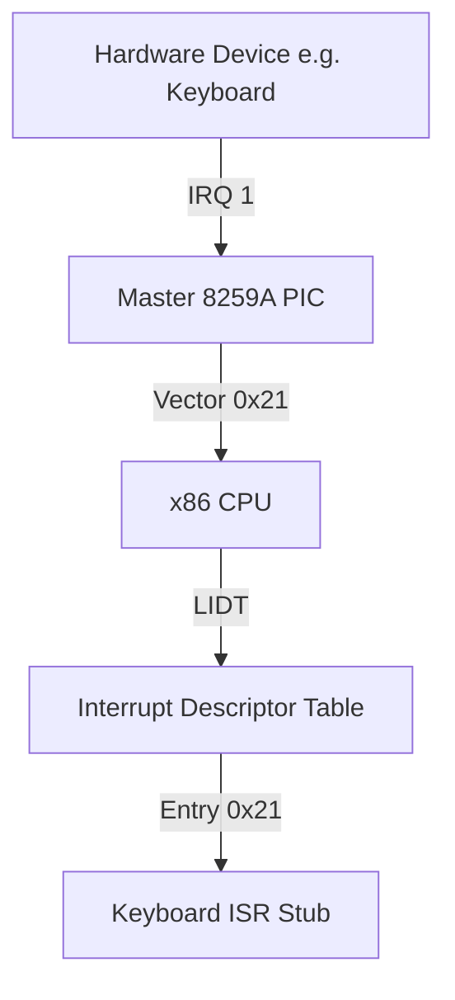

# DByteOS Kernel Interrupt Architecture Foundation (v7.6.1)

This document details the layout, data structures, and cascade configuration for standard **x86 Interrupt Handling** under freestanding and zero-allocation constraints.

---

## 1. Architectural Overview

In a protected-mode x86 operating system kernel, handling processor exceptions and hardware interrupts requires configuring two central components:
1. **Interrupt Descriptor Table (IDT)**: A table of up to 256 gate descriptors loaded via the `LIDT` instruction.
2. **Programmable Interrupt Controller (8259A PIC)**: A pair of cascaded chips mapping external hardware lines (IRQs) to CPU interrupt vectors.



---

## 2. The Interrupt Descriptor Table (IDT)

The IDT tells the CPU where to jump when an exception or hardware interrupt occurs. In standard 32-bit x86, the table contains **Gate Descriptors** packed tightly inside a `[IdtEntry; 256]` array.

### Gate Descriptor Structure (`IdtEntry` - 8 Bytes)
Each descriptor is defined as follows:

| Offset | Size | Name | Description |
| :--- | :--- | :--- | :--- |
| `0..1` | 2 Bytes | `offset_low` | Low 16 bits of the ISR entry point address. |
| `2..3` | 2 Bytes | `selector` | GDT Code Segment Selector (typically `0x08`). |
| `4` | 1 Byte | `zero` | Reserved, must always be `0`. |
| `5` | 1 Byte | `type_attr` | Type and attributes (Present, DPL, Gate Type). |
| `6..7` | 2 Bytes | `offset_high` | High 16 bits of the ISR entry point address. |

### The IDT Pointer (`IdtPtr` - 6 Bytes Layout)
To notify the CPU of the IDT location, the standard `lidt` assembly instruction accepts a pointer to a packed 6-byte register layout block in memory:
- **`limit`** (Offset `0..1`, 2 Bytes): Size of the IDT table in bytes minus 1 (typically `(256 * 8) - 1` = `0x7FF` bytes).
- **`base`** (Offset `2..5`, 4 Bytes): Linear 32-bit base address pointing directly to the contiguous `[IdtEntry; 256]` table array in memory.

During execution, loading this pointer register structure into the processor's IDTR register configures the memory address bounds for CPU exception vectors.

### Exception Handler Status Table
The following table summarizes the currently registered (active) and planned CPU exception vectors in the IDT:

| Vector | Type | Name | Status | Description |
| :--- | :--- | :--- | :--- | :--- |
| `0` | Fault / Trap | Divide-by-Zero | **Active** | Controlled via `int 0` trap for shell diagnostics. |
| `3` | Trap | Breakpoint | **Active** | Standard software breakpoint via `int3`. |
| `14` | Fault | Page Fault | *Planned* | Unhandled in current version (v7.6.1). |

### Breakpoint Exception Behavior (`int3` Trap - Vector 3)
When the CPU executes the one-byte `int3` instruction (`0xCC`), the following hardware sequence is performed:
1. **Execution Suspension**: CPU suspends current instruction pipeline execution.
2. **Hardware Stack Push**: The CPU pushes the EFLAGS register, GDT Code Segment Selector (`CS`), and the return instruction pointer (`EIP`) pointing to the instruction *immediately following* `int3` onto the kernel stack. Note that the Breakpoint exception does *not* push an error code.
3. **Descriptor Gate Jump**: CPU looks up entry 3 in the IDT, verifies the present bits, jumps privilege levels if necessary (remains Ring 0), and transfers execution control to `breakpoint_handler_asm`.
4. **General Registers Preservation**: Our assembly stub wrapper executes `pushad` to push all 8 general-purpose registers (32 bytes) onto the stack: `EAX`, `ECX`, `EDX`, `EBX`, `ESP`, `EBP`, `ESI`, and `EDI`.
5. **Rust Dispatch**: Calls `breakpoint_handler_rust` which outputs high-level text logs safely to both VGA and Serial console channels.
6. **State Restoration & Return**: Executes `popad` to restore register values, and executes `iretd` to pop the saved `EIP`, `CS`, and `EFLAGS` off the stack, resuming user shell execution seamlessly without triple faulting.

### Divide-by-Zero Exception Behavior (Vector 0)
When a division error occurs, the processor normally triggers a **Fault** (Vector 0). In a real fault condition, the return `EIP` pushed onto the stack points to the *offending division instruction*.
- **The Infinite Loop Gotcha**: If a handler simply executes `iretd` without modifying the pushed stack pointer, the CPU will jump back to the exact same division instruction and trigger the fault again, leading to an infinite exception loop or a Triple Fault.
- **Trap-Style Controlled Trigger (`int 0`)**: To avoid this risk in our diagnostics lab while validating Vector 0 registration, the `div0` shell command triggers Vector 0 via a software trap (`int 0`). Under software interrupt rules, the CPU pushes the `EIP` pointing to the *next instruction* after `int 0`. This enables safe trap-style execution flow, incrementing exception telemetry stats, printing diagnostic status, and returning back to the interactive polling shell loop flawlessly.

### Page Fault Direction Note (Vector 14)
Page Fault handling remains **planned / disabled** in `v7.6.1`. The `pf-note` command documents the intended direction without installing an IDT gate, reading privileged fault state, or triggering a real memory violation.

```txt
page fault: planned / disabled
vector: 14
cr2: unavailable
error code: documented only
```

On x86, a real Page Fault pushes an error code that describes why address translation failed. The relevant fields include whether the page was present, whether the access was a write, whether the access came from user mode, and whether reserved bits or instruction fetch protection were involved. The faulting linear address is reported through the `CR2` register.

In this milestone, `CR2` is intentionally unavailable because no vector 14 handler is registered and no fault frame is decoded. Page fault is still unhandled; any accidental illegal memory access can still reset the VM through Double/Triple Fault behavior.

---

## 3. The Programmable Interrupt Controller (8259A PIC)

The 8259A Programmable Interrupt Controller manages external hardware interrupts (IRQs) and redirects them to the CPU.

### Ports and Remapping
By default, the IBM PC maps Master PIC interrupts (IRQs 0-7) to CPU vectors `0x08-0x0F`. However, this conflicts with processor exceptions (such as Double Fault at `0x08`). To prevent collisions, the PIC must be remapped to clear vectors `0x20` and higher:

- **Master PIC**: Command port `0x20` / Data port `0x21`. Remapped vector offset: `0x20` (CPU vectors `32-39`).
- **Slave PIC**: Command port `0xA0` / Data port `0xA1`. Remapped vector offset: `0x28` (CPU vectors `40-47`).

### Initialization Cascade (ICW)
Remapping requires sending 4 Initialization Command Words (ICW) to the command and data ports in a strict sequence:
1. **ICW1 (`0x11`)**: Start initialization.
2. **ICW2**: Base interrupt vectors (Master: `0x20`, Slave: `0x28`).
3. **ICW3**: Cascade line setup (Master cascade: `0x04`, Slave identity: `0x02`).
4. **ICW4 (`0x01`)**: Enable 8086 microprocessor mode.

---

## 4. Architectural Glossary

To ensure precise terminology and strict alignment across the DByteOS system, the following standard glossary is defined:

- **IDT (Interrupt Descriptor Table)**: An architecture-defined array of 256 gate descriptors representing handler hooks for CPU exceptions and external IRQs.
- **ISR (Interrupt Service Routine)**: A specialized, freestanding low-level handler routine triggered immediately by the CPU upon encountering an interrupt vector.
- **IRQ (Interrupt Request)**: An physical hardware line (numbered 0 to 15 on dual 8259A PICs) signaling external hardware requests to the programmable controller.
- **PIC (Programmable Interrupt Controller)**: An 8259A chip duo mapping physical IRQs to configurable CPU interrupt vectors via Initialization Command Words.
- **STI (Set Interrupt Flag)**: The x86 instruction enabling maskable external interrupts on the processor by setting the IF (Interrupt Flag) flag in the EFLAGS register.
- **CLI (Clear Interrupt Flag)**: The x86 instruction disabling maskable external interrupts on the processor by clearing the IF flag, forcing the CPU to ignore incoming IRQ signals.

---

## 5. Safety Warnings & Active Disclaimers

> [!WARNING]
> **Active Interrupts are Disabled (No STI)**
> The standard `lidt` instruction was successfully called during bootstrap to load the active Interrupt Descriptor Table base address. However, maskable interrupts remain strictly disabled on the processor (no `sti` instruction execution). All external IRQ signals will be completely ignored, keeping CPU hardware interrupt dispatch dormant.

> [!CAUTION]
> **Only Vector 0 and Vector 3 Handlers are Active**
> Although the IDT structure is successfully loaded, only Vector 0 (Divide-by-Zero diagnostics via controlled `int 0`) and Vector 3 (Breakpoint via `int3`) are active in this milestone. All other gates remain initialized with a missing/non-present default gate (`IdtEntry::missing()`).
>
> - **Raw Divide Faults are Not Used for Shell Diagnostics**: The `div0` command intentionally uses a controlled software trap instead of a raw `div` fault to avoid returning to the same faulting instruction.
> - **No Page Fault Handler Yet**: Vector 14 is planned but unhandled. Any illegal virtual memory access can still trigger a Double/Triple Fault reset.

> [!IMPORTANT]
> **No PIC Remapping Dispatch**
> No Initialization Command Words (ICWs) have been sent to ports `0x20` or `0xA0`. The 8259A PIC chips remain configured with default BIOS configurations.

> [!IMPORTANT]
> **Keyboard Polling Mode is Active**
> Keyboard event processing remains 100% polling-based (reading VGA buffer and I/O Port `0x60` directly in the interactive polling loop). No IRQ1 interrupt-driven keyboard input path has been registered or claimed yet.

> [!NOTE]
> **No System Timer Driver**
> Uptime measurements are unavailable because no Programmable Interval Timer (PIT) IRQ0 handler is initialized or activated.

---

## 6. Current Milestone Status (`v7.6.1`)

To preserve absolute stability and maintain polling-based shell input, **Interrupts remain strictly disabled** in version `7.6.1`, and CPU exception diagnostics and user experience (UX) have been successfully expanded:
- **`handlers` Command**: Lists active handlers (`vector 0: divide-by-zero`, `vector 3: breakpoint`) and planned handlers (`vector 14: page fault`) in a clean, visual format.
- **`exception-status` & `exceptions` Command**: Displays detailed exception diagnostics summary including total count, last vector (with name), and current interrupt flag status (`disabled`).
- **`exception-help` Command**: Displays a comprehensive help guide for all exception diagnostics suite commands.
- **`pf-note` Command**: Documents that page fault is planned / disabled, vector 14 is not active, `CR2` is unavailable, and the error code is documented only.
- **Exception Handler Status Table**: Added a clear vector registration tracking table mapping Active vs Planned entry gates in Section 2.
- **Controlled Divide-by-Zero (Vector 0)**: Fully active. Registered IDT entry 0 pointing to `divide_by_zero_handler_asm`, preserving GPRs via `pushad`/`popad` and returning via `iretd`.
- **Breakpoint Exception (Vector 3)**: Fully active. Registered IDT entry 3 pointing to `breakpoint_handler_asm`, preserving GPRs and returning cleanly via `iretd`.
- **STI (Set Interrupts Flag) instruction**: Uncalled.
- **PIC Remap Commands**: Not dispatched.
- **IDT Loading**: Executed successfully using the standard `lidt` instruction during bootstrap.
- **Status Reporting**: The `system` command dynamically syncs exception count and active/planned status information cleanly.
- **Page Fault Handler Status**: Planned / disabled. No `entries[14].set_handler` binding, no `int 14` trigger, and no raw page fault trigger are present in this release.
