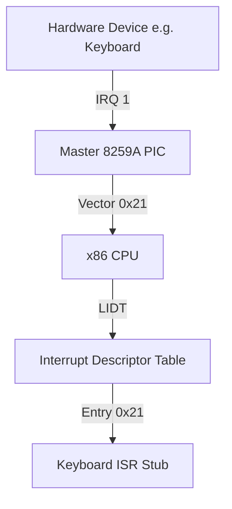

# DByteOS Kernel Interrupt Architecture Foundation (v7.0.0)

This document details the layout, data structures, and cascade configuration for standard **x86 Interrupt Handling** under freestanding and zero-allocation constraints.

---

## 1. Architectural Overview

In a protected-mode x86 operating system kernel, handling processor exceptions and hardware interrupts requires configuring two central components:
1. **Interrupt Descriptor Table (IDT)**: A table of up to 256 gate descriptors loaded via the `LIDT` instruction.
2. **Programmable Interrupt Controller (8259A PIC)**: A pair of cascaded chips mapping external hardware lines (IRQs) to CPU interrupt vectors.

---

## 2. The Interrupt Descriptor Table (IDT)

The IDT tells the CPU where to jump when an exception or hardware interrupt occurs. In standard 32-bit x86, the table contains **Gate Descriptors** packed tightly inside a `[IdtEntry; 256]` array.

### Gate Descriptor Structure (`IdtEntry` - 8 Bytes)
Each descriptor is defined as follows:

| Offset | Size | Name | Description |
| :--- | :--- | :--- | :--- |
| `0..1` | 2 Bytes | `offset_low` | Low 16 bits of the ISR entry point address. |
| `2..3` | 2 Bytes | `selector` | GDT Code Segment Selector (typically `0x08`). |
| `4` | 1 Byte | `zero` | Reserved, must always be `0`. |
| `5` | 1 Byte | `type_attr` | Type and attributes (Present, DPL, Gate Type). |
| `6..7` | 2 Bytes | `offset_high` | High 16 bits of the ISR entry point address. |

### The IDT Pointer (`IdtPtr` - 6 Bytes)
To notify the CPU of the IDT location, the `lidt` instruction accepts a packed 6-byte pointer:
- **`limit`** (2 Bytes): Size of the table in bytes minus 1 (typically `(256 * 8) - 1` = `0x7FF`).
- **`base`** (4 Bytes): Linear base address pointing directly to the table in memory.

---

## 3. The Programmable Interrupt Controller (8259A PIC)

The 8259A Programmable Interrupt Controller manages external hardware interrupts (IRQs) and redirects them to the CPU.

### Ports and Remapping
By default, the IBM PC maps Master PIC interrupts (IRQs 0-7) to CPU vectors `0x08-0x0F`. However, this conflicts with processor exceptions (such as Double Fault at `0x08`). To prevent collisions, the PIC must be remapped to clear vectors `0x20` and higher:

- **Master PIC**: Command port `0x20` / Data port `0x21`. Remapped vector offset: `0x20` (CPU vectors `32-39`).
- **Slave PIC**: Command port `0xA0` / Data port `0xA1`. Remapped vector offset: `0x28` (CPU vectors `40-47`).

### Initialization Cascade (ICW)
Remapping requires sending 4 Initialization Command Words (ICW) to the command and data ports in a strict sequence:
1. **ICW1 (`0x11`)**: Start initialization.
2. **ICW2**: Base interrupt vectors (Master: `0x20`, Slave: `0x28`).
3. **ICW3**: Cascade line setup (Master cascade: `0x04`, Slave identity: `0x02`).
4. **ICW4 (`0x01`)**: Enable 8086 microprocessor mode.

---

## 4. Current Milestone Status (`v7.0.0`)

To preserve absolute stability and maintain polling-based shell input, **Interrupts are strictly planned and disabled** in version `7.0.0`:
- **STI (Set Interrupts Flag) instruction**: Uncalled.
- **PIC Remap Commands**: Not dispatched.
- **IDT Loading**: Not executed.
- **Status Reporting**: The `system` command explicitly lists: `interrupts: planned / disabled`.
