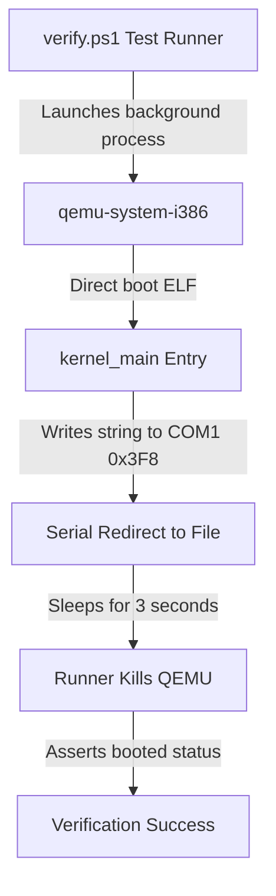

# DByteOS QEMU Boot Smoke (v6.2.2)

This document describes the virtualized boot smoke verification system built for the **DByteOS Kernel Lab**.

## Architecture & Communication Protocol

The virtualized boot smoke tests verify the bare-metal integrity of our freestanding kernel ELF artifact by launching it under x86 emulation and capturing direct serial console outputs.



### Serial Port Configurations (COM1)
- **Port I/O Address**: `0x3F8`
- **Interrupts**: Disabled (polling mode)
- **Baud Rate Divisor**: `3` (38400 baud)
- **Line Control**: `8` data bits, no parity, `1` stop bit (`8N1`)
- **FIFO**: Enabled (clear buffer, `14` byte threshold)

## Verification Redirection Flags
To test without launching a heavy graphics window, QEMU is executed in standard output redirection mode:
```powershell
qemu-system-i386 -kernel target\i686-unknown-linux-gnu\debug\dbyte_kernel -serial file:tmp\qemu_serial.log -display none
```

- `-kernel`: Boots our freestanding ELF kernel directly without requiring an ISO or GRUB bootloader block.
- `-serial file:tmp\qemu_serial.log`: Redirects COM1 serial outputs into a file which is asynchronously read by the test suite.
- `-display none`: Completely disables graphical display output to keep tests silent and head-less.

## Manual Execution Proof

To manually boot and verify serial output directly on your host machine:

1. **Compile the Freestanding Kernel Workspace**:
   ```powershell
   powershell -ExecutionPolicy Bypass -File .\kernel-lab\scripts\build.ps1
   ```
2. **Execute Headless Serial Emulation**:
   ```powershell
   powershell -ExecutionPolicy Bypass -File .\kernel-lab\scripts\run.ps1 -Serial
   ```

### Expected Command Execution Log
```txt
========================================================================
Launching freestanding DByteOS Kernel Lab in HEADLESS SERIAL mode...
Executing: qemu-system-i386 -kernel "C:\Users\DEADBYTE\Downloads\ProgramingLangPJ\kernel-lab\target\i686-unknown-linux-gnu\debug\dbyte_kernel" -serial stdio -display none
Note: Headless Serial Mode initiated. QEMU is running in the background.
Press [Ctrl + C] in this terminal to terminate the simulation.
========================================================================
DByteOS Kernel Lab
version: 6.2.2
status: booted
target: i686 multiboot
```

## Architecture Fallback Matrix
The runner automatically probes your host environment and routes command streams accordingly:

| Installed Emulator | Executed Command | Mode |
| --- | --- | --- |
| `qemu-system-i386` | `qemu-system-i386 -kernel ...` | Native 32-bit Emulation |
| `qemu-system-x86_64` | `qemu-system-x86_64 -kernel ...` | Fallback 64-bit Emulation |
| None | Graceful skip / friendly path warnings | Isolated offline build only |

