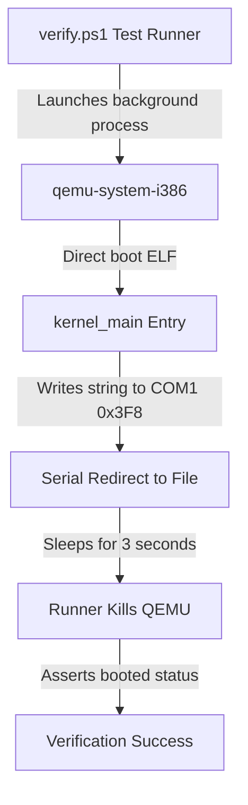

# DByteOS QEMU Boot Smoke (v6.2.1)

This document describes the virtualized boot smoke verification system built for the **DByteOS Kernel Lab**.

## Architecture & Communication Protocol

The virtualized boot smoke tests verify the bare-metal integrity of our freestanding kernel ELF artifact by launching it under x86 emulation and capturing direct serial console outputs.



### Serial Port Configurations (COM1)
- **Port I/O Address**: `0x3F8`
- **Interrupts**: Disabled (polling mode)
- **Baud Rate Divisor**: `3` (38400 baud)
- **Line Control**: `8` data bits, no parity, `1` stop bit (`8N1`)
- **FIFO**: Enabled (clear buffer, `14` byte threshold)

## Verification Redirection Flags
To test without launching a heavy graphics window, QEMU is executed in standard output redirection mode:
```powershell
qemu-system-i386 -kernel target\i686-unknown-linux-gnu\debug\dbyte_kernel -serial file:tmp\qemu_serial.log -display none
```

- `-kernel`: Boots our freestanding ELF kernel directly without requiring an ISO or GRUB bootloader block.
- `-serial file:tmp\qemu_serial.log`: Redirects COM1 serial outputs into a file which is asynchronously read by the test suite.
- `-display none`: Completely disables graphical display output to keep tests silent and head-less.
