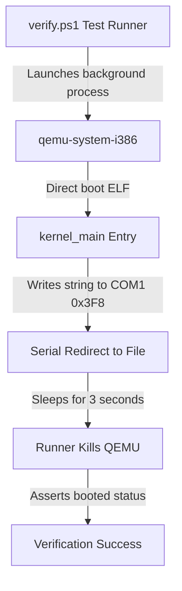

# DByteOS QEMU Boot Smoke (v6.5.0)

This document describes the virtualized boot smoke verification system built for the **DByteOS Kernel Lab**.

## Architecture & Communication Protocol

The virtualized boot smoke tests verify the bare-metal integrity of our freestanding kernel ELF artifact by launching it under x86 emulation and capturing direct serial console outputs.



### Serial Port Configurations (COM1)
- **Port I/O Address**: `0x3F8`
- **Interrupts**: Disabled (polling mode)
- **Baud Rate Divisor**: `3` (38400 baud)
- **Line Control**: `8` data bits, no parity, `1` stop bit (`8N1`)
- **FIFO**: Enabled (clear buffer, `14` byte threshold)

## Verification Redirection Flags
To test without launching a heavy graphics window, QEMU is executed in standard output redirection mode:
```powershell
qemu-system-i386 -kernel target\i686-unknown-linux-gnu\debug\dbyte_kernel -serial file:tmp\qemu_serial.log -display none
```

- `-kernel`: Boots our freestanding ELF kernel directly without requiring an ISO or GRUB bootloader block.
- `-serial file:tmp\qemu_serial.log`: Redirects COM1 serial outputs into a file which is asynchronously read by the test suite.
- `-display none`: Completely disables graphical display output to keep tests silent and head-less.

## Manual Execution Proof

To manually boot and verify serial output directly on your host machine:

1. **Compile the Freestanding Kernel Workspace**:
   ```powershell
   powershell -ExecutionPolicy Bypass -File .\kernel-lab\scripts\build.ps1
   ```
2. **Execute Headless Serial Emulation**:
   ```powershell
   powershell -ExecutionPolicy Bypass -File .\kernel-lab\scripts\run.ps1 -Serial
   ```

### Expected Command Execution Log
```txt
========================================================================
Launching freestanding DByteOS Kernel Lab in HEADLESS SERIAL mode...
Executing: qemu-system-i386 -kernel "C:\Users\DEADBYTE\Downloads\ProgramingLangPJ\kernel-lab\target\i686-unknown-linux-gnu\debug\dbyte_kernel" -serial stdio -display none
Note: Headless Serial Mode initiated. QEMU is running in the background.
Press [Ctrl + C] in this terminal to terminate the simulation.
========================================================================
DByteOS Kernel Lab
version: 6.5.0
status: booted
target: i686 multiboot
```

## Architecture Fallback Matrix
The runner automatically probes your host environment and routes command streams accordingly:

| Installed Emulator | Executed Command | Mode |
| --- | --- | --- |
| `qemu-system-i386` | `qemu-system-i386 -kernel ...` | Native 32-bit Emulation |
| `qemu-system-x86_64` | `qemu-system-x86_64 -kernel ...` | Fallback 64-bit Emulation |
| None | Graceful skip / friendly path warnings | Isolated offline build only |

## Keyboard Modifier Aware Decoding (v6.5.0)

In version `6.5.0`, a polling-based PS/2 keyboard listener and stateful ASCII modifier decoding module were implemented. It monitors key events by querying the status register, tracks Shift and CapsLock state transitions, maps lowercase/uppercase toggles using `Shift ^ CapsLock` XOR logic, and provides Shift + number symbol maps.

### Register Address Primitives
- **Keyboard Status Register**: Port `0x64` (Read-only)
  - **Bit 0 (OBF - Output Buffer Full)**: A value of `1` indicates that data has been received from the keyboard controller and is ready to be fetched from the output buffer (port `0x60`).
- **Keyboard Output Buffer**: Port `0x60` (Read-only)
  - Contains the 8-bit scancode byte corresponding to the pressed/released key.

### Expected Live Keyboard Output
When launching the simulation in graphical mode:
```powershell
powershell -ExecutionPolicy Bypass -File .\kernel-lab\scripts\run.ps1
```

1. **Left-click** inside the graphical QEMU window to redirect keyboard focus to the virtual machine.
2. Press keys on your host keyboard. You will see translated ASCII characters print dynamically onto the VGA screen and stateful modifier logs print on the serial console:
   ```txt
   DByteOS Keyboard Lab
   status: listening
   [MODIFIER] Shift: true, CapsLock: false
   A
   [MODIFIER] Shift: false, CapsLock: false
   a
   ```
   *(Note: Pressing Shift + 'A' prints '[MODIFIER] Shift: true, CapsLock: false' to Serial and echoes uppercase 'A' to the screen, while releasing Shift outputs '[MODIFIER] Shift: false, CapsLock: false' and subsequent keypresses yield lowercase 'a'.)*

### Manual Typing Proof: hello deadbyte 1337
To verify the full end-to-end interactive integrity of the keyboard translation sub-system:
1. Launch graphical simulation: `powershell -File .\kernel-lab\scripts\run.ps1`
2. Left-click inside the QEMU graphical display window to grab focus.
3. Type the string: `hello deadbyte 1337`
4. The system translates each keypress on-the-fly and echoes the characters to both the VGA screen and the serial console.
5. Hit **`Backspace`** several times. Observe that characters are cleanly wiped from both screens one-by-one.

### Complete Supported Keyboard Mappings (PS/2 Set 1)
All other keystrokes not explicitly defined below are currently ignored by the freestanding parser.

| Category | Key | Make Code (Hex) | Decoded ASCII / Action |
| --- | --- | --- | --- |
| **Alphabetic** | `A` through `Z` | `0x1E` through `0x2C` (Set 1) | Lowercase character representation (`'a'` - `'z'`) |
| **Numeric** | `1` through `0` | `0x02` through `0x0B` | Numeric symbol representation (`'1'` - `'0'`) |
| **Spacer** | `Space` | `0x39` | Blank space padding byte (`' '`) |
| **Control** | `Enter` | `0x1C` | Translates to Carriage Return / Newline (`'\n'`) |
| **Control** | `Backspace` | `0x0E` | Erase previous character trigger (`'\x08'`) |

---

### In-Depth Backspace Visual Erase Behavior

Erase behavior requires synchronizing the local graphical viewport and the external host serial capture terminal:
1. **Text-Mode VGA Screen**:
   - The kernel decrements the frame buffer index pointer `CURSOR` by 1 (`CURSOR -= 1`).
   - Overwrites the character cell with a space character byte (`b' '`) and sets text colors back to white-on-black (`0x0F`) to visually delete the character.
2. **COM1 Serial Port Redirect**:
   - The kernel writes the standard ANSI/ASCII backspace control character `\x08` (which moves the host terminal cursor one column left).
   - Transmits a space character `\x20` (overwriting the character at that column with empty space).
   - Transmits another backspace character `\x08` (shifting the cursor left again so subsequent typed keys append at the corrected column).

---

### Architectural Boundaries & Explicit Exclusions

> [!WARNING]
> This release (`v6.5.0`) enforces strict technical bounds to maintain lab stability:
>
> 1. **Polling-Only Keyboard Processing**: The system does **NOT** configure the Interrupt Descriptor Table (IDT) or map the Programmable Interrupt Controller (PIC/8259). Keypress retrieval operates strictly within a synchronous, non-blocking polling loop within `kernel_main` querying status port `0x64` bit 0.
> 2. **Basic Modifiers Only**: The kernel supports Left/Right Shift tracking, CapsLock toggling, and Shift + number symbols. It does **NOT** track Ctrl or Alt modifiers, nor does it support full stateful keyboard layout configurations.
