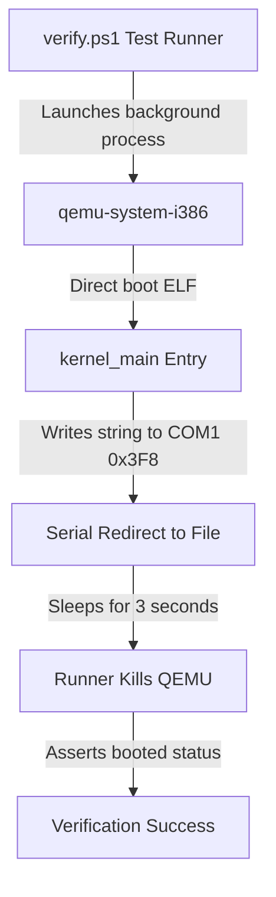

# DByteOS QEMU Boot Smoke (v6.4.0)

This document describes the virtualized boot smoke verification system built for the **DByteOS Kernel Lab**.

## Architecture & Communication Protocol

The virtualized boot smoke tests verify the bare-metal integrity of our freestanding kernel ELF artifact by launching it under x86 emulation and capturing direct serial console outputs.



### Serial Port Configurations (COM1)
- **Port I/O Address**: `0x3F8`
- **Interrupts**: Disabled (polling mode)
- **Baud Rate Divisor**: `3` (38400 baud)
- **Line Control**: `8` data bits, no parity, `1` stop bit (`8N1`)
- **FIFO**: Enabled (clear buffer, `14` byte threshold)

## Verification Redirection Flags
To test without launching a heavy graphics window, QEMU is executed in standard output redirection mode:
```powershell
qemu-system-i386 -kernel target\i686-unknown-linux-gnu\debug\dbyte_kernel -serial file:tmp\qemu_serial.log -display none
```

- `-kernel`: Boots our freestanding ELF kernel directly without requiring an ISO or GRUB bootloader block.
- `-serial file:tmp\qemu_serial.log`: Redirects COM1 serial outputs into a file which is asynchronously read by the test suite.
- `-display none`: Completely disables graphical display output to keep tests silent and head-less.

## Manual Execution Proof

To manually boot and verify serial output directly on your host machine:

1. **Compile the Freestanding Kernel Workspace**:
   ```powershell
   powershell -ExecutionPolicy Bypass -File .\kernel-lab\scripts\build.ps1
   ```
2. **Execute Headless Serial Emulation**:
   ```powershell
   powershell -ExecutionPolicy Bypass -File .\kernel-lab\scripts\run.ps1 -Serial
   ```

### Expected Command Execution Log
```txt
========================================================================
Launching freestanding DByteOS Kernel Lab in HEADLESS SERIAL mode...
Executing: qemu-system-i386 -kernel "C:\Users\DEADBYTE\Downloads\ProgramingLangPJ\kernel-lab\target\i686-unknown-linux-gnu\debug\dbyte_kernel" -serial stdio -display none
Note: Headless Serial Mode initiated. QEMU is running in the background.
Press [Ctrl + C] in this terminal to terminate the simulation.
========================================================================
DByteOS Kernel Lab
version: 6.4.0
status: booted
target: i686 multiboot
```

## Architecture Fallback Matrix
The runner automatically probes your host environment and routes command streams accordingly:

| Installed Emulator | Executed Command | Mode |
| --- | --- | --- |
| `qemu-system-i386` | `qemu-system-i386 -kernel ...` | Native 32-bit Emulation |
| `qemu-system-x86_64` | `qemu-system-x86_64 -kernel ...` | Fallback 64-bit Emulation |
| None | Graceful skip / friendly path warnings | Isolated offline build only |

## Keyboard ASCII Decoded Listening (v6.4.0)

In version `6.4.0`, a polling-based PS/2 keyboard listener and basic ASCII translation module were implemented. It monitors key events by querying the status register and translates valid Make codes to raw ASCII characters.

### Register Address Primitives
- **Keyboard Status Register**: Port `0x64` (Read-only)
  - **Bit 0 (OBF - Output Buffer Full)**: A value of `1` indicates that data has been received from the keyboard controller and is ready to be fetched from the output buffer (port `0x60`).
- **Keyboard Output Buffer**: Port `0x60` (Read-only)
  - Contains the 8-bit scancode byte corresponding to the pressed/released key.

### Expected Live Keyboard Output
When launching the simulation in graphical mode:
```powershell
powershell -ExecutionPolicy Bypass -File .\kernel-lab\scripts\run.ps1
```

1. **Left-click** inside the graphical QEMU window to redirect keyboard focus to the virtual machine.
2. Press keys on your host keyboard. You will see translated ASCII characters print dynamically onto the VGA screen and the serial console:
   ```txt
   DByteOS Keyboard Lab
   status: listening
   a
   b
   ```
   *(Note: Pressing 'A' followed by 'B' will print 'a' and 'b'. All Break codes (key releases) are filtered out to prevent double-typing.)*

### Essential Key Scancode Reference (PS/2 Set 1)

The PS/2 keyboard controller inside QEMU emits 8-bit scancodes based on the Set 1 specification. When a key is pressed, it transmits a **Make code**. When a key is released, it transmits a **Break code** (which is usually the Make code bitwise ORed with `0x80`).

| Key | Make Code (Press) | Break Code (Release) | Key Action |
| --- | --- | --- | --- |
| **`A`** | `0x1E` | `0x9E` | Primary validation keystroke |
| **`B`** | `0x30` | `0xB0` | Secondary validation keystroke |
| **`Enter`** | `0x1C` | `0x9C` | Carries carriage return / line break signals |
| **`Backspace`** | `0x0E` | `0x8E` | Backspace delete buffer cursor trigger |
| **`Space`** | `0x39` | `0xB9` | Spacebar blank character pad |
| **`Esc`** | `0x01` | `0x81` | Escape/exit execution frame trigger |

---

### Architectural Boundaries & Explicit Exclusions

> [!WARNING]
> This release (`v6.4.0`) has strictly defined architectural scopes to prevent over-complicating the bootstrap lab:
>
> 1. **No Interrupt Service Routines (ISRs)**: The system does **NOT** configure the Interrupt Descriptor Table (IDT) or map the Programmable Interrupt Controller (PIC/8259). Key listening runs completely inside a synchronous, non-blocking polling loop within `kernel_main` querying port `0x64`.
> 2. **No Complex Modifier Layouts**: The kernel does **NOT** support Shift, CapsLock, Ctrl, or Alt state transitions yet. It maps core alphanumeric characters, Space, Enter, and Backspace as basic un-modified lowercase/numeric codes. Shift and CapsLock key-state handling are slated for version `v6.4.1` or `v6.5.0`.
