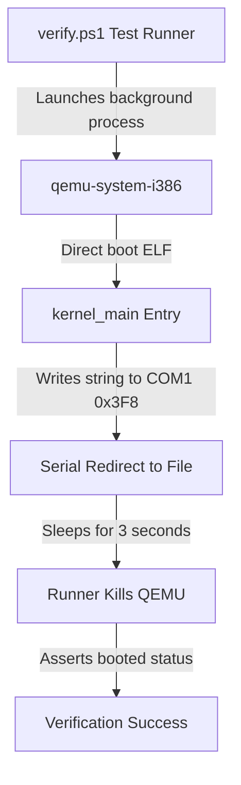

# DByteOS QEMU Boot Smoke (v8.13.1)

`v8.13.1` is an IRQ Gate Bind State Telemetry release over the `v8.12.1` controlled bind smoke line. It preserves polling-keyboard decoding for hyphenated commands and adds `irq-gate-state`, `irq-gate-history`, and `irq-gate-preflight` read-only telemetry plus `system` / `handlers` sync for controlled bind state. IDT vectors `32/33` may bind only via `irq-gate-arm` / `irq-gate-bind-smoke`. It does not run bind smoke at boot, enable interrupts, unmask PIC IRQ lines, rewrite keyboard polling, or dispatch EOI.

This document describes the virtualized boot smoke verification system built for the **DByteOS Kernel Lab**.

## Architecture & Communication Protocol

The virtualized boot smoke tests verify the bare-metal integrity of our freestanding kernel ELF artifact by launching it under x86 emulation and capturing direct serial console outputs.



### Serial Port Configurations (COM1)
- **Port I/O Address**: `0x3F8`
- **Interrupts**: Disabled (polling mode)
- **Baud Rate Divisor**: `3` (38400 baud)
- **Line Control**: `8` data bits, no parity, `1` stop bit (`8N1`)
- **FIFO**: Enabled (clear buffer, `14` byte threshold)

## Verification Redirection Flags
To test without launching a heavy graphics window, QEMU is executed in standard output redirection mode:
```powershell
qemu-system-i386 -kernel target\i686-unknown-linux-gnu\debug\dbyte_kernel -serial file:tmp\qemu_serial.log -display none
```

- `-kernel`: Boots our freestanding ELF kernel directly without requiring an ISO or GRUB bootloader block.
- `-serial file:tmp\qemu_serial.log`: Redirects COM1 serial outputs into a file which is asynchronously read by the test suite.
- `-display none`: Completely disables graphical display output to keep tests silent and head-less.

## Manual Execution Proof

To manually boot and verify serial output directly on your host machine:

1. **Compile the Freestanding Kernel Workspace**:
   ```powershell
   powershell -ExecutionPolicy Bypass -File .\kernel-lab\scripts\build.ps1
   ```
2. **Execute Headless Serial Emulation**:
   ```powershell
   powershell -ExecutionPolicy Bypass -File .\kernel-lab\scripts\run.ps1 -Serial
   ```

### Expected Command Execution Log
```txt
========================================================================
Launching freestanding DByteOS Kernel Lab in HEADLESS SERIAL mode...
Executing: qemu-system-i386 -kernel "C:\Users\DEADBYTE\Downloads\ProgramingLangPJ\kernel-lab\target\i686-unknown-linux-gnu\debug\dbyte_kernel" -serial stdio -display none
Note: Headless Serial Mode initiated. QEMU is running in the background.
Press [Ctrl + C] in this terminal to terminate the simulation.
========================================================================
DByteOS Kernel Lab
version: 8.13.1
status: booted
target: i686 multiboot
```

## Architecture Fallback Matrix
The runner automatically probes your host environment and routes command streams accordingly:

| Installed Emulator | Executed Command | Mode |
| --- | --- | --- |
| `qemu-system-i386` | `qemu-system-i386 -kernel ...` | Native 32-bit Emulation |
| `qemu-system-x86_64` | `qemu-system-x86_64 -kernel ...` | Fallback 64-bit Emulation |
| None | Graceful skip / friendly path warnings | Isolated offline build only |

## Keyboard Line Editor & Command Dispatch Lab (v8.13.1)

In version `8.13.1`, a polling-based PS/2 keyboard listener and stateful ASCII modifier decoding module are coupled with a zero-allocation **Kernel Command Dispatcher** and line editor. It tracks Shift and CapsLock state transitions, manages a 128-byte line buffer, protects the shell prompt from accidental erasure, and processes typed commands dynamically.

### Key Shell & Command Features
1. **Shell Prompt**: Renders `dbyte-kernel> ` on screen/serial.
2. **Fixed-Size Buffer**: A static mutable buffer `LINE_BUFFER` tracks up to 128 typed characters. Characters typed past this 128-byte boundary are safely discarded to prevent heap overflows and memory unsafety.
3. **Prompt Protection Guard**: Keypresses of Backspace (`\x08`) only perform visual erasure and buffer shrinking when `LINE_LEN > 0`. This guarantees the prompt `"dbyte-kernel> "` cannot be deleted.
4. **Hardened Line Submission**: Pressing Enter (`\n`) outputs `\n`. If `LINE_LEN > 0`, it parses the command dynamically. If `LINE_LEN == 0` (empty line), it simply yields a new prompt without printing anything to preserve console cleanliness.
5. **Command Dispatcher Table**:

| Command Input | Parameter Handling | Output Response / Behavior |
| :--- | :--- | :--- |
| `help` | None | Prints: `commands: help about version clear echo mem uptime banner keyboard reboot-note system cls status mods keys prompt int3 div0 exception exception-reset handlers handlers --active exception-status exceptions exceptions --verbose exception-help exception-about fault-status fault-reset pf-note pf-status pf-smoke irq-note irq-status irq-handlers eoi-note eoi-status irq-gates irq-gate-status irq-gate-plan irq-gate-arm irq-gate-bind-smoke irq-gate-bind-status irq-gate-state irq-gate-history irq-gate-preflight irq-bind-note irq-bind-status irq-readiness irq-risk irq-preflight pic-note pic-status pic-plan pic-remap-arm pic-remap-smoke pic-remap-status pic-remap-state pic-remap-history pic-remap-preflight irq-map pic-status --verbose` |
| `about` | None | Prints: `DByteOS Kernel Lab` |
| `version` | None | Prints: `DByteOS Kernel Lab 8.13.1` |
| `clear` | None | Clears the entire VGA console and resets prompt location to top-left. |
| `cls` | None | Clears the entire VGA console (alias of `clear`). |
| `echo` | Matches exactly or with space | Prints a newline (if exact `"echo"`) or prints raw `<text>` parameter. |
| `mem` | None | Prints: static lab view memory constraints (heap/allocator `unavailable`). |
| `uptime` | None | Prints: timer driver warning (`unavailable (no timer driver)`). |
| `banner` | None | Renders the beautiful three-line DByteOS logo banner. |
| `keyboard` | None | Prints live state telemetry (Shift active, CapsLock active, polling mode). |
| `reboot-note` | None | Prints reboot ACPI/PS2 driver warning (`unavailable`). |
| `system` | None | Prints overall system summary (version, input, display, COM1 serial settings, `filesystem: none`, `process model: none`, `dbyte vm: none`, `idt: loaded`, active exception handlers, `page fault handler: active smoke`, `pic/irq: planned / disabled`, `pic remap: planned / disabled`, `pic dry-run telemetry: available`, `irq handlers: skeleton / disabled`, recovery mode, Page Fault smoke state, `interrupts: disabled`, exception count, and last exception). |
| `status` | None | Prints quick system status (active, version, input mode). |
| `mods` | None | Prints live modifier states (Shift, CapsLock active statuses). |
| `keys` | None | Prints keyboard mode and casing casing layout definitions. |
| `prompt` | None | Prints read-only prompt display (`dbyte-kernel>`). |
| `int3` | None | Executes the active breakpoint exception handler (vector 3). |
| `div0` | None | Executes the active divide-by-zero diagnostics path through controlled `int 0`, not raw `div`. |
| `exception` | None | Prints legacy telemetry fields: count, last vector, last name. |
| `exception-reset` | None | Resets exception telemetry to `0 / none / none`; safe to run repeatedly. |
| `handlers` | None | Lists active exception handlers for vector 0, 3, and 14, plus planned IRQ skeletons. |
| `handlers --active` | None | Lists only active handlers for vector 0, 3, and 14. |
| `exception-status` | None | Prints concise exception count, last exception, and interrupt state. |
| `exceptions` | None | Alias for `exception-status`. |
| `exceptions --verbose` | None | Prints telemetry with active, smoke, and planned handler groups. |
| `exception-help` | None | Prints exception diagnostics command help. |
| `exception-about` | None | Prints the Kernel Exception Subsystem Foundation summary. |
| `fault-status` | None | Prints fault recovery status, recovery mode, PF smoke state, and interrupt state. |
| `fault-reset` | None | Clears exception telemetry and PF smoke recovery state. |
| `pf-note` | None | Prints the active smoke page fault note and explains that CR2/error code are available after `pf-smoke`. |
| `pf-status` | None | Prints Page Fault handler, trigger, CR2/error-code, and recovery status. |
| `pf-smoke` | None | Triggers a controlled real Page Fault smoke probe and returns to the shell through the recovery trampoline. |
| `irq-note` | None | Prints the planned / disabled PIC/IRQ direction note. |
| `irq-status` | None | Prints PIC remap, IRQ handler, keyboard polling, timer, and interrupt status. |
| `irq-handlers` | None | Prints IRQ0/IRQ1 skeleton handler status with IDT binding disabled. |
| `pic-note` | None | Prints the planned / disabled PIC remap code foundation note. |
| `pic-status` | None | Prints PIC remap function, offset, IRQ handler, and interrupt status. |
| `pic-plan` | None | Prints the PIC remap dry-run plan and ICW values without hardware writes. |
| `pic-remap-arm` | None | Arms the one-shot controlled PIC remap smoke path. |
| `pic-remap-smoke` | None | Runs the PIC remap ICW smoke only if armed; otherwise reports blocked. |
| `pic-remap-status` | None | Prints controlled remap smoke arm/executed status. |
| `pic-remap-state` | None | Prints controlled remap state telemetry. |
| `pic-remap-history` | None | Prints controlled remap command history telemetry. |
| `pic-remap-preflight` | None | Prints controlled remap readiness telemetry without hardware writes. |
| `irq-map` | None | Prints the planned IRQ0-IRQ15 vector map and no active IRQ handlers. |
| `eoi-status` | None | Prints the EOI strategy planned / disabled status. |
| `eoi-note` | None | Explains EOI concepts, PIC ports, master/slave dependencies, and dry-run isolation. |
| `irq-gates` | None | Prints the planned CPU vector mappings for external interrupts. |
| `irq-gate-status` | None | Prints the actual runtime IDT state of IRQ gates 32 and 33. |
| `irq-gate-plan` | None | Prints the dormant IRQ0/IRQ1 gate binding plan from compiled helper data. |
| `irq-gate-arm` | None | Arms the one-shot controlled IRQ gate bind smoke path. |
| `irq-gate-bind-smoke` | None | Binds IDT vectors `32/33` to dormant smoke wrappers only if armed; otherwise reports blocked. |
| `irq-gate-bind-status` | None | Prints controlled IRQ gate bind smoke arm/executed state and dormant handler status. |
| `irq-gate-state` | None | Prints read-only IRQ gate bind state telemetry (armed/executed/bound). |
| `irq-gate-history` | None | Prints read-only IRQ gate bind command history telemetry. |
| `irq-gate-preflight` | None | Prints read-only IRQ gate bind preflight telemetry without mutating hardware. |
| `irq-bind-note` | None | Prints the disabled IRQ0/IRQ1 bind-path note from compiled helper data. |
| `irq-bind-status` | None | Prints the disabled IRQ0/IRQ1 bind-path status from compiled helper data. |
| `irq-readiness` | None | Prints runtime IRQ readiness telemetry without enabling interrupts. |
| `irq-risk` | None | Prints why runtime IRQ remains blocked. |
| `irq-preflight` | None | Prints pass/unbound/disabled preflight checks for future IRQ activation. |
| `pic-status --verbose` | None | Prints verbose PIC dry-run telemetry status. |
| *`<unknown>`* | Unsupported strings | Prints: `error: unknown command` |
| *`<empty>`* | `LINE_LEN == 0` | Silent reprompt (cursor moves to new line, prints prompt). |

### Register Address Primitives
- **Keyboard Status Register**: Port `0x64` (Read-only)
  - **Bit 0 (OBF - Output Buffer Full)**: A value of `1` indicates that data has been received from the keyboard controller and is ready to be fetched from the output buffer (port `0x60`).
- **Keyboard Output Buffer**: Port `0x60` (Read-only)
  - Contains the 8-bit scancode byte corresponding to the pressed/released key.

### Expected Live Keyboard Output
When launching the simulation in graphical mode:
```powershell
powershell -ExecutionPolicy Bypass -File .\kernel-lab\scripts\run.ps1
```

1. **Left-click** inside the graphical QEMU window to redirect keyboard focus to the virtual machine.
2. Observe the interactive prompt: `dbyte-kernel> `
3. Type commands and press Enter to execute them. For example:
   ```txt
    dbyte-kernel> help
    commands: help about version clear echo mem uptime banner keyboard reboot-note system cls status mods keys prompt int3 div0 exception exception-reset handlers handlers --active exception-status exceptions exceptions --verbose exception-help exception-about fault-status fault-reset pf-note pf-status pf-smoke irq-note irq-status irq-handlers eoi-note eoi-status irq-gates irq-gate-status irq-gate-plan irq-gate-arm irq-gate-bind-smoke irq-gate-bind-status irq-gate-state irq-gate-history irq-gate-preflight irq-bind-note irq-bind-status irq-readiness irq-risk irq-preflight pic-note pic-status pic-plan pic-remap-arm pic-remap-smoke pic-remap-status pic-remap-state pic-remap-history pic-remap-preflight irq-map pic-status --verbose
    dbyte-kernel> version
    DByteOS Kernel Lab 8.13.1
   dbyte-kernel> system
   DByteOS Kernel Lab
   version: 8.13.1
   input mode: keyboard polling
   ...
   interrupts: disabled
   pic remap controlled smoke: executed=no
   irq gates controlled smoke: bound=no
   dbyte-kernel> handlers
   active handlers:
   vector 0: divide-by-zero
   vector 3: breakpoint
   vector 14: page fault
   planned handlers:
   none
   irq handlers:
   skeleton planned: irq0 timer, irq1 keyboard
   active: none
   dbyte-kernel> exception-status
   exceptions handled: 0
   last exception: none
   interrupts: disabled
   dbyte-kernel> fault-status
   fault recovery:
   exceptions handled: 0
   last exception: none
   recovery mode: smoke-safe
   page fault smoke: armed=false
   interrupts: disabled
   dbyte-kernel> pf-status
   page fault:
   vector: 14
   handler: active smoke
   trigger: pf-smoke controlled real fault
   cr2: available after pf-smoke
   error code: available after pf-smoke
   recovery: trampoline
   dbyte-kernel> exception-about
   exception subsystem:
   foundation: active
   active vectors: 0 divide-by-zero, 3 breakpoint, 14 page fault smoke
   telemetry: count / last vector / last name
   recovery: smoke-safe trampoline
   status ux: active
   interrupts: disabled
   dbyte-kernel> pf-note
   page fault: active smoke
   vector: 14
   cr2: available after pf-smoke
   error code: available after pf-smoke
   dbyte-kernel> pf-smoke
   exception: page fault
   vector: 14
   cr2: 0x........
   error code: 0x........
   status: handled
   dbyte-kernel> irq-note
   pic/irq: planned / disabled
   pic remap: documented only
   irq vectors: 32-47 planned
   irq handler skeletons: irq0 timer, irq1 keyboard
   keyboard irq1: disabled
   timer irq0: disabled
   interrupts: disabled
   dbyte-kernel> irq-status
   irq subsystem:
   foundation: planned
   pic: not remapped
   irq handlers: none
   keyboard input: polling-only
   timer: unavailable
   interrupts: disabled
   dbyte-kernel> irq-handlers
   irq handlers:
   foundation: skeleton / disabled
   irq0 timer: skeleton / disabled
   irq1 keyboard: skeleton / disabled
   vectors: 32 / 33
   idt binding: disabled
   pic remap: disabled
   interrupts: disabled
   dbyte-kernel> pic-note
   pic remap: planned / disabled
   remap offsets: 0x20 / 0x28
   irq vectors: 0x20-0x2f
   icw sequence: documented in code
   hardware writes: disabled
   interrupts: disabled
   dbyte-kernel> pic-status
   pic subsystem:
   foundation: code planned
   remap function: present / not called
   master offset: 0x20
   slave offset: 0x28
   irq handlers: none
   interrupts: disabled
   dbyte-kernel> pic-plan
   pic remap dry-run:
   master offset: 0x20
   slave offset: 0x28
   irq vector range: 0x20-0x2f
   icw1: 0x11
   icw2 master: 0x20
   icw2 slave: 0x28
   icw3 master: 0x04
   icw3 slave: 0x02
   icw4: 0x01
   mask after remap: 0xff
   hardware writes: disabled
   dbyte-kernel> pic-remap-status
   PIC remap smoke status
   armed: no
   executed: no
   master offset: 0x20
   slave offset: 0x28
   mask after remap: 0xff
   sti: disabled
   irq gates: unbound
   eoi dispatch: disabled
   dbyte-kernel> pic-remap-state
   PIC remap state
   armed: no
   executed: no
   master offset: 0x20
   slave offset: 0x28
   icw sequence expected: yes
   icw sequence applied: no
   mask after remap: 0xff
   irq runtime: disabled
   dbyte-kernel> pic-remap-history
   PIC remap history
   arm command: available
   smoke command: available
   last smoke executed: no
   icw writes: controlled command path only
   boot remap: no
   dbyte-kernel> pic-remap-preflight
   PIC remap preflight
   guard: command armed required
   icw sequence: ready
   master offset: 0x20
   slave offset: 0x28
   mask after remap: 0xff
   sti: disabled
   irq gates: unbound
   eoi dispatch: disabled
   result: telemetry only
   dbyte-kernel> pic-remap-smoke
   PIC remap controlled smoke
   guard: not armed
   result: blocked
   next: pic-remap-arm
   dbyte-kernel> pic-remap-arm
   PIC remap smoke armed
   mode: controlled smoke
   next: pic-remap-smoke
   interrupts: disabled
   irq gates: unbound
   dbyte-kernel> pic-remap-smoke
   PIC remap controlled smoke
   guard: armed
   icw sequence: written
   master offset: 0x20
   slave offset: 0x28
   mask after remap: 0xff
   sti: disabled
   irq gates: unbound
   eoi dispatch: disabled
   result: remapped / masked
   dbyte-kernel> pic-remap-status
   PIC remap smoke status
   armed: no
   executed: yes
   master offset: 0x20
   slave offset: 0x28
   mask after remap: 0xff
   sti: disabled
   irq gates: unbound
   eoi dispatch: disabled
   dbyte-kernel> pic-remap-state
   PIC remap state
   armed: no
   executed: yes
   master offset: 0x20
   slave offset: 0x28
   icw sequence expected: yes
   icw sequence applied: yes
   mask after remap: 0xff
   irq runtime: disabled
   dbyte-kernel> pic-remap-history
   PIC remap history
   arm command: available
   smoke command: available
   last smoke executed: yes
   icw writes: controlled command path only
   boot remap: no
   dbyte-kernel> irq-map
   irq map:
   irq0 timer -> vector 32 (0x20)
   irq1 keyboard -> vector 33 (0x21)
   irq2 cascade -> vector 34 (0x22)
   irq3 serial2 -> vector 35 (0x23)
   irq4 serial1 -> vector 36 (0x24)
   irq5 parallel2 -> vector 37 (0x25)
   irq6 floppy -> vector 38 (0x26)
   irq7 parallel1 -> vector 39 (0x27)
   irq8 rtc -> vector 40 (0x28)
   irq9 acpi -> vector 41 (0x29)
   irq10 reserved -> vector 42 (0x2a)
   irq11 reserved -> vector 43 (0x2b)
   irq12 mouse -> vector 44 (0x2c)
   irq13 fpu -> vector 45 (0x2d)
   irq14 primary-ata -> vector 46 (0x2e)
   irq15 secondary-ata -> vector 47 (0x2f)
   active irq handlers: none
   dbyte-kernel> pic-status --verbose
    pic subsystem:
    foundation: dry-run telemetry
    remap function: present / not called
    dry-run plan: available
    master offset: 0x20
    slave offset: 0x28
    irq vectors: 0x20-0x2f
    hardware writes: disabled
    irq handlers: none
    interrupts: disabled
    dbyte-kernel> eoi-status
    eoi strategy status: cascade master/slave
    eoi command value: 0x20
    master PIC: planned
    slave PIC: planned
    dispatch: disabled
    dbyte-kernel> eoi-note
    EOI strategy note:
    - EOI means End-Of-Interrupt.
    - Master PIC EOI targets command port 0x20 in the future.
    - Slave IRQs require slave EOI plus master cascade acknowledgement in the future.
    - IRQ0 timer and IRQ1 keyboard EOI paths are planned only.
    - No EOI is dispatched in this milestone.
    dbyte-kernel> irq-gates
    IRQ Interrupt Gates:
    - Vector 32 (0x20): IRQ0 Timer (planned)
    - Vector 33 (0x21): IRQ1 Keyboard (planned)
    - Handler setup: planned
    - Status: dormant / disabled
    dbyte-kernel> irq-gate-status
    IDT vector 32 (IRQ0 Timer): disabled / null handler
    IDT vector 33 (IRQ1 Keyboard): disabled / null handler
    gate binding dispatch: dormant
    dbyte-kernel> irq-gate-plan
    IRQ Gate Binding Plan:
    IRQ0 timer -> vector 32 (0x20)
    IRQ1 keyboard -> vector 33 (0x21)
    IDT binding: disabled
    PIC remap: disabled
    EOI dispatch: disabled
    interrupts: disabled
    state: dormant / disabled
    dbyte-kernel> irq-gate-bind-status
    IRQ gate bind smoke status
    armed: no
    executed: no
    IDT vector 32: unbound
    IDT vector 33: unbound
    active IRQ0 handler: smoke stub / dormant
    active IRQ1 handler: smoke stub / dormant
    pic irq mask: masked
    sti: disabled
    eoi dispatch: disabled
    keyboard input: polling-only
    dbyte-kernel> irq-gate-state
    IRQ gate bind state
    armed: no
    executed: no
    IDT vector 32: unbound
    IDT vector 33: unbound
    active IRQ0 handler: smoke stub / dormant
    active IRQ1 handler: smoke stub / dormant
    bind expected: yes
    bind applied: no
    irq runtime: disabled
    pic irq mask: masked
    sti: disabled
    eoi dispatch: disabled
    keyboard input: polling-only
    dbyte-kernel> irq-gate-history
    IRQ gate bind history
    arm command: available
    smoke command: available
    last smoke executed: no
    idt binds: controlled command path only
    boot bind: no
    dbyte-kernel> irq-gate-preflight
    IRQ gate bind preflight
    guard: command armed required
    bind path: ready
    IDT vector 32: unbound
    IDT vector 33: unbound
    pic irq mask: masked
    sti: disabled
    eoi dispatch: disabled
    keyboard input: polling-only
    result: telemetry only
    dbyte-kernel> irq-gate-bind-smoke
    IRQ gate bind controlled smoke
    guard: not armed
    result: blocked
    next: irq-gate-arm
    dbyte-kernel> irq-gate-arm
    IRQ gate bind smoke armed
    mode: controlled bind smoke
    next: irq-gate-bind-smoke
    interrupts: disabled
    pic irq mask: masked
    eoi dispatch: disabled
    dbyte-kernel> irq-gate-bind-smoke
    IRQ gate bind controlled smoke
    guard: armed
    IDT vector 32: bound to IRQ0 timer smoke stub
    IDT vector 33: bound to IRQ1 keyboard smoke stub
    pic irq mask: masked
    sti: disabled
    eoi dispatch: disabled
    keyboard input: polling-only
    result: bound / dormant
    dbyte-kernel> irq-gate-bind-status
    IRQ gate bind smoke status
    armed: no
    executed: yes
    IDT vector 32: bound
    IDT vector 33: bound
    active IRQ0 handler: smoke stub / dormant
    active IRQ1 handler: smoke stub / dormant
    pic irq mask: masked
    sti: disabled
    eoi dispatch: disabled
    keyboard input: polling-only
    dbyte-kernel> irq-gate-state
    IRQ gate bind state
    armed: no
    executed: yes
    IDT vector 32: bound
    IDT vector 33: bound
    active IRQ0 handler: smoke stub / dormant
    active IRQ1 handler: smoke stub / dormant
    bind expected: yes
    bind applied: yes
    irq runtime: disabled
    pic irq mask: masked
    sti: disabled
    eoi dispatch: disabled
    keyboard input: polling-only
    dbyte-kernel> irq-gate-history
    IRQ gate bind history
    arm command: available
    smoke command: available
    last smoke executed: yes
    idt binds: controlled command path only
    boot bind: no
    dbyte-kernel> irq-gate-preflight
    IRQ gate bind preflight
    guard: command armed required
    bind path: ready
    IDT vector 32: bound
    IDT vector 33: bound
    pic irq mask: masked
    sti: disabled
    eoi dispatch: disabled
    keyboard input: polling-only
    result: telemetry only
    dbyte-kernel> irq-bind-note
    IRQ bind note:
    IRQ0 timer gate: disabled bind path only
    IRQ1 keyboard gate: disabled bind path only
    IDT entries: planned / not installed
    PIC remap: disabled
    EOI dispatch: disabled
    interrupts: disabled
    dbyte-kernel> irq-bind-status
    IRQ bind status:
    helper: bind_irq_gates_disabled
    boot call: no
    IDT vector 32: unbound
    IDT vector 33: unbound
    active IRQ0 handler: none
    active IRQ1 handler: none
    keyboard input: polling-only
    dbyte-kernel> irq-readiness
    IRQ runtime readiness
    idt exceptions: ok
    irq gate plan: ok
    eoi strategy: ok
    pic remap: controlled smoke only
    sti: disabled
    keyboard fallback: polling
    ready for runtime irq: no
    dbyte-kernel> irq-risk
    IRQ runtime risk
    runtime irq: blocked
    reason: IRQ0/IRQ1 gates are not bound
    required before enable: IDT gate bind, PIC remap, EOI dispatch, handler stubs
    sti allowed: no
    dbyte-kernel> irq-preflight
    IRQ runtime preflight
    IDT exceptions 0/3/14: pass
    IRQ vectors 32/33: unbound
    bind path: disabled
    EOI dispatch: disabled
    PIC remap: controlled smoke only
    keyboard fallback: polling
    pf-smoke: unchanged
    result: blocked
    dbyte-kernel> fault-status
   fault recovery:
   exceptions handled: 1
   last exception: 14 (page-fault)
   recovery mode: smoke-safe
   page fault smoke: armed=false
   interrupts: disabled
   dbyte-kernel> echo hello deadbyte
   hello deadbyte
   dbyte-kernel> wat
   error: unknown command
   dbyte-kernel> 
   ```

### Manual Typing Proof: Command Dispatching
To verify the full end-to-end interactive integrity of the command dispatching sub-system:
1. Launch graphical simulation: `powershell -File .\kernel-lab\scripts\run.ps1`
2. Left-click inside the QEMU graphical display window to grab focus.
3. Type: `help`
4. Hit **`Enter`**. Verify that the list of commands is cleanly output to both VGA and Serial.
5. Hit **`Enter`** on a blank line. Observe that it simply advances the line and shows the prompt again.
6. Type: `echo hello`
7. Hit **`Backspace`** several times to erase `hello` and the space, then type ` version` (yielding `echo version`).
8. Hit **`Enter`**. Observe that it echoes `version` as raw text rather than executing it as a nested command (verifying the prefix parsing works strictly).

### Full Exception Journey Smoke

The Kernel Exception Subsystem Foundation journey is:

```txt
int3 -> exception-status
div0 -> exception-status
pf-smoke -> fault-status
exception-about
```

This path validates active vectors `0 / 3 / 14`, telemetry updates, recovery trampoline behavior, status UX, and disabled interrupts while preserving keyboard polling.

### Exact Stateful Keyboard Modifier Mappings

Stateful modifiers allow real-time shifting of characters and number symbols. The following dedicated scancodes are captured and processed by the modifier state machine:

| Modifier Key | Make Code (Hex) | Break Code (Hex) | State Change Action |
| --- | --- | --- | --- |
| **`Left Shift`** | `0x2A` | `0xAA` | Set `SHIFT_ACTIVE = true` on Make; `false` on Break |
| **`Right Shift`** | `0x36` | `0xB6` | Set `SHIFT_ACTIVE = true` on Make; `false` on Break |
| **`CapsLock`** | `0x3A` | `0xBA` | Toggles `CAPS_LOCK_ACTIVE` on **Make-Only**; Break is ignored |

#### CapsLock Make-Only Toggle Logic
To prevent accidental double-toggling of the CapsLock state during a single physical key press and release event, the kernel **only** toggles state variables when receiving the Make code (`0x3A`). Any subsequent Break code (`0xBA`) emitted on physical key release is explicitly ignored.

#### Shift XOR CapsLock Casing Algorithm
Standard text entry applies exclusive OR (`Shift ^ CapsLock`) logic to alphabetical letters:
- **Lowercase `a`-`z`**: Rendered when both `Shift` and `CapsLock` are inactive, or when **both** are active (Shift cancels CapsLock).
- **Uppercase `A`-`Z`**: Rendered only when **either** `Shift` or `CapsLock` is active, but not both.

---

### Shifted Numeric Symbol Mappings Table

When `SHIFT_ACTIVE` is true, typing a numeric key redirects the translation mapping to the following US keyboard symbols:

| Numeric Key | Basic Make Code | Normal Output | Shifted Make Code | Shifted Symbol Output |
| --- | --- | --- | --- | --- |
| **`1`** | `0x02` | `'1'` | `Shift + 0x02` | **`'!'`** |
| **`2`** | `0x03` | `'2'` | `Shift + 0x03` | **`'@'`** |
| **`3`** | `0x04` | `'3'` | `Shift + 0x04` | **`'#'`** |
| **`4`** | `0x05` | `'4'` | `Shift + 0x05` | **`'$'`** |
| **`5`** | `0x06` | `'5'` | `Shift + 0x06` | **`'%'`** |
| **`6`** | `0x07` | `'6'` | `Shift + 0x07` | **`'^'`** |
| **`7`** | `0x08` | `'7'` | `Shift + 0x08` | **`'&'`** |
| **`8`** | `0x09` | `'8'` | `Shift + 0x09` | **`'*'`** |
| **`9`** | `0x0A` | `'9'` | `Shift + 0x0A` | **`'('`** |
| **`0`** | `0x0B` | `'0'` | `Shift + 0x0B` | **`')'`** |
| **`-`** | `0x0C` | `'-'` | `Shift + 0x0C` | **`'_'`** |
| **`=`** | `0x0D` | `'='` | `Shift + 0x0D` | **`'+'`** |

### Keyboard Symbol Decode Hotfix Manual Proof

The previous keyboard hotfix remains part of the `v8.13.1` baseline and keeps the keyboard path polling-only while allowing hyphenated commands and the minimum required symbol echo test to be typed directly in QEMU:

```txt
dbyte-kernel> irq-status
dbyte-kernel> pic-remap-status
dbyte-kernel> eoi-status
dbyte-kernel> pf-smoke
dbyte-kernel> echo - = + _
- = + _
```

No IRQ1 keyboard handler is installed; these symbols are decoded from PS/2 Set 1 scancodes in the existing polling loop.

### IRQ Gate Bind Controlled Smoke Manual Proof

The `v8.13.1` controlled smoke path proves that hyphenated IRQ commands can be typed and that IDT vectors `32/33` are bound only after explicit arming:

```txt
dbyte-kernel> echo - = + _
- = + _
dbyte-kernel> irq-gate-bind-status
dbyte-kernel> irq-gate-state
dbyte-kernel> irq-gate-bind-smoke
dbyte-kernel> irq-gate-arm
dbyte-kernel> irq-gate-bind-smoke
dbyte-kernel> irq-gate-bind-status
dbyte-kernel> irq-gate-state
dbyte-kernel> irq-gate-history
dbyte-kernel> irq-gate-preflight
dbyte-kernel> system
```

After bind smoke, `system` reports:

```txt
irq gates controlled smoke: bound=yes
```

The resulting gate bind remains dormant: `sti` is disabled, PIC IRQ lines are masked, EOI dispatch is disabled, and keyboard input remains polling-only.

---

### Serial Telemetry Echo Format
Every time a modifier state (Shift or CapsLock) transitions, the kernel transmits a dedicated status packet to the COM1 Serial console. The exact layout is formatted as:
```txt
[MODIFIER] Shift: <bool>, CapsLock: <bool>
```
*Example Capture Log:*
```txt
[MODIFIER] Shift: true, CapsLock: false
[MODIFIER] Shift: false, CapsLock: false
[MODIFIER] Shift: false, CapsLock: true
```

---

### Complete Supported Keyboard Mappings (PS/2 Set 1)
All other keystrokes not explicitly defined below are currently ignored by the freestanding parser.

| Category | Key | Make Code (Hex) | Decoded ASCII / Action |
| --- | --- | --- | --- |
| **Alphabetic** | `A` through `Z` | `0x1E` through `0x2C` (Set 1) | Cased representation (`'a'` - `'z'` / `'A'` - `'Z'`) |
| **Numeric** | `1` through `0` | `0x02` through `0x0B` | Numeric or symbol representation |
| **Symbol** | `-` / `_` | `0x0C` | `'-'` or shifted `'_'` |
| **Symbol** | `=` / `+` | `0x0D` | `'='` or shifted `'+'` |
| **Numpad** | `Numpad -` | `0x4A` | `'-'` |
| **Numpad** | `Numpad +` | `0x4E` | `'+'` |
| **Spacer** | `Space` | `0x39` | Blank space padding byte (`' '`) |
| **Control** | `Enter` | `0x1C` | Translates to Carriage Return / Newline (`'\n'`) |
| **Control** | `Backspace` | `0x0E` | Erase previous character trigger (`'\x08'`) |

---

### In-Depth Backspace Visual Erase Behavior

Erase behavior requires synchronizing the local graphical viewport and the external host serial capture terminal:
1. **Text-Mode VGA Screen**:
   - The kernel decrements the frame buffer index pointer `CURSOR` by 1 (`CURSOR -= 1`).
   - Overwrites the character cell with a space character byte (`b' '`) and sets text colors back to white-on-black (`0x0F`) to visually delete the character.
2. **COM1 Serial Port Redirect**:
   - The kernel writes the standard ANSI/ASCII backspace control character `\x08` (which moves the host terminal cursor one column left).
   - Transmits a space character `\x20` (overwriting the character at that column with empty space).
   - Transmits another backspace character `\x08` (shifting the cursor left again so subsequent typed keys append at the corrected column).

---

### Architectural Boundaries & Explicit Exclusions

> [!WARNING]
> This controlled smoke release (`v8.13.1`) enforces strict technical bounds to maintain lab stability:
>
> 1. **Polling-Only Keyboard Processing**: The system does **NOT** enable maskable interrupts or route keyboard input through IRQ1. Keypress retrieval operates strictly within a synchronous, non-blocking polling loop within `kernel_main` querying status port `0x64` bit 0.
> 2. **US-ish Minimal Keymap Only**: The kernel translates a small, hand-selected subset of keys based on standard US layouts. It does **NOT** support a full stateful keyboard layout translator (like UK, Dvorak, AZERTY, or extended ANSI layouts). Advanced modifiers (Ctrl, Alt) are parsed but currently ignored.
> 3. **Page Fault Smoke Only**: Vector 14 is bound only for controlled `pf-smoke` diagnostics. The smoke path reads `CR2`, reports the raw CPU error code, rewrites saved EIP to a recovery trampoline, and never uses `int 14`.
> 4. **IRQ Gate Plan Telemetry Only**: `irq-gate-plan` reports the dormant IRQ0/IRQ1 plan from compiled helper data only. It does not bind IDT entries 32/33, remap the PIC, dispatch EOI, or change keyboard polling.
> 5. **IRQ Bind Disabled Path Telemetry Only**: `irq-bind-note` and `irq-bind-status` report the disabled bind-path helper data only. They do not run at boot, install IDT entries, remap the PIC, dispatch EOI, enable interrupts, or replace keyboard polling.
> 6. **IRQ Readiness Telemetry Only**: `irq-readiness`, `irq-risk`, and `irq-preflight` report blocked runtime readiness only. They do not run at boot, install gates, dispatch EOI, enable interrupts, or replace keyboard polling.
> 7. **PIC Remap Controlled Smoke Only**: `pic-remap-arm` and `pic-remap-smoke` provide the only PIC ICW hardware-write path. It is command-only, two-step armed, masks all PIC IRQ lines after remap, does not dispatch EOI, and does not execute `sti`.
> 8. **IRQ Gate Bind Controlled Smoke Only**: `irq-gate-arm` and `irq-gate-bind-smoke` provide the only IDT vector `32/33` bind path. It is command-only, two-step armed, uses dormant smoke wrappers, does not unmask PIC IRQ lines, does not dispatch EOI, does not replace keyboard polling, and does not execute `sti`.
> 9. **IRQ Gate Bind State Telemetry Only**: `irq-gate-state`, `irq-gate-history`, and `irq-gate-preflight` report controlled bind telemetry only. They do not run at boot, install gates, unmask PIC lines, dispatch EOI, enable interrupts, or replace keyboard polling.
