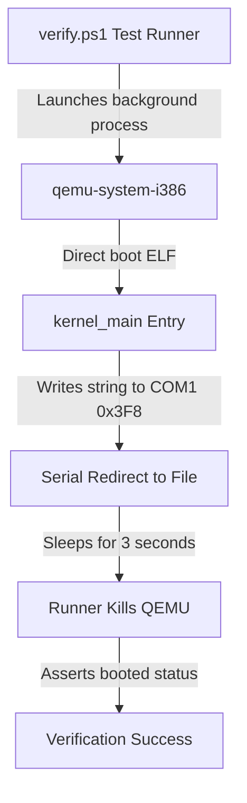

# DByteOS QEMU Boot Smoke (v10.50.0)

`v10.50.0` is a DByte App UI Service Pack Foundation release. It keeps the existing `gfx-console-shell` kernel command and generic `run <app_name>` runner while adding the static `uidemo` app. `uidemo` combines existing services only: `KERNEL_GRAPHICS_LOG_CLEAR = 7`, `KERNEL_GRAPHICS_LOG = 6`, `KERNEL_STATUS = 1`, and `KERNEL_TICKS = 2`. It clears the graphics log adapter, writes `GRAPHICS LOG READY`, reads kernel status, and reads controlled IRQ0 tick-window telemetry without adding a VM opcode, service id, shell command, loader, heap allocation, dynamic registry, or hardware mutation. The static app registry now contains exactly `hello`, `math`, `sysinfo`, `ticks`, `tickmath`, `argtest`, `strtest`, `logtest`, `logclear`, and `uidemo`; `apps` renders as four bounded lines: `apps: hello math sysinfo`, `apps: ticks tickmath argtest`, `apps: strtest logtest logclear`, and `apps: uidemo`. QEMU proof artifacts: `tmp\qemu_gfx_console_uidemo_v10.50.0.serial.log`, `tmp\qemu_gfx_console_uidemo_v10.50.0.ppm`, and `tmp\qemu_gfx_console_uidemo_v10.50.0.png`.

`v10.49.0` is a DByte Graphics Log Clear Service Foundation release. It keeps the existing `gfx-console-shell` kernel command and generic `run <app_name>` runner while adding `KERNEL_GRAPHICS_LOG_CLEAR = 7`, a no-allocation KCALL service that consumes no VM stack arguments, calls the `VmOutput::clear_log()` adapter event, writes `LOG CLEARED`, and returns no stack value for the static `logclear` proof app. The static app registry now contains exactly `hello`, `math`, `sysinfo`, `ticks`, `tickmath`, `argtest`, `strtest`, `logtest`, and `logclear`; `apps` renders as three bounded lines: `apps: hello math sysinfo`, `apps: ticks tickmath argtest`, and `apps: strtest logtest logclear`. It avoids filesystem loaders, parser/compiler paths, dynamic registry, text-shell dispatch, BYTEDECK paths, heap allocation, process bridges, VM framebuffer access, PIC/IDT/IRQ changes, IRQ0 behavior changes, IRQ1 unmask, or STI. QEMU proof artifacts: `tmp\qemu_gfx_console_logclear_v10.49.0.serial.log`, `tmp\qemu_gfx_console_logclear_v10.49.0.ppm`, and `tmp\qemu_gfx_console_logclear_v10.49.0.png`.

`v10.48.0` is a DByte Graphics Log Service Foundation release. It keeps the existing `gfx-console-shell` kernel command and generic `run <app_name>` runner while adding `KERNEL_GRAPHICS_LOG = 6`, a no-allocation KCALL service that consumes one VM stack string constant and writes that borrowed text through `VmOutput` for the static `logtest` proof app. The VM owns argument pop, type checks, and const-table bounds checks; the kernel host receives borrowed `VmHostArgs::StrConst(&str)` and returns no stack value for service 6. The static app registry now contains exactly `hello`, `math`, `sysinfo`, `ticks`, `tickmath`, `argtest`, `strtest`, and `logtest`; `apps` renders as three bounded lines: `apps: hello math sysinfo`, `apps: ticks tickmath argtest`, and `apps: strtest logtest`. It avoids filesystem loaders, parser/compiler paths, dynamic registry, text-shell dispatch, BYTEDECK paths, heap allocation, process bridges, PIC/IDT/IRQ changes, IRQ0 behavior changes, IRQ1 unmask, or STI. QEMU proof artifacts: `tmp\qemu_gfx_console_logtest_v10.48.0.serial.log`, `tmp\qemu_gfx_console_logtest_v10.48.0.ppm`, and `tmp\qemu_gfx_console_logtest_v10.48.0.png`. `v10.47.1` is a DByte Graphics Console X Glyph Polish release. It keeps the existing `gfx-console-shell` command, generic `run <app_name>` runner, `strtest`, KCALL behavior, service ids, app registry, VM opcode set, and graphics clipping unchanged while adding the missing uppercase `X` glyph so the proof line renders as `ARG TEXT DBYTE SERVICE ARG`. It avoids filesystem loaders, parser/compiler paths, dynamic registry, text-shell dispatch, BYTEDECK paths, heap allocation, process bridges, PIC/IDT/IRQ changes, IRQ0 behavior changes, IRQ1 unmask, or STI. QEMU proof artifacts: `tmp\qemu_gfx_console_strtest_xglyph_v10.47.1.serial.log`, `tmp\qemu_gfx_console_strtest_xglyph_v10.47.1.ppm`, and `tmp\qemu_gfx_console_strtest_xglyph_v10.47.1.png`. `v10.47.0` is a DByte Kernel Service String Argument Foundation release. It keeps the existing `gfx-console-shell` kernel command and generic `run <app_name>` runner while adding `KERNEL_ECHO_STR = 5`, a no-allocation KCALL service that consumes one VM stack string constant and writes `ARG TEXT DBYTE SERVICE ARG` for the static `strtest` proof app. The VM owns argument pop, type checks, and const-table bounds checks; the kernel host receives borrowed `VmHostArgs::StrConst(&str)` and returns no stack value for service 5. The static app registry now contains exactly `hello`, `math`, `sysinfo`, `ticks`, `tickmath`, `argtest`, and `strtest`; `apps` renders as three bounded lines: `apps: hello math sysinfo`, `apps: ticks tickmath argtest`, and `apps: strtest`. It avoids filesystem loaders, parser/compiler paths, dynamic registry, text-shell dispatch, BYTEDECK paths, heap allocation, process bridges, PIC/IDT/IRQ changes, IRQ0 behavior changes, IRQ1 unmask, or STI. QEMU proof artifacts: `tmp\qemu_gfx_console_strtest_v10.47.0.serial.log`, `tmp\qemu_gfx_console_strtest_v10.47.0.ppm`, and `tmp\qemu_gfx_console_strtest_v10.47.0.png`. `v10.46.0` is a DByte Kernel Service Argument Foundation release. It keeps the existing `gfx-console-shell` kernel command and generic `run <app_name>` runner while adding `KERNEL_ECHO_I32 = 4`, a read-only KCALL service that consumes one VM stack i32 and writes `ARG VALUE 7` for the static `argtest` proof app. The VM owns argument pop and stack underflow checks; the kernel host receives fixed `VmHostArgs` and returns no stack value for service 4. The static app registry now contains exactly `hello`, `math`, `sysinfo`, `ticks`, `tickmath`, and `argtest`; `apps` renders as two bounded lines: `apps: hello math sysinfo` and `apps: ticks tickmath argtest`. It avoids filesystem loaders, parser/compiler paths, dynamic registry, text-shell dispatch, BYTEDECK paths, heap allocation, process bridges, PIC/IDT/IRQ changes, IRQ0 behavior changes, IRQ1 unmask, or STI. QEMU proof artifacts: `tmp\qemu_gfx_console_argtest_v10.46.0.serial.log`, `tmp\qemu_gfx_console_argtest_v10.46.0.ppm`, and `tmp\qemu_gfx_console_argtest_v10.46.0.png`. `v10.45.1` is a DByte Graphics Log Clipping Polish release. It keeps the existing `gfx-console-shell` kernel command, the existing generic `run <app_name>` runner, the exact static app registry, and the `tickmath` KCALL return-value behavior. Graphics log rows are cleared before redraw and variable log text is clipped to the console content edge, so QEMU proof captures should not show stale right-edge glyphs after `run tickmath`. It avoids filesystem loaders, parser/compiler paths, dynamic registry, text-shell dispatch, BYTEDECK paths, heap allocation, process bridges, PIC/IDT/IRQ changes, IRQ0 fire, IRQ1 unmask, or STI. QEMU proof artifacts: `tmp\qemu_gfx_console_tickmath_clip_v10.45.1.serial.log`, `tmp\qemu_gfx_console_tickmath_clip_v10.45.1.ppm`, and `tmp\qemu_gfx_console_tickmath_clip_v10.45.1.png`. `v10.45.0` is a DByte Kernel Service Return Value Foundation release. It keeps the existing `gfx-console-shell` kernel command and adds read-only `KERNEL_TICK_VALUE = 3` service return access through the existing `KCALL` boundary. The static app registry now contains exactly `hello`, `math`, `sysinfo`, `ticks`, and `tickmath`; `run tickmath` prints `APP TICKMATH`, receives the controlled IRQ0 tick target as an i32 on the VM stack, adds `1`, and prints `9`. This is not a persistent runtime clock. It avoids filesystem loaders, parser/compiler paths, dynamic registry, text-shell dispatch, BYTEDECK paths, heap allocation, process bridges, PIC/IDT/IRQ changes, IRQ0 fire, IRQ1 unmask, or STI. QEMU proof artifacts: `tmp\qemu_gfx_console_tickmath_v10.45.0.serial.log`, `tmp\qemu_gfx_console_tickmath_v10.45.0.ppm`, and `tmp\qemu_gfx_console_tickmath_v10.45.0.png`. `v10.44.0` is a DByte Kernel Tick Service Foundation release. It keeps the existing `gfx-console-shell` kernel command and adds read-only `KERNEL_TICKS = 2` service access through the existing `KCALL` boundary. The static app registry now contains exactly `hello`, `math`, `sysinfo`, and `ticks`; `run ticks` prints `APP TICKS` and reports controlled IRQ0 tick-window telemetry as `IRQ0 TICKS 0008` and `IRQ0 MASKED`. This is not a persistent runtime clock. It avoids filesystem loaders, parser/compiler paths, dynamic registry, text-shell dispatch, BYTEDECK paths, heap allocation, process bridges, PIC/IDT/IRQ changes, IRQ0 fire, IRQ1 unmask, or STI. QEMU proof artifacts: `tmp\qemu_gfx_console_ticks_v10.44.0.serial.log`, `tmp\qemu_gfx_console_ticks_v10.44.0.ppm`, and `tmp\qemu_gfx_console_ticks_v10.44.0.png`. `v10.43.0` is a DByte Kernel Service Call Foundation release. It keeps the existing `gfx-console-shell` kernel command and adds a narrow `KCALL <service_id>` host-call boundary for embedded DByte apps. The static app registry now contains exactly `hello`, `math`, and `sysinfo`; `run sysinfo` prints `APP SYSINFO` and calls service id `1` for deterministic kernel status lines while preserving generic `run <app_name>` dispatch. It avoids filesystem loaders, parser/compiler paths, dynamic registry, text-shell dispatch, BYTEDECK paths, heap allocation, process bridges, PIC/IDT/IRQ changes, IRQ1, or STI. QEMU proof artifacts: `tmp\qemu_gfx_console_kcall_v10.43.0.serial.log`, `tmp\qemu_gfx_console_kcall_v10.43.0.ppm`, and `tmp\qemu_gfx_console_kcall_v10.43.0.png`. `v10.42.0` is a DByte Generic Embedded App Runner Foundation release. It keeps the existing `gfx-console-shell` kernel command and upgrades static graphics-shell app execution from separate `run hello` / `run math` branches to generic `run <app_name>` lookup through the embedded registry. It preserves exactly two apps, `hello` and `math`, keeps deterministic `run nope` app-not-found behavior, and avoids filesystem loaders, parser/compiler paths, dynamic registry, text-shell dispatch, BYTEDECK paths, heap allocation, process bridges, IRQ changes, or VM opcode changes. QEMU proof artifacts: `tmp\qemu_gfx_console_generic_apps_v10.42.0.serial.log`, `tmp\qemu_gfx_console_generic_apps_v10.42.0.ppm`, and `tmp\qemu_gfx_console_generic_apps_v10.42.0.png`. `v10.41.0` is a DByte Embedded App Registry Foundation release. It keeps the existing `gfx-console-shell` kernel command and adds static graphics-shell app commands `apps`, `run hello`, and `run math` to the bounded session without adding a filesystem loader, parser/compiler, dynamic registry, text-shell dispatch, BYTEDECK path, or VM opcode. QEMU proof artifacts: `tmp\qemu_gfx_console_apps_v10.41.0.serial.log`, `tmp\qemu_gfx_console_apps_v10.41.0.ppm`, and `tmp\qemu_gfx_console_apps_v10.41.0.png`. `v10.40.0` is a DByte Graphics Shell VM Command Foundation release. It keeps the existing `gfx-console-shell` kernel command and adds one graphics-shell command, `vm`, to the bounded session alongside `help`, `status`, `clear`, and `exit`. The `vm` command runs only the existing embedded VM probe through a no-heap capture adapter, renders `command: vm`, `DBYTE VM ONLINE`, and `42` in the graphics SYSTEM LOG, and prints `gfx-console-shell: command dispatched: vm` for the QEMU proof without adding a filesystem loader, parser/compiler, app registry, text-shell dispatch, or VM opcode. QEMU proof artifacts: `tmp\qemu_gfx_console_vm_v10.40.0.serial.log`, `tmp\qemu_gfx_console_vm_v10.40.0.ppm`, and `tmp\qemu_gfx_console_vm_v10.40.0.png`. `v10.39.0` is a DByte Graphics Console Session Loop Foundation release. It keeps the existing `gfx-console-shell` command surface and upgrades it from one-shot dispatch to a bounded four-command graphics session loop with `help`, `status`, `clear`, `exit`, deterministic unknown-command handling, fixed 32-byte input buffering, and no text-shell or VM execution. QEMU proof artifacts: `tmp\qemu_gfx_console_session_v10.39.0.serial.log`, `tmp\qemu_gfx_console_session_v10.39.0.ppm`, and `tmp\qemu_gfx_console_session_v10.39.0.png`. `v10.38.0` is a DByte Graphics Console Command Dispatch Foundation release. It adds exactly one `gfx-console-shell` command that enters one-way Mode 13h, redraws the existing graphics console, accepts one bounded PS/2-polled command line, dispatches the graphics-only `status` command, renders deterministic unknown-command output, and prints `gfx-console-shell: command dispatched: status` for the QEMU proof without executing text-shell commands or VM code. QEMU proof artifacts: `tmp\qemu_gfx_console_shell_v10.38.0.serial.log`, `tmp\qemu_gfx_console_shell_v10.38.0.ppm`, and `tmp\qemu_gfx_console_shell_v10.38.0.png`. `v10.37.0` is a DByte Graphics Console Input Echo Foundation release. It adds exactly one `gfx-console-input` command that enters one-way Mode 13h, redraws the existing graphics console, echoes a bounded PS/2-polled input line on the pixel prompt, and prints `gfx-console-input: captured line: hello` for the QEMU proof without parsing or executing the typed text. QEMU proof artifacts: `tmp\qemu_gfx_console_input_v10.37.0.serial.log`, `tmp\qemu_gfx_console_input_v10.37.0.ppm`, and `tmp\qemu_gfx_console_input_v10.37.0.png`. `v10.36.0` is a DByte Graphics Console Cursor Foundation release. It adds no commands, keeps `gfx-console` one-way in Mode 13h, draws a static pixel cursor after `dbyte-kernel>`, preserves hardware boundaries, and locks derived cursor placement with no blink, timer, or input loop. QEMU proof artifacts: `tmp\qemu_gfx_console_cursor_v10.36.0.serial.log`, `tmp\qemu_gfx_console_cursor_v10.36.0.ppm`, and `tmp\qemu_gfx_console_cursor_v10.36.0.png`. `v10.35.1` is a DByte Graphics Console Glyph Polish release. It adds no commands, keeps `gfx-console` one-way in Mode 13h, preserves hardware boundaries, and locks the glyph coverage needed for the current graphics console. QEMU proof artifacts: `tmp\qemu_gfx_console_v10.35.1.serial.log`, `tmp\qemu_gfx_console_v10.35.1.ppm`, and `tmp\qemu_gfx_console_v10.35.1.png`. `v10.35.0` is a DByte Graphics Console Foundation release. It adds exactly one manual `gfx-console` command that enters VGA Mode 13h, renders a structured pixel console through the existing `vga_gfx` drawing primitives, and keeps `gfx-show`, text boot, embedded DByte boot script, VM command surface, keyboard polling, and IRQ boundaries unchanged. `v10.34.1` is a DByte VGA Graphics Surface Hardening release. It adds no commands and preserves the `v10.34.0` one-way `gfx-show` Mode 13h surface while tightening verifier guards around exact output, framebuffer and resolution constants, the explicit VGA port allowlist, forbidden PIC/IDT/IRQ paths, VM command surface, keyboard polling, and unchanged hardware primitive boundaries. `v10.34.0` is a DByte VGA Graphics Surface Foundation release. It adds exactly one manual `gfx-show` command that enters VGA Mode 13h, clears the `0xA0000` framebuffer, draws a static 320x200 pixel DByteOS surface, and leaves the default text boot, embedded DByte boot script, VM command surface, keyboard polling, and IRQ boundaries unchanged. `v10.33.1` is a DByte Embedded Boot Script Hardening release. It adds no commands and preserves the `v10.33.0` embedded boot script, VM command outputs, VGA VM status row, static bytecode architecture, adapter isolation, deterministic boot-script error handling, and IRQ boundaries while tightening verifier guards around boot order, command surface, static bytecode, and forbidden loader/parser/compiler/heap/process paths. `v10.33.0` is a DByte Embedded Boot Script Foundation release. It runs one static embedded DByte bytecode boot script automatically before the shell prompt, prints `DBYTE BOOT SCRIPT` and `2`, adds boot-script status fields to `dbyte-vm-status`, keeps `dbyte-vm-run-probe` unchanged, keeps the VM isolated through the existing adapter, adds no commands, and preserves IRQ boundaries. `v10.32.1` is a DByte Kernel VM Probe Hardening release. It adds no commands and preserves the `v10.32.0` rendered DByte kernel VM probe outputs while tightening verifier guards around the exact opcode set, fixed stack, deterministic VM errors, no host std/heap/filesystem/process paths, adapter isolation, and unchanged IRQ boundaries. `v10.32.0` is a DByte Kernel VM Probe Foundation release. It adds exactly two `dbyte-vm-*` commands that run one embedded `no_std` DByte bytecode probe inside the kernel while keeping host parser/compiler/std modules, filesystem loading, process spawning, BYTEDECK, and IRQ runtime behavior out of the kernel. `v10.31.1` is a Controlled IRQ0 Tick Counter Window Hardening release. It adds no commands and preserves the `v10.31.0` rendered IRQ0 tick counter window outputs while tightening verifier guards around the fixed target, software-only arm, bounded fire transaction, safe return state, handler order, VGA status classifications, denied IRQ1/runtime paths, keyboard polling, and existing hardware primitive boundaries. `v10.31.0` is a Controlled IRQ0 Tick Counter Window Foundation release. It adds exactly four manual `irq0-ticks-*` commands that extend the proven one-shot window into a bounded 8-tick transaction, keeps IF disabled before return, restores the original PIC master mask, leaves IRQ0 masked, redraws the VGA IRQ0 status after the window closes, and does not enable persistent STI, IRQ1, scheduler loops, background redraw, or keyboard IRQ mode. `v10.30.1` is a Controlled IRQ0 Delivery One-Shot Window Hardening release. It adds no commands and preserves the `v10.30.0` rendered IRQ0 window outputs while tightening verifier guards around the arm precondition chain, bounded `sti`/`cli` transaction order, handler self-mask and EOI order, VGA status classifications, no persistent IRQ0 delivery state, no IRQ1 path, no scheduler/timer loop/background redraw, keyboard polling, and existing PIC_EOI, IDT `0x81`, `int 0x81`, and IRQ0 descriptor bind boundaries. `v10.30.0` is a Controlled IRQ0 Delivery One-Shot Window Foundation release. It adds exactly four manual `irq0-window-*` commands that require the existing PIC remap, manual PIC_EOI, IRQ0 descriptor bind, and transactional IRQ0 unmask proofs before opening one bounded `sti` window, then executes `cli`, restores the original PIC master mask, returns with IF disabled and IRQ0 masked, reports the IRQ0 delivery count, and redraws the VGA IRQ0 status line without enabling runtime IRQ activation, IRQ1, scheduler loops, background redraw, or keyboard IRQ mode. `v10.29.3` is a VGA Text Window Cleanup release. It keeps the direct VGA text window visual-only, clears the full 80x25 text screen before each draw, centers the panel, preserves the single `ui-redraw` command and serial prompt behavior, keeps keyboard polling, and does not advance IRQ activation. `v10.29.2` is a First VGA Text Window Smoke release. It renders a static DByteOS window directly into VGA text memory, adds the `ui-redraw` command, preserves serial boot output, keeps keyboard polling, and does not advance IRQ activation. `v10.29.1` is a Controlled IRQ0 Timer Handler Stub Hardening release. It adds no commands and preserves the `v10.29.0` rendered IRQ0 handler stub outputs while tightening verifier guards around exact output, IRQ0 wrapper structure, master PIC_EOI helper callsites, IRQ0 self-mask read-modify-write behavior, denied activation paths, no IRQ1 path, keyboard polling, and scoped formatter gating. `v10.29.0` is a Controlled IRQ0 Timer Handler Stub Foundation release. It prepares an unreachable IRQ0 timer handler stub body with software counter increment, IRQ0 self-mask, and master PIC_EOI helper paths while keeping STI disabled, IRQ0 masked outside transactional smoke, hardware IRQ delivery disabled, runtime irq inactive, and keyboard polling unchanged. `v10.28.1` is an IRQ0 Activation Preflight Hardening release.

Pinned graphics-session serial proofs remain: `gfx-console-shell: command dispatched: help`, `gfx-console-shell: command dispatched: status`, `gfx-console-shell: command dispatched: clear`, `gfx-console-shell: command dispatched: vm`, and `gfx-console-shell: exit`.

Pinned `v10.50.0` graphics uidemo serial proofs are: `gfx-console-shell: command dispatched: apps`, `gfx-console-shell: app dispatched: uidemo`, and `gfx-console-shell: exit`.

Pinned `v10.50.0` graphics uidemo proof strings are: `command: apps`, `apps: hello math sysinfo`, `apps: ticks tickmath argtest`, `apps: strtest logtest logclear`, `apps: uidemo`, `command: run uidemo`, `APP UIDEMO`, `GRAPHICS LOG READY`, `KERNEL ONLINE`, and `IRQ0 TICKS 0008`.

`v10.28.0` is an IRQ0 Activation Preflight release. It adds three read-only preflight commands that read the existing sticky IRQ0 descriptor-bind, transactional IRQ0 unmask, and manual PIC_EOI smoke proofs while keeping STI disabled, IRQ0 currently masked, runtime IRQ inactive, and activation denied.

`v10.27.1` is a Controlled PIC IRQ0 Unmask One-Shot Smoke Hardening release. It adds no commands and preserves the `v10.27.0` rendered IRQ0 unmask smoke outputs while tightening verifier guards around exact output, transactional source ordering, IRQ0-only mask transformation, restore-before-return, sticky proof behavior, forbidden IRQ1/slave-PIC/STI/delivery paths, keyboard polling, and the single manual PIC_EOI, vector `0x81` bind, and `int 0x81` callsites.

`v10.27.0` is a Controlled PIC IRQ0 Unmask One-Shot Smoke Foundation release. It adds a manual-only transactional IRQ0 PIC mask smoke that reads the master mask, temporarily clears only the IRQ0 mask bit, records proof telemetry, restores the original master mask before returning, and keeps `sti`, hardware IRQ delivery, IRQ0 handler invocation, handler-triggered EOI, IRQ1 unmask, slave PIC mask writes, keyboard IRQ mode, and runtime IRQ activation disabled. `v10.26.1` is a Controlled IRQ0 Timer Bind One-Shot Smoke Hardening release. It adds no commands and preserves the `v10.26.0` rendered IRQ0 bind smoke outputs while tightening verifier guards around exact output, one-shot sequencing, PIC-derived IRQ0 vector selection, inert stub isolation, forbidden PIC unmask/STI/hardware delivery, keyboard polling, and the single manual PIC_EOI, vector `0x81` bind, and `int 0x81` callsites. `v10.26.0` is a Controlled IRQ0 Timer Bind One-Shot Smoke Foundation release. It adds a manual-only one-shot IRQ0 timer IDT descriptor bind derived from the PIC master remap offset while keeping PIC IRQ0/IRQ1 unmask disabled, `sti` disabled, hardware IRQ delivery denied, handler-triggered EOI denied, keyboard polling unchanged, runtime IRQ inactive, and existing PIC_EOI, vector `0x81` bind, and `int 0x81` callsites unchanged. `v10.25.1` is a Controlled Hardware IRQ Delivery Candidate Hardening release. It adds no commands and preserves the `v10.25.0` rendered candidate outputs while tightening verifier guards around candidate read-only isolation, existing proof/bridge telemetry sources, denied delivery fields, forbidden hardware mutation, keyboard polling, and the single manual PIC_EOI, IDT bind, and `int 0x81` callsites. `v10.25.0` is a Controlled Hardware IRQ Delivery Candidate Foundation release. It adds a read-only hardware IRQ delivery candidate above the proven manual PIC_EOI, IDT bind, and IDT invocation chain while keeping candidate readiness denied, IRQ0/IRQ1 delivery denied, live IRQ handler bind denied, handler-triggered EOI denied, `sti` disabled, PIC lines masked, keyboard polling unchanged, runtime IRQ inactive, and the single manual PIC_EOI, IDT bind, and `int 0x81` callsites unchanged. `v10.24.1` is a Controlled IDT Invocation Runtime Bridge Hardening release. It adds no commands and preserves the `v10.24.0` rendered invocation-bridge outputs while tightening verifier guards around sticky proof sources, read-only bridge isolation, denied runtime delivery, forbidden hardware mutation, and the single manual PIC_EOI, IDT bind, and `int 0x81` callsites. `v10.24.0` is a Controlled IDT Invocation Runtime Bridge Foundation release. It adds a read-only bridge above the manual `0x81` IDT invocation smoke, reports sticky bind/invocation proof for the current boot, and keeps live IRQ delivery denied, IRQ handler hardware reachability denied, handler-triggered EOI denied, runtime IRQ inactive, `sti` disabled, PIC lines masked, keyboard polling unchanged, and the single manual PIC_EOI, IDT bind, and `int 0x81` callsites unchanged. `v10.23.1` is a Controlled IDT Vector Invocation One-Shot Smoke Hardening release. It adds no commands and preserves the `v10.23.0` manual invocation outputs while tightening verifier guards around the exact state sequence, the single manual `int 0x81` callsite, inert-stub telemetry, sticky proof, forbidden IRQ0/IRQ1 binding, forbidden runtime activation, keyboard polling, and the single manual PIC_EOI callsite. `v10.23.0` is a Controlled IDT Vector Invocation One-Shot Smoke Foundation release. It adds a manual one-shot command path that may invoke dedicated software interrupt vector `0x81` exactly once after the current boot has proven the manual `0x81` IDT bind, records inert-stub reach telemetry, consumes the invocation latch, and keeps IRQ0/IRQ1 binding denied, runtime IRQ inactive, `sti` disabled, PIC lines masked, keyboard polling unchanged, handler-triggered EOI denied, and the single manual PIC_EOI callsite unchanged. `v10.22.1` is a Controlled IDT Bind Runtime Bridge Hardening release. It adds no commands and preserves the `v10.22.0` bridge outputs while tightening verifier guards around sticky proof source, read-only bridge isolation, forbidden interrupt invocation, forbidden IRQ0/IRQ1 binding, and the single manual PIC_EOI callsite. `v10.22.0` is a Controlled IDT Bind Runtime Bridge Foundation release. It adds a read-only bridge above the manual IDT bind smoke proof while keeping interrupt invocation denied, live IRQ bind denied, IRQ handler reachability denied, runtime IRQ inactive, `sti` disabled, PIC lines masked, keyboard polling unchanged, and the single manual PIC_EOI callsite unchanged. `v10.21.1` is a Controlled IDT Bind One-Shot Smoke Hardening release. It adds no commands and preserves `v10.21.0` IDT bind smoke outputs while tightening verifier guards around exact output, the one-shot state sequence, vector `0x81`, forbidden vector `0x80`, forbidden IRQ0/IRQ1 binds, forbidden interrupt invocation, and the single manual PIC_EOI callsite. `v10.21.0` is a Controlled IDT Bind One-Shot Smoke Foundation release. It adds a manual one-shot command path that may perform exactly one IDT descriptor bind to dedicated non-IRQ vector `0x81` after explicit arming while keeping IRQ0/IRQ1 binding denied, interrupt invocation denied, handler-triggered EOI denied, runtime IRQ inactive, `sti` disabled, PIC lines masked, keyboard polling unchanged, and the single manual PIC_EOI callsite unchanged. `v10.20.1` is a Controlled IRQ Handler Bind Candidate Hardening release. It adds no commands and preserves `v10.20.0` bind-candidate outputs while tightening verifier guards around exact output, read-only isolation, forbidden IDT mutation, forbidden IRQ-path invocation, and the single manual PIC_EOI callsite. `v10.5.0` is a Controlled Activation Decision Freeze release. `v10.6.0` is a Controlled Hardware Mutation Readiness Checklist release. `v10.6.1` is a Controlled Hardware Mutation Readiness Checklist Hardening release. `v10.7.0` is a Controlled Mutation Smoke Sequencer Foundation release. `v10.7.1` is a Controlled Mutation Smoke Sequencer Hardening release. `v10.8.0` is a Controlled EOI Write Smoke Preflight release. `v10.8.1` is a Controlled EOI Write Smoke Preflight Hardening release. `v10.9.0` is a First Controlled EOI Write Smoke Candidate release. `v10.9.1` is a First Controlled EOI Write Smoke Candidate Hardening release. `v10.10.0` is a Controlled EOI Write Permit Model Foundation release. `v10.10.1` is a Controlled EOI Write Permit Model Hardening release. `v10.11.0` is a Controlled EOI Write One-Shot Command Path Foundation release. `v10.11.1` is a Controlled EOI Write One-Shot Command Path Hardening release. `v10.12.0` is a Controlled EOI Write One-Shot Latch Foundation release. `v10.12.1` is a Controlled EOI Write One-Shot Latch Hardening release. `v10.13.0` is a Controlled EOI Write One-Shot Permit Bridge Foundation release. `v10.13.1` is a Controlled EOI Write One-Shot Permit Bridge Hardening release. `v10.14.0` is a Controlled EOI Write Permit Transition Model Foundation release. `v10.14.1` is a Controlled EOI Write Permit Transition Model Hardening release. `v10.15.0` is a Controlled EOI Write Permit Evaluation Foundation release. `v10.15.1` is a Controlled EOI Write Permit Evaluation Hardening release. `v10.20.0` is a Controlled IRQ Handler Bind Candidate Foundation release. It adds a read-only bind candidate above the unbound handler EOI stub while keeping live IDT bind denied, IRQ handler reachability denied, handler-triggered EOI denied, runtime IRQ inactive, `sti` disabled, PIC lines masked, and the single manual PIC_EOI callsite unchanged. `v10.19.1` is a Controlled IRQ Handler EOI Stub Hardening release. It adds no commands and preserves `v10.19.0` stub behavior while tightening verifier guards around exact output, read-only isolation, forbidden IRQ-path invocation, and the single manual PIC_EOI callsite. `v10.19.0` is a Controlled IRQ Handler EOI Stub Foundation release. It adds an unbound read-only handler EOI stub placeholder while keeping stub invocation denied, handler-triggered EOI denied, runtime IRQ inactive, `sti` disabled, PIC lines masked, live IRQ handlers unbound, and the single manual PIC_EOI callsite unchanged. `v10.18.1` is a Controlled IRQ Handler EOI Path Candidate Hardening release. It adds no commands and preserves `v10.18.0` candidate behavior while tightening verifier guards around exact output, read-only isolation, forbidden handler invocation, and the single manual PIC_EOI callsite. `v10.18.0` is a Controlled IRQ Handler EOI Path Candidate Foundation release. It adds an unreachable read-only candidate layer for future handler-side EOI while keeping handler-triggered EOI denied, runtime IRQ inactive, `sti` disabled, PIC lines masked, live IRQ handlers unbound, and the single manual PIC_EOI callsite unchanged. `v10.17.2` is a Controlled PIC_EOI Runtime Bridge Readiness Hardening release. It adds no commands and preserves `v10.17.1` sticky proof behavior while tightening verifier guards around bridge output, proof source, read-only isolation, and the single manual PIC_EOI callsite. `v10.17.1` is a Controlled PIC_EOI Runtime Bridge Session Proof Repair release. It splits sticky session proof from transient hardware-smoke performed telemetry while keeping the single manual PIC_EOI callsite unchanged. `v10.17.0` is a Controlled PIC_EOI Runtime Bridge Readiness Foundation release. It adds a read-only bridge from the manual PIC_EOI smoke proof toward future handler readiness while keeping handler-triggered EOI denied, runtime IRQ inactive, `sti` disabled, PIC lines masked, live IRQ handlers unbound, and keyboard polling unchanged. `v10.16.1` is a First Controlled PIC_EOI Write Smoke Hardening release. It preserves the `v10.16.0` manual one-shot hardware smoke outputs while tightening verifier guards around the exact sequence, single allowlisted callsite, forbidden runtime activation paths, and keyboard polling. `v10.16.0` is a First Controlled PIC_EOI Write Smoke Foundation release. It adds a manual one-shot shell command path that may perform exactly one `write_pic_port(PIC_MASTER_COMMAND, PIC_EOI)` after explicit arming while keeping slave EOI writes, IRQ runtime activation, `sti`, PIC unmask, live IDT binding, and keyboard IRQ mode disabled.

`v10.7.1` is not a mutation release. It adds verification guards for exact sequencer command output, read-only helper and dispatcher isolation, stale `v10.7.0` metadata, and no live IRQ0/IRQ1 or keyboard IRQ mode.

`v10.8.0` is not a PIC EOI write release. It adds command and verification preflight for the first-write decision point without writing `PIC_EOI`.

`v10.8.1` is not a PIC EOI write release. It hardens the existing `v10.8.0` first-write preflight contract without writing `PIC_EOI`.

`v10.9.0` is not an EOI write activation release. `eoi-write-smoke-candidate-fire` reports dry-run blocked and does not write `PIC_EOI`.

`v10.9.1` is not an EOI write release. It hardens the existing candidate command/output guards while `eoi-write-smoke-candidate-fire` still reports dry-run blocked and does not write `PIC_EOI`.

`v10.10.1` is not an EOI write release. It hardens the existing permit model only. `eoi-write-permit-status` reports `permit granted: no` and `first PIC_EOI write allowed: no`.

`v10.11.0` is not an EOI write release. `eoi-write-oneshot-arm` reports `one-shot armed: no`, and `eoi-write-oneshot-fire` reports `error: EOI one-shot fire blocked by permit model`.

`v10.11.1` is not a latch or EOI write release. It hardens the existing one-shot command path only; `eoi-write-oneshot-arm` still reports `one-shot armed: no`, and `eoi-write-oneshot-fire` still reports `error: EOI one-shot fire blocked by permit model`.

`v10.12.0` permits a software latch only. `eoi-write-oneshot-latch-arm` reports `one-shot armed: yes`, blocked `eoi-write-oneshot-latch-fire` reports `blocked fire cleared latch: no`, and `eoi-write-oneshot-latch-clear` returns `one-shot armed: no`. No `PIC_EOI` write is performed.

`v10.12.1` keeps the same QEMU command surface and hardens the expected sequence: initial one-shot armed: no, unarmed fire blocked by latch state before hardware write, arm reports `one-shot armed: yes`, armed fire remains blocked by the permit model and does not clear the latch, status remains armed, clear reports `one-shot armed: no`, and status remains unarmed.

`v10.13.0` adds `eoi-write-bridge-note`, `eoi-write-bridge-status`, `eoi-write-bridge-check`, and `eoi-write-bridge-blockers`. The bridge reports `bridge ready: no`, `permit granted: no`, `first PIC_EOI write allowed: no`, `hardware mutation: no`, and `runtime irq active: no`.

`v10.13.1` is hardening-only. It keeps the same QEMU bridge snapshots while verifying that bridge code reads permit and latch telemetry, derives readiness, reports blockers, and never mutates the latch or writes hardware.

`v10.14.0` adds `eoi-write-permit-transition-note`, `eoi-write-permit-transition-status`, `eoi-write-permit-transition-arm`, `eoi-write-permit-transition-clear`, `eoi-write-permit-transition-check`, and `eoi-write-permit-transition-blockers`. The transition reports `permit transition armed: yes/no` while `permit granted: no`, `bridge ready: no`, `first PIC_EOI write allowed: no`, `hardware mutation: no`, and `runtime irq active: no` remain unchanged.

`v10.14.1` is hardening-only. It keeps the same QEMU transition snapshots while verifying the denied/unarmed sequence, single `arm`/`clear` store paths, read-only status/check/blockers paths, no latch or permit mutation, no positive permit state, and no hardware write path.

`v10.15.0` adds `eoi-write-eval-note`, `eoi-write-eval-status`, `eoi-write-eval-check`, and `eoi-write-eval-blockers`. The evaluator reads the permit model, one-shot latch, bridge, transition state, final gate, mutation checklist, preflight, and candidate telemetry while reporting `evaluation ready: no`, `permit granted: no`, `bridge ready: no`, `first PIC_EOI write allowed: no`, `hardware mutation: no`, and `runtime irq active: no`.

`v10.15.1` is hardening-only. It keeps the same evaluator command surface and rendered output while verifying reader ordering, helper and dispatcher isolation, no evaluator latch/transition/permit/bridge mutation, no positive evaluator state, no `PIC_EOI` write, no `sti`, no PIC unmask, no live IRQ0/IRQ1, no live IDT bind, and unchanged keyboard polling.

`v10.16.0` adds `eoi-write-hw-smoke-note`, `eoi-write-hw-smoke-status`, `eoi-write-hw-smoke-arm`, `eoi-write-hw-smoke-fire`, `eoi-write-hw-smoke-clear`, and `eoi-write-hw-smoke-blockers`. The `fire` command is the only manual path allowed to write `PIC_EOI`, and only after `arm`; a successful fire consumes the latch and a repeated fire is blocked.

`v10.16.1` is hardening-only. It keeps the same hw-smoke command surface and rendered outputs while verifying the unarmed-fire, arm, successful-fire, repeated-fire, and clear sequence, the single manual `PIC_EOI` write callsite, no runtime IRQ activation, no `sti`, no PIC unmask, no live IRQ0/IRQ1 bind, and unchanged keyboard polling.

`v10.17.0` adds `eoi-runtime-bridge-note`, `eoi-runtime-bridge-status`, `eoi-runtime-bridge-check`, and `eoi-runtime-bridge-blockers`. The bridge is read-only: it reports session-local manual PIC_EOI smoke proof while keeping runtime bridge readiness denied and handler-triggered EOI disabled.

`v10.17.1` repairs the bridge proof source. The bridge now reads sticky boot-session proof set only by a successful manual `eoi-write-hw-smoke-fire`, not the transient `first PIC_EOI write performed` field that `eoi-write-hw-smoke-clear` resets.

`v10.17.2` is hardening-only. It keeps the rendered bridge and hardware-smoke outputs unchanged while verifying sticky proof source isolation, read-only runtime bridge surfaces, no handler-triggered EOI, and the single manual `PIC_EOI` write boundary.

`v10.18.0` adds `irq-handler-eoi-candidate-note`, `irq-handler-eoi-candidate-status`, `irq-handler-eoi-candidate-check`, and `irq-handler-eoi-candidate-blockers`. The candidate reads runtime bridge readiness but remains unreachable from interrupt handlers and never writes `PIC_EOI`.

`v10.18.1` is hardening-only. It keeps the rendered handler EOI candidate outputs unchanged while verifying candidate helper/dispatcher isolation, read-only runtime bridge input, no handler invocation, and the single manual `PIC_EOI` write boundary.

`v10.19.0` adds `irq-handler-eoi-stub-note`, `irq-handler-eoi-stub-status`, `irq-handler-eoi-stub-check`, and `irq-handler-eoi-stub-blockers`. The stub reads the handler EOI candidate but remains unbound, unreachable from IRQ runtime, and unable to write `PIC_EOI`.

`v10.19.1` is hardening-only. It keeps the rendered handler EOI stub outputs unchanged while verifying stub helper/dispatcher isolation, read-only candidate input, no IRQ-path invocation, and the single manual PIC_EOI write boundary.

`v10.20.1` is hardening-only. It keeps the rendered handler bind candidate outputs unchanged from `v10.20.0` while verifying the bind-candidate input boundary, read-only helper/dispatcher isolation, no live IDT bind, no IRQ-path invocation, and the single manual PIC_EOI write boundary.

`v10.20.0` adds `irq-handler-bind-candidate-note`, `irq-handler-bind-candidate-status`, `irq-handler-bind-candidate-check`, and `irq-handler-bind-candidate-blockers`. The bind candidate reads the unbound handler EOI stub but remains telemetry-only: no live IDT bind, no IRQ0/IRQ1 registration, no interrupt-path reachability, and no handler-triggered `PIC_EOI`.

`v10.21.0` adds `idt-bind-hw-smoke-note`, `idt-bind-hw-smoke-status`, `idt-bind-hw-smoke-arm`, `idt-bind-hw-smoke-fire`, `idt-bind-hw-smoke-clear`, and `idt-bind-hw-smoke-blockers`. The IDT bind hardware smoke is manual-only: `fire` binds dedicated non-IRQ vector `0x81` to an inert test stub only after `arm`, consumes the latch after a successful bind, blocks repeated fire without re-arm, never invokes the interrupt, and never binds IRQ0/IRQ1.

`v10.21.1` is hardening-only. It keeps the rendered IDT bind smoke outputs unchanged from `v10.21.0` while verifying the exact one-shot sequence, the single `0x81` bind callsite, no `0x80`, no IRQ0/IRQ1 bind, no interrupt invocation, no `sti`, no PIC unmask, unchanged keyboard polling, and the single manual PIC_EOI write boundary.

`v10.22.0` adds `idt-bind-runtime-bridge-note`, `idt-bind-runtime-bridge-status`, `idt-bind-runtime-bridge-check`, and `idt-bind-runtime-bridge-blockers`. The bridge reads sticky boot-session proof from the manual IDT bind smoke, not transient `performed`/`consumed`/`armed` telemetry, and keeps runtime IDT bridge readiness denied.

`v10.22.1` is hardening-only. The IDT bind runtime bridge command outputs remain unchanged from `v10.22.0`; verifier guards now lock exact output, sticky proof source, read-only bridge helper/dispatcher isolation, no `int 0x81`, no IRQ0/IRQ1 bind, no `sti`, no PIC unmask, keyboard polling, and the single manual PIC_EOI write boundary.

Hardened transition sequence:

```txt
initial: permit transition armed: no
initial: permit granted: no
check: transition check remains denied
arm: permit transition armed: yes
check: permit granted: no
check: bridge ready: no
status: permit transition armed: yes
clear: permit transition armed: no
status: permit transition armed: no
```

The existing activation decision freeze layer remains in force underneath the mutation checklist, sequencer, and EOI write smoke preflight surfaces.

This carries forward the IRQ Runtime Activation Preconditions 2 release contract as a stricter final gate.

This document describes the virtualized boot smoke verification system built for the **DByteOS Kernel Lab**.

## Architecture & Communication Protocol

The virtualized boot smoke tests verify the bare-metal integrity of our freestanding kernel ELF artifact by launching it under x86 emulation and capturing direct serial console outputs.



### Serial Port Configurations (COM1)

- **Port I/O Address**: `0x3F8`
- **Interrupts**: Disabled (polling mode)
- **Baud Rate Divisor**: `3` (38400 baud)
- **Line Control**: `8` data bits, no parity, `1` stop bit (`8N1`)
- **FIFO**: Enabled (clear buffer, `14` byte threshold)

## Verification Redirection Flags

To test without launching a heavy graphics window, QEMU is executed in standard output redirection mode:

```powershell
qemu-system-i386 -kernel target\i686-unknown-linux-gnu\debug\dbyte_kernel -serial file:tmp\qemu_serial.log -display none
```

- `-kernel`: Boots our freestanding ELF kernel directly without requiring an ISO or GRUB bootloader block.
- `-serial file:tmp\qemu_serial.log`: Redirects COM1 serial outputs into a file which is asynchronously read by the test suite.
- `-display none`: Completely disables graphical display output to keep tests silent and head-less.

## Manual Execution Proof

To manually boot and verify serial output directly on your host machine:

1. **Compile the Freestanding Kernel Workspace**:
   ```powershell
   powershell -ExecutionPolicy Bypass -File .\kernel-lab\scripts\build.ps1
   ```
2. **Execute Headless Serial Emulation**:
   ```powershell
   powershell -ExecutionPolicy Bypass -File .\kernel-lab\scripts\run.ps1 -Serial
   ```

### Expected Command Execution Log

```txt
========================================================================
Launching freestanding DByteOS Kernel Lab in HEADLESS SERIAL mode...
Executing: qemu-system-i386 -kernel "C:\Users\DEADBYTE\Downloads\ProgramingLangPJ\kernel-lab\target\i686-unknown-linux-gnu\debug\dbyte_kernel" -serial stdio -display none
Note: Headless Serial Mode initiated. QEMU is running in the background.
Press [Ctrl + C] in this terminal to terminate the simulation.
========================================================================
DByteOS Kernel Lab
version: 9.0.2
status: booted
target: i686 multiboot
DByteOS Keyboard Lab
status: listening
DBYTE BOOT SCRIPT
2
dbyte-kernel>
```

## Architecture Fallback Matrix

The runner automatically probes your host environment and routes command streams accordingly:

| Installed Emulator   | Executed Command                       | Mode                        |
| -------------------- | -------------------------------------- | --------------------------- |
| `qemu-system-i386`   | `qemu-system-i386 -kernel ...`         | Native 32-bit Emulation     |
| `qemu-system-x86_64` | `qemu-system-x86_64 -kernel ...`       | Fallback 64-bit Emulation   |
| None                 | Graceful skip / friendly path warnings | Isolated offline build only |

## Keyboard Line Editor & Command Dispatch Lab (v9.0.2)

In version `9.0.2`, a polling-based PS/2 keyboard listener and stateful ASCII modifier decoding module are coupled with a zero-allocation **Kernel Command Dispatcher** and line editor. It tracks Shift and CapsLock state transitions, manages a 128-byte line buffer, protects the shell prompt from accidental erasure, and processes typed commands dynamically.

### Key Shell & Command Features

1. **Shell Prompt**: Renders `dbyte-kernel> ` on screen/serial.
2. **Fixed-Size Buffer**: A static mutable buffer `LINE_BUFFER` tracks up to 128 typed characters. Characters typed past this 128-byte boundary are safely discarded to prevent heap overflows and memory unsafety.
3. **Prompt Protection Guard**: Keypresses of Backspace (`\x08`) only perform visual erasure and buffer shrinking when `LINE_LEN > 0`. This guarantees the prompt `"dbyte-kernel> "` cannot be deleted.
4. **Hardened Line Submission**: Pressing Enter (`\n`) outputs `\n`. If `LINE_LEN > 0`, it parses the command dynamically. If `LINE_LEN == 0` (empty line), it simply yields a new prompt without printing anything to preserve console cleanliness.
5. **Command Dispatcher Table**:

| Command Input          | Parameter Handling            | Output Response / Behavior                                                                                                                                                                                                                                                                                                                                                                                                                                                                                                                                                                                                                                                                                                                                                                                                           |
| :--------------------- | :---------------------------- | :----------------------------------------------------------------------------------------------------------------------------------------------------------------------------------------------------------------------------------------------------------------------------------------------------------------------------------------------------------------------------------------------------------------------------------------------------------------------------------------------------------------------------------------------------------------------------------------------------------------------------------------------------------------------------------------------------------------------------------------------------------------------------------------------------------------------------------- |
| `help`                 | None                          | Prints: `commands: help about version clear echo mem uptime banner keyboard reboot-note system cls status mods keys prompt ui-redraw gfx-show gfx-console gfx-console-input gfx-console-shell int3 div0 exception exception-reset handlers handlers --active exception-status exceptions exceptions --verbose exception-help exception-about fault-status fault-reset pf-note pf-status pf-smoke irq-note irq-status irq-handlers eoi-note eoi-status irq-gates irq-gate-status irq-gate-plan irq-gate-arm irq-gate-bind-smoke irq-gate-bind-status irq-gate-state irq-gate-history irq-gate-preflight irq-bind-note irq-bind-status irq-readiness irq-risk irq-preflight irq-runtime-arm irq-runtime-commit irq-runtime-preflight irq-runtime-status irq-runtime-blockers irq-runtime-matrix irq-runtime-readiness irq-runtime-next irq-runtime-activation-plan irq-runtime-token-note irq-runtime-token-status irq-runtime-token-arm irq-runtime-token-clear irq-runtime-gate-note irq-runtime-gate-status irq-runtime-gate-check irq-runtime-gate-blockers irq-runtime-sim-note irq-runtime-sim-status irq-runtime-sim-run irq-runtime-sim-blockers sti-plan sti-status sti-preflight sti-blockers irq-runtime-activation-smoke irq-runtime-activation-smoke-status irq-runtime-activation-smoke-blockers eoi-dispatch-smoke-note eoi-dispatch-smoke-status eoi-dispatch-smoke-plan eoi-dispatch-smoke-blockers pic-unmask-smoke-note pic-unmask-smoke-status pic-unmask-smoke-plan pic-unmask-smoke-blockers idt-runtime-bind-smoke-note idt-runtime-bind-smoke-status idt-runtime-bind-smoke-plan idt-runtime-bind-smoke-blockers irq-runtime-final-gate-note irq-runtime-final-gate-status irq-runtime-final-gate-check irq-runtime-final-gate-blockers irq-runtime-decision-note irq-runtime-decision-status irq-runtime-decision-freeze irq-runtime-decision-blockers irq-runtime-mutation-note irq-runtime-mutation-status irq-runtime-mutation-check irq-runtime-mutation-blockers irq-runtime-mutation-sequence-note irq-runtime-mutation-sequence-status irq-runtime-mutation-sequence-plan irq-runtime-mutation-sequence-blockers eoi-write-smoke-preflight-note eoi-write-smoke-preflight-status eoi-write-smoke-preflight-check eoi-write-smoke-preflight-blockers eoi-write-smoke-candidate-note eoi-write-smoke-candidate-status eoi-write-smoke-candidate-arm eoi-write-smoke-candidate-fire eoi-write-smoke-candidate-blockers eoi-write-permit-note eoi-write-permit-status eoi-write-permit-check eoi-write-permit-blockers eoi-write-oneshot-note eoi-write-oneshot-status eoi-write-oneshot-arm eoi-write-oneshot-fire eoi-write-oneshot-blockers eoi-write-oneshot-latch-note eoi-write-oneshot-latch-status eoi-write-oneshot-latch-arm eoi-write-oneshot-latch-clear eoi-write-oneshot-latch-fire eoi-write-oneshot-latch-blockers eoi-write-bridge-note eoi-write-bridge-status eoi-write-bridge-check eoi-write-bridge-blockers eoi-write-permit-transition-note eoi-write-permit-transition-status eoi-write-permit-transition-arm eoi-write-permit-transition-clear eoi-write-permit-transition-check eoi-write-permit-transition-blockers eoi-write-eval-note eoi-write-eval-status eoi-write-eval-check eoi-write-eval-blockers eoi-write-hw-smoke-note eoi-write-hw-smoke-status eoi-write-hw-smoke-arm eoi-write-hw-smoke-fire eoi-write-hw-smoke-clear eoi-write-hw-smoke-blockers eoi-runtime-bridge-note eoi-runtime-bridge-status eoi-runtime-bridge-check eoi-runtime-bridge-blockers irq-handler-eoi-candidate-note irq-handler-eoi-candidate-status irq-handler-eoi-candidate-check irq-handler-eoi-candidate-blockers irq-handler-eoi-stub-note irq-handler-eoi-stub-status irq-handler-eoi-stub-check irq-handler-eoi-stub-blockers irq-handler-bind-candidate-note irq-handler-bind-candidate-status irq-handler-bind-candidate-check irq-handler-bind-candidate-blockers idt-bind-hw-smoke-note idt-bind-hw-smoke-status idt-bind-hw-smoke-arm idt-bind-hw-smoke-fire idt-bind-hw-smoke-clear idt-bind-hw-smoke-blockers idt-bind-runtime-bridge-note idt-bind-runtime-bridge-status idt-bind-runtime-bridge-check idt-bind-runtime-bridge-blockers idt-invoke-hw-smoke-note idt-invoke-hw-smoke-status idt-invoke-hw-smoke-arm idt-invoke-hw-smoke-fire idt-invoke-hw-smoke-clear idt-invoke-hw-smoke-blockers idt-invoke-runtime-bridge-note idt-invoke-runtime-bridge-status idt-invoke-runtime-bridge-check idt-invoke-runtime-bridge-blockers irq-delivery-candidate-note irq-delivery-candidate-status irq-delivery-candidate-check irq-delivery-candidate-blockers irq0-bind-hw-smoke-note irq0-bind-hw-smoke-status irq0-bind-hw-smoke-arm irq0-bind-hw-smoke-fire irq0-bind-hw-smoke-clear irq0-bind-hw-smoke-blockers irq0-unmask-hw-smoke-note irq0-unmask-hw-smoke-status irq0-unmask-hw-smoke-arm irq0-unmask-hw-smoke-fire irq0-unmask-hw-smoke-clear irq0-unmask-hw-smoke-blockers irq0-preflight-status irq0-preflight-check irq0-preflight-blockers irq0-handler-stub-status irq0-handler-stub-check irq0-handler-stub-blockers irq0-window-status irq0-window-arm irq0-window-fire irq0-window-clear irq0-ticks-status irq0-ticks-arm irq0-ticks-fire irq0-ticks-clear dbyte-vm-status dbyte-vm-run-probe pic-note pic-status pic-plan pic-remap-arm pic-remap-smoke pic-remap-status pic-remap-state pic-remap-history pic-remap-preflight irq-map pic-status --verbose pic-mask-plan pic-mask-status irq-mask-blockers` |
| `about`                | None                          | Prints: `DByteOS Kernel Lab`                                                                                                                                                                                                                                                                                                                                                                                                                                                                                                                                                                                                                                                                                                                                                                                                         |
| `version`              | None                          | Prints: `DByteOS Kernel Lab 9.0.2`                                                                                                                                                                                                                                                                                                                                                                                                                                                                                                                                                                                                                                                                                                                                                                                                  |
| `clear`                | None                          | Clears the entire VGA console and resets prompt location to top-left.                                                                                                                                                                                                                                                                                                                                                                                                                                                                                                                                                                                                                                                                                                                                                                |
| `cls`                  | None                          | Clears the entire VGA console (alias of `clear`).                                                                                                                                                                                                                                                                                                                                                                                                                                                                                                                                                                                                                                                                                                                                                                                    |
| `echo`                 | Matches exactly or with space | Prints a newline (if exact `"echo"`) or prints raw `<text>` parameter.                                                                                                                                                                                                                                                                                                                                                                                                                                                                                                                                                                                                                                                                                                                                                               |
| `mem`                  | None                          | Prints: static lab view memory constraints (heap/allocator `unavailable`).                                                                                                                                                                                                                                                                                                                                                                                                                                                                                                                                                                                                                                                                                                                                                           |
| `uptime`               | None                          | Prints: timer driver warning (`unavailable (no timer driver)`).                                                                                                                                                                                                                                                                                                                                                                                                                                                                                                                                                                                                                                                                                                                                                                      |
| `banner`               | None                          | Renders the beautiful three-line DByteOS logo banner.                                                                                                                                                                                                                                                                                                                                                                                                                                                                                                                                                                                                                                                                                                                                                                                |
| `keyboard`             | None                          | Prints live state telemetry (Shift active, CapsLock active, polling mode).                                                                                                                                                                                                                                                                                                                                                                                                                                                                                                                                                                                                                                                                                                                                                           |
| `reboot-note`          | None                          | Prints reboot ACPI/PS2 driver warning (`unavailable`).                                                                                                                                                                                                                                                                                                                                                                                                                                                                                                                                                                                                                                                                                                                                                                               |
| `system`               | None                          | Prints overall system summary (version, input, display, COM1 serial settings, `filesystem: none`, `process model: none`, `dbyte vm: none`, `idt: loaded`, active exception handlers, `page fault handler: active smoke`, `pic/irq: planned / disabled`, `pic remap: planned / disabled`, `pic dry-run telemetry: available`, `irq handlers: skeleton / disabled`, recovery mode, Page Fault smoke state, `interrupts: disabled`, exception count, and last exception).                                                                                                                                                                                                                                                                                                                                                               |
| `status`               | None                          | Prints quick system status (active, version, input mode).                                                                                                                                                                                                                                                                                                                                                                                                                                                                                                                                                                                                                                                                                                                                                                            |
| `mods`                 | None                          | Prints live modifier states (Shift, CapsLock active statuses).                                                                                                                                                                                                                                                                                                                                                                                                                                                                                                                                                                                                                                                                                                                                                                       |
| `keys`                 | None                          | Prints keyboard mode and casing casing layout definitions.                                                                                                                                                                                                                                                                                                                                                                                                                                                                                                                                                                                                                                                                                                                                                                           |
| `prompt`               | None                          | Prints read-only prompt display (`dbyte-kernel>`).                                                                                                                                                                                                                                                                                                                                                                                                                                                                                                                                                                                                                                                                                                                                                                                   |
| `int3`                 | None                          | Executes the active breakpoint exception handler (vector 3).                                                                                                                                                                                                                                                                                                                                                                                                                                                                                                                                                                                                                                                                                                                                                                         |
| `div0`                 | None                          | Executes the active divide-by-zero diagnostics path through controlled `int 0`, not raw `div`.                                                                                                                                                                                                                                                                                                                                                                                                                                                                                                                                                                                                                                                                                                                                       |
| `exception`            | None                          | Prints legacy telemetry fields: count, last vector, last name.                                                                                                                                                                                                                                                                                                                                                                                                                                                                                                                                                                                                                                                                                                                                                                       |
| `exception-reset`      | None                          | Resets exception telemetry to `0 / none / none`; safe to run repeatedly.                                                                                                                                                                                                                                                                                                                                                                                                                                                                                                                                                                                                                                                                                                                                                             |
| `handlers`             | None                          | Lists active exception handlers for vector 0, 3, and 14, plus planned IRQ skeletons.                                                                                                                                                                                                                                                                                                                                                                                                                                                                                                                                                                                                                                                                                                                                                 |
| `handlers --active`    | None                          | Lists only active handlers for vector 0, 3, and 14.                                                                                                                                                                                                                                                                                                                                                                                                                                                                                                                                                                                                                                                                                                                                                                                  |
| `exception-status`     | None                          | Prints concise exception count, last exception, and interrupt state.                                                                                                                                                                                                                                                                                                                                                                                                                                                                                                                                                                                                                                                                                                                                                                 |
| `exceptions`           | None                          | Alias for `exception-status`.                                                                                                                                                                                                                                                                                                                                                                                                                                                                                                                                                                                                                                                                                                                                                                                                        |
| `exceptions --verbose` | None                          | Prints telemetry with active, smoke, and planned handler groups.                                                                                                                                                                                                                                                                                                                                                                                                                                                                                                                                                                                                                                                                                                                                                                     |
| `exception-help`       | None                          | Prints exception diagnostics command help.                                                                                                                                                                                                                                                                                                                                                                                                                                                                                                                                                                                                                                                                                                                                                                                           |
| `exception-about`      | None                          | Prints the Kernel Exception Subsystem Foundation summary.                                                                                                                                                                                                                                                                                                                                                                                                                                                                                                                                                                                                                                                                                                                                                                            |
| `fault-status`         | None                          | Prints fault recovery status, recovery mode, PF smoke state, and interrupt state.                                                                                                                                                                                                                                                                                                                                                                                                                                                                                                                                                                                                                                                                                                                                                    |
| `fault-reset`          | None                          | Clears exception telemetry and PF smoke recovery state.                                                                                                                                                                                                                                                                                                                                                                                                                                                                                                                                                                                                                                                                                                                                                                              |
| `pf-note`              | None                          | Prints the active smoke page fault note and explains that CR2/error code are available after `pf-smoke`.                                                                                                                                                                                                                                                                                                                                                                                                                                                                                                                                                                                                                                                                                                                             |
| `pf-status`            | None                          | Prints Page Fault handler, trigger, CR2/error-code, and recovery status.                                                                                                                                                                                                                                                                                                                                                                                                                                                                                                                                                                                                                                                                                                                                                             |
| `pf-smoke`             | None                          | Triggers a controlled real Page Fault smoke probe and returns to the shell through the recovery trampoline.                                                                                                                                                                                                                                                                                                                                                                                                                                                                                                                                                                                                                                                                                                                          |
| `irq-note`             | None                          | Prints the planned / disabled PIC/IRQ direction note.                                                                                                                                                                                                                                                                                                                                                                                                                                                                                                                                                                                                                                                                                                                                                                                |
| `irq-status`           | None                          | Prints PIC remap, IRQ handler, keyboard polling, timer, and interrupt status.                                                                                                                                                                                                                                                                                                                                                                                                                                                                                                                                                                                                                                                                                                                                                        |
| `irq-handlers`         | None                          | Prints IRQ0/IRQ1 skeleton handler status with IDT binding disabled.                                                                                                                                                                                                                                                                                                                                                                                                                                                                                                                                                                                                                                                                                                                                                                  |
| `irq-runtime-activation-smoke` | None                          | Prints read-only activation smoke foundation status without hardware mutation.                                                                                                                                                                                                                                                                                                                                                                                                                                                                                                                                                                                                                                                                                                                                       |
| `irq-runtime-activation-smoke-status` | None                          | Prints read-only activation smoke telemetry across token, gate, matrix, simulation, and STI plan.                                                                                                                                                                                                                                                                                                                                                                                                                                                                                                                                                                                                                                                                                                                   |
| `irq-runtime-activation-smoke-blockers` | None                          | Prints blockers keeping activation smoke blocked and runtime IRQ inactive.                                                                                                                                                                                                                                                                                                                                                                                                                                                                                                                                                                                                                                                                                                                                          |
| `eoi-dispatch-smoke-note` | None                          | Prints the controlled dry-run EOI dispatch smoke scope and planned PIC EOI routing.                                                                                                                                                                                                                                                                                                                                                                                                                                                                                                                                                                                                                                                                                                                                  |
| `eoi-dispatch-smoke-status` | None                          | Prints read-only EOI dispatch smoke status without PIC_EOI writes.                                                                                                                                                                                                                                                                                                                                                                                                                                                                                                                                                                                                                                                                                                                                                  |
| `eoi-dispatch-smoke-plan` | None                          | Prints the dry-run EOI dispatch smoke prerequisite and routing plan.                                                                                                                                                                                                                                                                                                                                                                                                                                                                                                                                                                                                                                                                                                                                                 |
| `eoi-dispatch-smoke-blockers` | None                          | Prints blockers keeping EOI dispatch smoke blocked and runtime IRQ inactive.                                                                                                                                                                                                                                                                                                                                                                                                                                                                                                                                                                                                                                                                                                                                        |
| `pic-unmask-smoke-note` | None                          | Prints the controlled dry-run PIC unmask smoke scope without PIC data-port writes.                                                                                                                                                                                                                                                                                                                                                                                                                                                                                                                                                                                                                                                                                                                                  |
| `pic-unmask-smoke-status` | None                          | Prints read-only PIC unmask smoke status without live IRQ unmasking.                                                                                                                                                                                                                                                                                                                                                                                                                                                                                                                                                                                                                                                                                                                                                |
| `pic-unmask-smoke-plan` | None                          | Prints the dry-run PIC unmask prerequisite and data-port guard plan.                                                                                                                                                                                                                                                                                                                                                                                                                                                                                                                                                                                                                                                                                                                                                |
| `pic-unmask-smoke-blockers` | None                          | Prints blockers keeping PIC unmask smoke blocked and runtime IRQ inactive.                                                                                                                                                                                                                                                                                                                                                                                                                                                                                                                                                                                                                                                                                                                                          |
| `idt-runtime-bind-smoke-note` | None                          | Prints the controlled dry-run IDT runtime bind smoke scope without handler binding.                                                                                                                                                                                                                                                                                                                                                                                                                                                                                                                                                                                                                                                                                                                                 |
| `idt-runtime-bind-smoke-status` | None                          | Prints read-only IDT runtime bind smoke status without live IRQ handler activation.                                                                                                                                                                                                                                                                                                                                                                                                                                                                                                                                                                                                                                                                                                                                 |
| `idt-runtime-bind-smoke-plan` | None                          | Prints the dry-run IDT runtime bind prerequisite and handler-bind guard plan.                                                                                                                                                                                                                                                                                                                                                                                                                                                                                                                                                                                                                                                                                                                                       |
| `idt-runtime-bind-smoke-blockers` | None                          | Prints blockers keeping IDT runtime bind smoke blocked and runtime IRQ inactive.                                                                                                                                                                                                                                                                                                                                                                                                                                                                                                                                                                                                                                                                                                                                    |
| `irq-runtime-final-gate-note` | None                          | Prints the final gate release-proof scope and no-mutation invariant. |
| `irq-runtime-final-gate-status` | None                          | Prints the aggregated read-only final gate status across all IRQ runtime readiness inputs. |
| `irq-runtime-final-gate-check` | None                          | Prints the final gate invariant check without enabling runtime IRQ. |
| `irq-runtime-final-gate-blockers` | None                          | Prints final activation blockers keeping IRQ runtime inactive. |
| `irq-runtime-decision-note` | None                          | Prints the controlled activation decision freeze scope and no-mutation invariant. |
| `irq-runtime-decision-status` | None                          | Prints the frozen blocked activation decision contract. |
| `irq-runtime-decision-freeze` | None                          | Prints the same frozen blocked decision contract as the release-proof freeze output. |
| `irq-runtime-decision-blockers` | None                          | Prints blockers keeping the activation decision frozen blocked. |
| `irq-runtime-mutation-note` | None                          | Prints the controlled hardware mutation checklist scope and no-mutation invariant. |
| `irq-runtime-mutation-status` | None                          | Prints the blocked hardware mutation readiness checklist. |
| `irq-runtime-mutation-check` | None                          | Prints the same blocked hardware mutation readiness checklist as the release-proof check output. |
| `irq-runtime-mutation-blockers` | None                          | Prints blockers keeping hardware mutation not ready. |
| `irq-runtime-mutation-sequence-note` | None                          | Prints the controlled mutation smoke sequencer scope and no-mutation invariant. |
| `irq-runtime-mutation-sequence-status` | None                          | Prints the blocked mutation smoke sequence contract. |
| `irq-runtime-mutation-sequence-plan` | None                          | Prints the same blocked mutation smoke sequence as the release-proof plan output. |
| `irq-runtime-mutation-sequence-blockers` | None                          | Prints blockers keeping the mutation smoke sequence not ready. |
| `eoi-write-smoke-preflight-note` | None                          | Prints the controlled first PIC EOI write preflight scope and no-first-write invariant. |
| `eoi-write-smoke-preflight-status` | None                          | Prints the blocked first PIC EOI write preflight contract. |
| `eoi-write-smoke-preflight-check` | None                          | Prints the same blocked first PIC EOI write preflight as the release-proof check output. |
| `eoi-write-smoke-preflight-blockers` | None                          | Prints blockers keeping the first PIC EOI write disallowed. |
| `eoi-write-smoke-candidate-note` | None                          | Prints the first controlled PIC EOI write candidate scope and no-write invariant. |
| `eoi-write-smoke-candidate-status` | None                          | Prints the blocked first controlled EOI write candidate contract. |
| `eoi-write-smoke-candidate-arm` | None                          | Prints the same blocked candidate status without setting any latch. |
| `eoi-write-smoke-candidate-fire` | None                          | Prints dry-run blocked fire output without writing `PIC_EOI`. |
| `eoi-write-smoke-candidate-blockers` | None                          | Prints blockers keeping the first controlled EOI write candidate blocked. |
| `eoi-write-permit-note` | None                          | Prints the controlled EOI write permit model scope and no-permit invariant. |
| `eoi-write-permit-status` | None                          | Prints the denied first controlled EOI write permit contract. |
| `eoi-write-permit-check` | None                          | Prints the same denied permit contract as status. |
| `eoi-write-permit-blockers` | None                          | Prints blockers keeping the first controlled EOI write permit denied. |
| `eoi-write-oneshot-note` | None                          | Prints the controlled EOI write one-shot command path scope and no-fire invariant. |
| `eoi-write-oneshot-status` | None                          | Prints the denied one-shot command path contract. |
| `eoi-write-oneshot-arm` | None                          | Prints the same denied one-shot status without setting any latch. |
| `eoi-write-oneshot-fire` | None                          | Prints permit-blocked one-shot fire output without writing `PIC_EOI`. |
| `eoi-write-oneshot-blockers` | None                          | Prints blockers keeping the one-shot command path denied. |
| `eoi-write-oneshot-latch-note` | None                          | Prints the software-only latch scope and no-write invariant. |
| `eoi-write-oneshot-latch-status` | None                          | Reads the software-only one-shot latch status. |
| `eoi-write-oneshot-latch-arm` | None                          | Sets the software-only latch to armed without enabling fire. |
| `eoi-write-oneshot-latch-clear` | None                          | Clears the software-only latch without touching hardware. |
| `eoi-write-oneshot-latch-fire` | None                          | Reads the latch and remains blocked without writing `PIC_EOI` or clearing the latch. |
| `eoi-write-oneshot-latch-blockers` | None                          | Prints blockers proving the latch is software-only and fire remains denied. |
| `eoi-write-bridge-note` | None                          | Prints the read-only permit/latch bridge scope and no-write invariant. |
| `eoi-write-bridge-status` | None                          | Reads permit and latch telemetry and reports bridge readiness denied. |
| `eoi-write-bridge-check` | None                          | Prints the same read-only bridge readiness contract as a check. |
| `eoi-write-bridge-blockers` | None                          | Prints blockers keeping the bridge denied without mutating latch state. |
| `eoi-write-permit-transition-note` | None                          | Prints the software-only permit transition scope and denied invariant. |
| `eoi-write-permit-transition-status` | None                          | Prints the current software transition state while permit remains denied. |
| `eoi-write-permit-transition-arm` | None                          | Arms only the software transition state. |
| `eoi-write-permit-transition-clear` | None                          | Clears only the software transition state. |
| `eoi-write-permit-transition-check` | None                          | Checks transition state while permit and bridge remain denied. |
| `eoi-write-permit-transition-blockers` | None                          | Prints blockers keeping transition from becoming a real permit. |
| `eoi-write-eval-note` | None                          | Prints the read-only evaluator scope and denied readiness fields. |
| `eoi-write-eval-status` | None                          | Reads the evaluator state without mutating latch, transition, permit, or bridge. |
| `eoi-write-eval-check` | None                          | Prints the same read-only evaluator contract as a check. |
| `eoi-write-eval-blockers` | None                          | Prints blockers keeping the first PIC EOI write path disabled. |
| `eoi-write-hw-smoke-note` | None                          | Prints the manual one-shot hardware smoke scope without touching hardware. |
| `eoi-write-hw-smoke-status` | None                          | Reads the hardware smoke latch and performed state without touching hardware. |
| `eoi-write-hw-smoke-arm` | None                          | Arms the manual one-shot hardware smoke latch without touching hardware. |
| `eoi-write-hw-smoke-fire` | None                          | If armed, performs exactly one `write_pic_port(PIC_MASTER_COMMAND, PIC_EOI)` and consumes the latch. |
| `eoi-write-hw-smoke-clear` | None                          | Clears the manual one-shot hardware smoke latch without touching hardware. |
| `eoi-write-hw-smoke-blockers` | None                          | Prints blockers proving this is not IRQ runtime activation. |
| `eoi-runtime-bridge-note` | None                          | Prints the read-only runtime bridge scope without touching hardware. |
| `eoi-runtime-bridge-status` | None                          | Reports whether the current session has proven manual PIC_EOI smoke and keeps runtime bridge readiness denied. |
| `eoi-runtime-bridge-check` | None                          | Prints the same read-only runtime bridge readiness contract as status. |
| `eoi-runtime-bridge-blockers` | None                          | Prints blockers keeping handler-triggered EOI disabled. |
| `irq-handler-eoi-candidate-note` | None                          | Prints the read-only handler EOI candidate scope without touching hardware. |
| `irq-handler-eoi-candidate-status` | None                          | Reports the unreachable handler EOI candidate with runtime bridge readiness denied. |
| `irq-handler-eoi-candidate-check` | None                          | Prints the same read-only candidate contract as status. |
| `irq-handler-eoi-candidate-blockers` | None                          | Prints blockers keeping handler-triggered EOI disabled and manual-only. |
| `irq-handler-eoi-stub-note` | None                          | Prints the read-only handler EOI stub scope without touching hardware. |
| `irq-handler-eoi-stub-status` | None                          | Reports the unbound handler EOI stub with invocation and PIC_EOI writes denied. |
| `irq-handler-eoi-stub-check` | None                          | Prints the same read-only stub contract as status. |
| `irq-handler-eoi-stub-blockers` | None                          | Prints blockers keeping the stub unbound, unreachable, and manual-only. |
| `irq-handler-bind-candidate-note` | None                          | Prints the read-only handler bind candidate scope without touching hardware. |
| `irq-handler-bind-candidate-status` | None                          | Reports the telemetry-only bind candidate with live IDT bind and IRQ reachability denied. |
| `irq-handler-bind-candidate-check` | None                          | Prints the same read-only bind candidate contract as status. |
| `irq-handler-bind-candidate-blockers` | None                          | Prints blockers keeping live handler bind and IRQ reachability disabled. |
| `idt-bind-hw-smoke-note` | None                          | Prints the manual one-shot IDT bind smoke scope without touching the IDT. |
| `idt-bind-hw-smoke-status` | None                          | Reads the IDT bind smoke latch and performed state without touching the IDT. |
| `idt-bind-hw-smoke-arm` | None                          | Arms the manual one-shot IDT bind smoke latch without touching the IDT. |
| `idt-bind-hw-smoke-fire` | None                          | If armed, performs exactly one `IDT.entries[0x81].set_handler(...)` bind and consumes the latch. |
| `idt-bind-hw-smoke-clear` | None                          | Clears the manual one-shot IDT bind smoke latch without unbinding the descriptor. |
| `idt-bind-hw-smoke-blockers` | None                          | Prints blockers proving this is not IRQ runtime activation or interrupt invocation. |
| `idt-bind-runtime-bridge-note` | None                          | Prints the read-only IDT bind runtime bridge scope without invoking interrupts. |
| `idt-bind-runtime-bridge-status` | None                          | Reports sticky boot-session IDT bind proof while keeping runtime bridge readiness denied. |
| `idt-bind-runtime-bridge-check` | None                          | Prints the same read-only IDT bind runtime bridge contract as status. |
| `idt-bind-runtime-bridge-blockers` | None                          | Prints blockers keeping live IRQ bind and interrupt invocation disabled. |
| `idt-invoke-hw-smoke-note` | None                          | Prints the manual one-shot IDT vector invocation smoke scope without invoking the vector. |
| `idt-invoke-hw-smoke-status` | None                          | Reads the IDT invocation smoke latch, transient telemetry, and sticky invocation proof. |
| `idt-invoke-hw-smoke-arm` | None                          | Arms the invocation smoke only after this boot has proven the manual vector `0x81` bind. |
| `idt-invoke-hw-smoke-fire` | None                          | If armed, invokes exactly one `int 0x81`, records inert-stub reach telemetry, and consumes the latch. |
| `idt-invoke-hw-smoke-clear` | None                          | Clears transient invocation smoke telemetry without resetting sticky proof. |
| `idt-invoke-hw-smoke-blockers` | None                          | Prints blockers proving this is not IRQ runtime activation or PIC EOI dispatch. |
| `idt-invoke-runtime-bridge-note` | None                          | Prints the read-only IDT invocation runtime bridge scope without invoking the vector. |
| `idt-invoke-runtime-bridge-status` | None                          | Reports sticky bind/invocation proof while keeping live IRQ delivery denied. |
| `idt-invoke-runtime-bridge-check` | None                          | Prints the same read-only IDT invocation runtime bridge contract as status. |
| `idt-invoke-runtime-bridge-blockers` | None                          | Prints blockers keeping live IRQ delivery and handler hardware reachability disabled. |
| `irq-delivery-candidate-note` | None                          | Prints the read-only hardware IRQ delivery candidate scope without enabling delivery. |
| `irq-delivery-candidate-status` | None                          | Reports sticky manual proof inputs while keeping IRQ0/IRQ1 delivery denied. |
| `irq-delivery-candidate-check` | None                          | Prints the same read-only hardware IRQ delivery candidate contract as status. |
| `irq-delivery-candidate-blockers` | None                          | Prints blockers keeping hardware IRQ delivery, live handler bind, STI, and PIC unmask disabled. |
| `irq0-bind-hw-smoke-note` | None                          | Prints the manual-only IRQ0 timer bind smoke scope and denied delivery fields. |
| `irq0-bind-hw-smoke-status` | None                          | Prints the IRQ0 timer bind latch, sticky proof, descriptor, and denied runtime fields. |
| `irq0-bind-hw-smoke-arm` | None                          | Arms the manual-only IRQ0 timer bind one-shot smoke path. |
| `irq0-bind-hw-smoke-fire` | None                          | Performs one IRQ0 timer IDT descriptor bind only when armed; otherwise reports blocked. |
| `irq0-bind-hw-smoke-clear` | None                          | Clears transient IRQ0 timer bind smoke latch state without clearing the sticky proof. |
| `irq0-bind-hw-smoke-blockers` | None                          | Prints blockers keeping IRQ0 delivery, PIC unmask, STI, handler EOI, and runtime IRQ disabled. |
| `irq0-unmask-hw-smoke-note` | None                          | Prints the manual-only transactional PIC IRQ0 unmask smoke scope and denied delivery fields. |
| `irq0-unmask-hw-smoke-status` | None                          | Prints the IRQ0 unmask latch, restore telemetry, sticky proof, and denied runtime fields. |
| `irq0-unmask-hw-smoke-arm` | None                          | Arms the manual-only transactional IRQ0 unmask one-shot smoke path. |
| `irq0-unmask-hw-smoke-fire` | None                          | Temporarily clears the master PIC IRQ0 mask bit and immediately restores the original mask when armed; otherwise reports blocked. |
| `irq0-unmask-hw-smoke-clear` | None                          | Clears transient IRQ0 unmask smoke latch state without clearing the sticky proof or touching PIC ports. |
| `irq0-unmask-hw-smoke-blockers` | None                          | Prints blockers keeping IRQ0 masked after fire, IRQ1 masked, STI disabled, and runtime IRQ disabled. |
| `irq0-preflight-status` | None                          | Prints read-only IRQ0 activation preflight proof inputs and denied activation fields. |
| `irq0-preflight-check` | None                          | Prints the same read-only IRQ0 activation preflight contract as status. |
| `irq0-preflight-blockers` | None                          | Prints concise blockers for future bounded STI activation smoke. |
| `irq0-handler-stub-status` | None                          | Prints the prepared IRQ0 timer handler stub paths while keeping hardware reachability denied. |
| `irq0-handler-stub-check` | None                          | Prints the same read-only IRQ0 timer handler stub contract as status. |
| `irq0-handler-stub-blockers` | None                          | Prints blockers keeping the prepared IRQ0 timer handler stub unreachable from hardware. |
| `irq0-window-status` | None                          | Prints the controlled IRQ0 delivery window state, delivery count, restore state, and proof preconditions. |
| `irq0-window-arm` | None                          | Arms the bounded IRQ0 delivery one-shot window only after PIC remap, manual EOI, IRQ0 bind, and transactional unmask proofs exist. |
| `irq0-window-fire` | None                          | Temporarily unmasks IRQ0, opens a bounded `sti` window, executes `cli`, restores the original PIC mask, records deliveries, and redraws the VGA IRQ0 line. |
| `irq0-window-clear` | None                          | Clears transient IRQ0 window telemetry without PIC I/O, STI, or sticky proof mutation. |
| `irq0-ticks-status` | None                          | Prints the controlled IRQ0 8-tick window state, target, observed ticks, restore state, and proof preconditions. |
| `irq0-ticks-arm` | None                          | Arms the bounded IRQ0 8-tick window only after PIC remap, manual EOI, IRQ0 bind, and transactional unmask proofs exist. |
| `irq0-ticks-fire` | None                          | Temporarily unmasks IRQ0, opens a bounded `sti` window until 8 ticks or timeout, executes `cli`, restores the original PIC mask, records ticks, and redraws the VGA IRQ0 line. |
| `irq0-ticks-clear` | None                          | Clears transient IRQ0 tick-window telemetry without PIC I/O, STI, or sticky proof mutation. |
| `dbyte-vm-status` | None                          | Prints the embedded DByte kernel VM readiness contract. |
| `dbyte-vm-run-probe` | None                       | Runs the embedded DByte bytecode probe and prints `DBYTE VM ONLINE` plus `42`. |
| `ui-redraw`            | None                          | Redraws the first static VGA text window and reports the redraw over serial. |
| `gfx-show`             | None                          | Enters VGA Mode 13h, draws the first static pixel graphics surface, and reports the render over serial. |
| `gfx-console`          | None                          | Enters VGA Mode 13h, draws the structured DByte graphics console surface, and reports the render over serial. |
| `gfx-console-input`    | One bounded line via PS/2 polling | Enters VGA Mode 13h, echoes typed input on the graphics prompt row, and prints `gfx-console-input: captured line: <text>` after Enter. |
| `gfx-console-shell`    | Up to five bounded commands via PS/2 polling | Enters VGA Mode 13h, runs a bounded graphics-only session for `help`, `status`, `clear`, `vm`, `apps`, `run <app_name>`, `exit`, app-not-found, or deterministic unknown-command results, and prints dispatch proof over serial. |
| `pic-note`             | None                          | Prints the planned / disabled PIC remap code foundation note.                                                                                                                                                                                                                                                                                                                                                                                                                                                                                                                                                                                                                                                                                                                                                                        |
| `pic-status`           | None                          | Prints PIC remap function, offset, IRQ handler, and interrupt status.                                                                                                                                                                                                                                                                                                                                                                                                                                                                                                                                                                                                                                                                                                                                                                |
| `pic-plan`             | None                          | Prints the PIC remap dry-run plan and ICW values without hardware writes.                                                                                                                                                                                                                                                                                                                                                                                                                                                                                                                                                                                                                                                                                                                                                            |
| `pic-remap-arm`        | None                          | Arms the one-shot controlled PIC remap smoke path.                                                                                                                                                                                                                                                                                                                                                                                                                                                                                                                                                                                                                                                                                                                                                                                   |
| `pic-remap-smoke`      | None                          | Runs the PIC remap ICW smoke only if armed; otherwise reports blocked.                                                                                                                                                                                                                                                                                                                                                                                                                                                                                                                                                                                                                                                                                                                                                               |
| `pic-remap-status`     | None                          | Prints controlled remap smoke arm/executed status.                                                                                                                                                                                                                                                                                                                                                                                                                                                                                                                                                                                                                                                                                                                                                                                   |
| `pic-remap-state`      | None                          | Prints controlled remap state telemetry.                                                                                                                                                                                                                                                                                                                                                                                                                                                                                                                                                                                                                                                                                                                                                                                             |
| `pic-remap-history`    | None                          | Prints controlled remap command history telemetry.                                                                                                                                                                                                                                                                                                                                                                                                                                                                                                                                                                                                                                                                                                                                                                                   |
| `pic-remap-preflight`  | None                          | Prints controlled remap readiness telemetry without hardware writes.                                                                                                                                                                                                                                                                                                                                                                                                                                                                                                                                                                                                                                                                                                                                                                 |
| `irq-map`              | None                          | Prints the planned IRQ0-IRQ15 vector map and no active IRQ handlers.                                                                                                                                                                                                                                                                                                                                                                                                                                                                                                                                                                                                                                                                                                                                                                 |
| `eoi-status`           | None                          | Prints the EOI strategy planned / disabled status.                                                                                                                                                                                                                                                                                                                                                                                                                                                                                                                                                                                                                                                                                                                                                                                   |
| `eoi-note`             | None                          | Explains EOI concepts, PIC ports, master/slave dependencies, and dry-run isolation.                                                                                                                                                                                                                                                                                                                                                                                                                                                                                                                                                                                                                                                                                                                                                  |
| `irq-gates`            | None                          | Prints the planned CPU vector mappings for external interrupts.                                                                                                                                                                                                                                                                                                                                                                                                                                                                                                                                                                                                                                                                                                                                                                      |
| `irq-gate-status`      | None                          | Prints the actual runtime IDT state of IRQ gates 32 and 33.                                                                                                                                                                                                                                                                                                                                                                                                                                                                                                                                                                                                                                                                                                                                                                          |
| `irq-gate-plan`        | None                          | Prints the dormant IRQ0/IRQ1 gate binding plan from compiled helper data.                                                                                                                                                                                                                                                                                                                                                                                                                                                                                                                                                                                                                                                                                                                                                            |
| `irq-gate-arm`         | None                          | Arms the one-shot controlled IRQ gate bind smoke path.                                                                                                                                                                                                                                                                                                                                                                                                                                                                                                                                                                                                                                                                                                                                                                               |
| `irq-gate-bind-smoke`  | None                          | Binds IDT vectors `32/33` to dormant smoke wrappers only if armed; otherwise reports blocked.                                                                                                                                                                                                                                                                                                                                                                                                                                                                                                                                                                                                                                                                                                                                        |
| `irq-gate-bind-status` | None                          | Prints controlled IRQ gate bind smoke arm/executed state and dormant handler status.                                                                                                                                                                                                                                                                                                                                                                                                                                                                                                                                                                                                                                                                                                                                                 |
| `irq-gate-state`       | None                          | Prints read-only IRQ gate bind state telemetry (armed/executed/bound).                                                                                                                                                                                                                                                                                                                                                                                                                                                                                                                                                                                                                                                                                                                                                               |
| `irq-gate-history`     | None                          | Prints read-only IRQ gate bind command history telemetry.                                                                                                                                                                                                                                                                                                                                                                                                                                                                                                                                                                                                                                                                                                                                                                            |
| `irq-gate-preflight`   | None                          | Prints read-only IRQ gate bind preflight telemetry without mutating hardware.                                                                                                                                                                                                                                                                                                                                                                                                                                                                                                                                                                                                                                                                                                                                                        |
| `irq-bind-note`        | None                          | Prints the disabled IRQ0/IRQ1 bind-path note from compiled helper data.                                                                                                                                                                                                                                                                                                                                                                                                                                                                                                                                                                                                                                                                                                                                                              |
| `irq-bind-status`      | None                          | Prints the disabled IRQ0/IRQ1 bind-path status from compiled helper data.                                                                                                                                                                                                                                                                                                                                                                                                                                                                                                                                                                                                                                                                                                                                                            |
| `irq-readiness`        | None                          | Prints runtime IRQ readiness telemetry without enabling interrupts.                                                                                                                                                                                                                                                                                                                                                                                                                                                                                                                                                                                                                                                                                                                                                                  |
| `irq-risk`             | None                          | Prints why runtime IRQ remains blocked.                                                                                                                                                                                                                                                                                                                                                                                                                                                                                                                                                                                                                                                                                                                                                                                              |
| `irq-preflight`        | None                          | Prints pass/unbound/disabled preflight checks for future IRQ activation.                                                                                                                                                                                                                                                                                                                                                                                                                                                                                                                                                                                                                                                                                                                                                             |
| `irq-runtime-preflight` | None                          | Prints consolidated IRQ runtime activation preflight status (consolidates PIC, gates, EOI, keyboard, pf-smoke state).                                                                                                                                                                                                                                                                                                                                                                                                                                                                                                                                                                                                                |
| `irq-runtime-status`   | None                          | Prints consolidated IRQ runtime readiness overview (runtime ready: no / yes).                                                                                                                                                                                                                                                                                                                                                                                                                                                                                                                                                                                                                                                         |
| `irq-runtime-blockers` | None                          | Prints explicit list of blockers preventing runtime IRQ activation.                                                                                                                                                                                                                                                                                                                                                                                                                                                                                                                                                                                                                                                                  |
| `pic-status --verbose` | None                          | Prints verbose PIC dry-run telemetry status.|
| _`<unknown>`_          | Unsupported strings           | Prints: `error: unknown command`                                                                                                                                                                                                                                                                                                                                                                                                                                                                                                                                                                                                                                                                                                                                                                                                     |
| _`<empty>`_            | `LINE_LEN == 0`               | Silent reprompt (cursor moves to new line, prints prompt).                                                                                                                                                                                                                                                                                                                                                                                                                                                                                                                                                                                                                                                                                                                                                                           |

### Register Address Primitives

- **Keyboard Status Register**: Port `0x64` (Read-only)
  - **Bit 0 (OBF - Output Buffer Full)**: A value of `1` indicates that data has been received from the keyboard controller and is ready to be fetched from the output buffer (port `0x60`).
- **Keyboard Output Buffer**: Port `0x60` (Read-only)
  - Contains the 8-bit scancode byte corresponding to the pressed/released key.

### Expected Live Keyboard Output

When launching the simulation in graphical mode:

```powershell
powershell -ExecutionPolicy Bypass -File .\kernel-lab\scripts\run.ps1
```

1. **Left-click** inside the graphical QEMU window to redirect keyboard focus to the virtual machine.
2. Observe the interactive prompt: `dbyte-kernel> `
3. Type commands and press Enter to execute them. For example:
   ```txt
    dbyte-kernel> help
    commands: help about version clear echo mem uptime banner keyboard reboot-note system cls status mods keys prompt ui-redraw gfx-show gfx-console gfx-console-input gfx-console-shell int3 div0 exception exception-reset handlers handlers --active exception-status exceptions exceptions --verbose exception-help exception-about fault-status fault-reset pf-note pf-status pf-smoke irq-note irq-status irq-handlers eoi-note eoi-status irq-gates irq-gate-status irq-gate-plan irq-gate-arm irq-gate-bind-smoke irq-gate-bind-status irq-gate-state irq-gate-history irq-gate-preflight irq-bind-note irq-bind-status irq-readiness irq-risk irq-preflight irq-runtime-arm irq-runtime-commit irq-runtime-preflight irq-runtime-status irq-runtime-blockers irq-runtime-matrix irq-runtime-readiness irq-runtime-next irq-runtime-activation-plan irq-runtime-token-note irq-runtime-token-status irq-runtime-token-arm irq-runtime-token-clear irq-runtime-gate-note irq-runtime-gate-status irq-runtime-gate-check irq-runtime-gate-blockers irq-runtime-sim-note irq-runtime-sim-status irq-runtime-sim-run irq-runtime-sim-blockers sti-plan sti-status sti-preflight sti-blockers irq-runtime-activation-smoke irq-runtime-activation-smoke-status irq-runtime-activation-smoke-blockers eoi-dispatch-smoke-note eoi-dispatch-smoke-status eoi-dispatch-smoke-plan eoi-dispatch-smoke-blockers pic-unmask-smoke-note pic-unmask-smoke-status pic-unmask-smoke-plan pic-unmask-smoke-blockers idt-runtime-bind-smoke-note idt-runtime-bind-smoke-status idt-runtime-bind-smoke-plan idt-runtime-bind-smoke-blockers irq-runtime-final-gate-note irq-runtime-final-gate-status irq-runtime-final-gate-check irq-runtime-final-gate-blockers irq-runtime-decision-note irq-runtime-decision-status irq-runtime-decision-freeze irq-runtime-decision-blockers irq-runtime-mutation-note irq-runtime-mutation-status irq-runtime-mutation-check irq-runtime-mutation-blockers irq-runtime-mutation-sequence-note irq-runtime-mutation-sequence-status irq-runtime-mutation-sequence-plan irq-runtime-mutation-sequence-blockers eoi-write-smoke-preflight-note eoi-write-smoke-preflight-status eoi-write-smoke-preflight-check eoi-write-smoke-preflight-blockers eoi-write-smoke-candidate-note eoi-write-smoke-candidate-status eoi-write-smoke-candidate-arm eoi-write-smoke-candidate-fire eoi-write-smoke-candidate-blockers eoi-write-permit-note eoi-write-permit-status eoi-write-permit-check eoi-write-permit-blockers eoi-write-oneshot-note eoi-write-oneshot-status eoi-write-oneshot-arm eoi-write-oneshot-fire eoi-write-oneshot-blockers eoi-write-oneshot-latch-note eoi-write-oneshot-latch-status eoi-write-oneshot-latch-arm eoi-write-oneshot-latch-clear eoi-write-oneshot-latch-fire eoi-write-oneshot-latch-blockers eoi-write-bridge-note eoi-write-bridge-status eoi-write-bridge-check eoi-write-bridge-blockers eoi-write-permit-transition-note eoi-write-permit-transition-status eoi-write-permit-transition-arm eoi-write-permit-transition-clear eoi-write-permit-transition-check eoi-write-permit-transition-blockers eoi-write-eval-note eoi-write-eval-status eoi-write-eval-check eoi-write-eval-blockers eoi-write-hw-smoke-note eoi-write-hw-smoke-status eoi-write-hw-smoke-arm eoi-write-hw-smoke-fire eoi-write-hw-smoke-clear eoi-write-hw-smoke-blockers eoi-runtime-bridge-note eoi-runtime-bridge-status eoi-runtime-bridge-check eoi-runtime-bridge-blockers irq-handler-eoi-candidate-note irq-handler-eoi-candidate-status irq-handler-eoi-candidate-check irq-handler-eoi-candidate-blockers irq-handler-eoi-stub-note irq-handler-eoi-stub-status irq-handler-eoi-stub-check irq-handler-eoi-stub-blockers irq-handler-bind-candidate-note irq-handler-bind-candidate-status irq-handler-bind-candidate-check irq-handler-bind-candidate-blockers idt-bind-hw-smoke-note idt-bind-hw-smoke-status idt-bind-hw-smoke-arm idt-bind-hw-smoke-fire idt-bind-hw-smoke-clear idt-bind-hw-smoke-blockers idt-bind-runtime-bridge-note idt-bind-runtime-bridge-status idt-bind-runtime-bridge-check idt-bind-runtime-bridge-blockers idt-invoke-hw-smoke-note idt-invoke-hw-smoke-status idt-invoke-hw-smoke-arm idt-invoke-hw-smoke-fire idt-invoke-hw-smoke-clear idt-invoke-hw-smoke-blockers idt-invoke-runtime-bridge-note idt-invoke-runtime-bridge-status idt-invoke-runtime-bridge-check idt-invoke-runtime-bridge-blockers irq-delivery-candidate-note irq-delivery-candidate-status irq-delivery-candidate-check irq-delivery-candidate-blockers irq0-bind-hw-smoke-note irq0-bind-hw-smoke-status irq0-bind-hw-smoke-arm irq0-bind-hw-smoke-fire irq0-bind-hw-smoke-clear irq0-bind-hw-smoke-blockers irq0-unmask-hw-smoke-note irq0-unmask-hw-smoke-status irq0-unmask-hw-smoke-arm irq0-unmask-hw-smoke-fire irq0-unmask-hw-smoke-clear irq0-unmask-hw-smoke-blockers irq0-preflight-status irq0-preflight-check irq0-preflight-blockers irq0-handler-stub-status irq0-handler-stub-check irq0-handler-stub-blockers irq0-window-status irq0-window-arm irq0-window-fire irq0-window-clear irq0-ticks-status irq0-ticks-arm irq0-ticks-fire irq0-ticks-clear dbyte-vm-status dbyte-vm-run-probe pic-note pic-status pic-plan pic-remap-arm pic-remap-smoke pic-remap-status pic-remap-state pic-remap-history pic-remap-preflight irq-map pic-status --verbose pic-mask-plan pic-mask-status irq-mask-blockers
    dbyte-kernel> ui-redraw
    ui-redraw: first VGA window rendered
    dbyte-kernel> gfx-show
    gfx-show: VGA graphics surface rendered
    dbyte-kernel> gfx-console
    gfx-console: DByte graphics console rendered
    dbyte-kernel> gfx-console-input
    gfx-console-input: captured line: hello
    dbyte-kernel> gfx-console-shell
    gfx-console-shell: command dispatched: apps
    gfx-console-shell: app dispatched: tickmath
    gfx-console-shell: exit
    dbyte-kernel> version
    DByteOS Kernel Lab 9.0.2
   dbyte-kernel> system
   DByteOS Kernel Lab
   version: 9.0.2
   input mode: keyboard polling
   ...
   interrupts: disabled
   pic remap controlled smoke: executed=no
   irq gates controlled smoke: bound=no
   dbyte-kernel> handlers
   active handlers:
   vector 0: divide-by-zero
   vector 3: breakpoint
   vector 14: page fault
   planned handlers:
   none
   irq handlers:
   skeleton planned: irq0 timer, irq1 keyboard
   active: none
   dbyte-kernel> exception-status
   exceptions handled: 0
   last exception: none
   interrupts: disabled
   dbyte-kernel> fault-status
   fault recovery:
   exceptions handled: 0
   last exception: none
   recovery mode: smoke-safe
   page fault smoke: armed=false
   interrupts: disabled
   dbyte-kernel> pf-status
   page fault:
   vector: 14
   handler: active smoke
   trigger: pf-smoke controlled real fault
   cr2: available after pf-smoke
   error code: available after pf-smoke
   recovery: trampoline
   dbyte-kernel> exception-about
   exception subsystem:
   foundation: active
   active vectors: 0 divide-by-zero, 3 breakpoint, 14 page fault smoke
   telemetry: count / last vector / last name
   recovery: smoke-safe trampoline
   status ux: active
   interrupts: disabled
   dbyte-kernel> pf-note
   page fault: active smoke
   vector: 14
   cr2: available after pf-smoke
   error code: available after pf-smoke
   dbyte-kernel> pf-smoke
   exception: page fault
   vector: 14
   cr2: 0x........
   error code: 0x........
   status: handled
   dbyte-kernel> irq-note
   pic/irq: planned / disabled
   pic remap: documented only
   irq vectors: 32-47 planned
   irq handler skeletons: irq0 timer, irq1 keyboard
   keyboard irq1: disabled
   timer irq0: disabled
   interrupts: disabled
   dbyte-kernel> irq-status
   irq subsystem:
   foundation: planned
   pic: not remapped
   irq handlers: none
   keyboard input: polling-only
   timer: unavailable
   interrupts: disabled
   dbyte-kernel> irq-handlers
   irq handlers:
   foundation: skeleton / disabled
   irq0 timer: skeleton / disabled
   irq1 keyboard: skeleton / disabled
   vectors: 32 / 33
   idt binding: disabled
   pic remap: disabled
   interrupts: disabled
   dbyte-kernel> pic-note
   pic remap: planned / disabled
   remap offsets: 0x20 / 0x28
   irq vectors: 0x20-0x2f
   icw sequence: documented in code
   hardware writes: disabled
   interrupts: disabled
   dbyte-kernel> pic-status
   pic subsystem:
   foundation: code planned
   remap function: present / not called
   master offset: 0x20
   slave offset: 0x28
   irq handlers: none
   interrupts: disabled
   dbyte-kernel> pic-plan
   pic remap dry-run:
   master offset: 0x20
   slave offset: 0x28
   irq vector range: 0x20-0x2f
   icw1: 0x11
   icw2 master: 0x20
   icw2 slave: 0x28
   icw3 master: 0x04
   icw3 slave: 0x02
   icw4: 0x01
   mask after remap: 0xff
   hardware writes: disabled
   dbyte-kernel> pic-remap-status
   PIC remap smoke status
   armed: no
   executed: no
   master offset: 0x20
   slave offset: 0x28
   mask after remap: 0xff
   sti: disabled
   irq gates: unbound
   eoi dispatch: disabled
   dbyte-kernel> pic-remap-state
   PIC remap state
   armed: no
   executed: no
   master offset: 0x20
   slave offset: 0x28
   icw sequence expected: yes
   icw sequence applied: no
   mask after remap: 0xff
   irq runtime: disabled
   dbyte-kernel> pic-remap-history
   PIC remap history
   arm command: available
   smoke command: available
   last smoke executed: no
   icw writes: controlled command path only
   boot remap: no
   dbyte-kernel> pic-remap-preflight
   PIC remap preflight
   guard: command armed required
   icw sequence: ready
   master offset: 0x20
   slave offset: 0x28
   mask after remap: 0xff
   sti: disabled
   irq gates: unbound
   eoi dispatch: disabled
   result: telemetry only
   dbyte-kernel> pic-remap-smoke
   PIC remap controlled smoke
   guard: not armed
   result: blocked
   next: pic-remap-arm
   dbyte-kernel> pic-remap-arm
   PIC remap smoke armed
   mode: controlled smoke
   next: pic-remap-smoke
   interrupts: disabled
   irq gates: unbound
   dbyte-kernel> pic-remap-smoke
   PIC remap controlled smoke
   guard: armed
   icw sequence: written
   master offset: 0x20
   slave offset: 0x28
   mask after remap: 0xff
   sti: disabled
   irq gates: unbound
   eoi dispatch: disabled
   result: remapped / masked
   dbyte-kernel> pic-remap-status
   PIC remap smoke status
   armed: no
   executed: yes
   master offset: 0x20
   slave offset: 0x28
   mask after remap: 0xff
   sti: disabled
   irq gates: unbound
   eoi dispatch: disabled
   dbyte-kernel> pic-remap-state
   PIC remap state
   armed: no
   executed: yes
   master offset: 0x20
   slave offset: 0x28
   icw sequence expected: yes
   icw sequence applied: yes
   mask after remap: 0xff
   irq runtime: disabled
   dbyte-kernel> pic-remap-history
   PIC remap history
   arm command: available
   smoke command: available
   last smoke executed: yes
   icw writes: controlled command path only
   boot remap: no
   dbyte-kernel> irq-map
   irq map:
   irq0 timer -> vector 32 (0x20)
   irq1 keyboard -> vector 33 (0x21)
   irq2 cascade -> vector 34 (0x22)
   irq3 serial2 -> vector 35 (0x23)
   irq4 serial1 -> vector 36 (0x24)
   irq5 parallel2 -> vector 37 (0x25)
   irq6 floppy -> vector 38 (0x26)
   irq7 parallel1 -> vector 39 (0x27)
   irq8 rtc -> vector 40 (0x28)
   irq9 acpi -> vector 41 (0x29)
   irq10 reserved -> vector 42 (0x2a)
   irq11 reserved -> vector 43 (0x2b)
   irq12 mouse -> vector 44 (0x2c)
   irq13 fpu -> vector 45 (0x2d)
   irq14 primary-ata -> vector 46 (0x2e)
   irq15 secondary-ata -> vector 47 (0x2f)
   active irq handlers: none
   dbyte-kernel> pic-status --verbose
    pic subsystem:
    foundation: dry-run telemetry
    remap function: present / not called
    dry-run plan: available
    master offset: 0x20
    slave offset: 0x28
    irq vectors: 0x20-0x2f
    hardware writes: disabled
    irq handlers: none
    interrupts: disabled
    dbyte-kernel> eoi-status
    eoi strategy status: cascade master/slave
    eoi command value: 0x20
    master PIC: planned
    slave PIC: planned
    dispatch: disabled
    dbyte-kernel> eoi-note
    EOI strategy note:
    - EOI means End-Of-Interrupt.
    - Master PIC EOI targets command port 0x20 in the future.
    - Slave IRQs require slave EOI plus master cascade acknowledgement in the future.
    - IRQ0 timer and IRQ1 keyboard EOI paths are planned only.
    - No EOI is dispatched in this milestone.
    dbyte-kernel> irq-gates
    IRQ Interrupt Gates:
    - Vector 32 (0x20): IRQ0 Timer (planned)
    - Vector 33 (0x21): IRQ1 Keyboard (planned)
    - Handler setup: planned
    - Status: dormant / disabled
    dbyte-kernel> irq-gate-status
    IDT vector 32 (IRQ0 Timer): disabled / null handler
    IDT vector 33 (IRQ1 Keyboard): disabled / null handler
    gate binding dispatch: dormant
    dbyte-kernel> irq-gate-plan
    IRQ Gate Binding Plan:
    IRQ0 timer -> vector 32 (0x20)
    IRQ1 keyboard -> vector 33 (0x21)
    IDT binding: disabled
    PIC remap: disabled
    EOI dispatch: disabled
    interrupts: disabled
    state: dormant / disabled
    dbyte-kernel> irq-gate-bind-status
    IRQ gate bind smoke status
    armed: no
    executed: no
    IDT vector 32: unbound
    IDT vector 33: unbound
    active IRQ0 handler: smoke stub / dormant
    active IRQ1 handler: smoke stub / dormant
    pic irq mask: masked
    sti: disabled
    eoi dispatch: disabled
    keyboard input: polling-only
    dbyte-kernel> irq-gate-state
    IRQ gate bind state
    armed: no
    executed: no
    IDT vector 32: unbound
    IDT vector 33: unbound
    active IRQ0 handler: smoke stub / dormant
    active IRQ1 handler: smoke stub / dormant
    bind expected: yes
    bind applied: no
    irq runtime: disabled
    pic irq mask: masked
    sti: disabled
    eoi dispatch: disabled
    keyboard input: polling-only
    dbyte-kernel> irq-gate-history
    IRQ gate bind history
    arm command: available
    smoke command: available
    last smoke executed: no
    idt binds: controlled command path only
    boot bind: no
    dbyte-kernel> irq-gate-preflight
    IRQ gate bind preflight
    guard: command armed required
    bind path: ready
    IDT vector 32: unbound
    IDT vector 33: unbound
    pic irq mask: masked
    sti: disabled
    eoi dispatch: disabled
    keyboard input: polling-only
    result: telemetry only
    dbyte-kernel> irq-gate-bind-smoke
    IRQ gate bind controlled smoke
    guard: not armed
    result: blocked
    next: irq-gate-arm
    dbyte-kernel> irq-gate-arm
    IRQ gate bind smoke armed
    mode: controlled bind smoke
    next: irq-gate-bind-smoke
    interrupts: disabled
    pic irq mask: masked
    eoi dispatch: disabled
    dbyte-kernel> irq-gate-bind-smoke
    IRQ gate bind controlled smoke
    guard: armed
    IDT vector 32: bound to IRQ0 timer smoke stub
    IDT vector 33: bound to IRQ1 keyboard smoke stub
    pic irq mask: masked
    sti: disabled
    eoi dispatch: disabled
    keyboard input: polling-only
    result: bound / dormant
    dbyte-kernel> irq-gate-bind-status
    IRQ gate bind smoke status
    armed: no
    executed: yes
    IDT vector 32: bound
    IDT vector 33: bound
    active IRQ0 handler: smoke stub / dormant
    active IRQ1 handler: smoke stub / dormant
    pic irq mask: masked
    sti: disabled
    eoi dispatch: disabled
    keyboard input: polling-only
    dbyte-kernel> irq-gate-state
    IRQ gate bind state
    armed: no
    executed: yes
    IDT vector 32: bound
    IDT vector 33: bound
    active IRQ0 handler: smoke stub / dormant
    active IRQ1 handler: smoke stub / dormant
    bind expected: yes
    bind applied: yes
    irq runtime: disabled
    pic irq mask: masked
    sti: disabled
    eoi dispatch: disabled
    keyboard input: polling-only
    dbyte-kernel> irq-gate-history
    IRQ gate bind history
    arm command: available
    smoke command: available
    last smoke executed: yes
    idt binds: controlled command path only
    boot bind: no
    dbyte-kernel> irq-gate-preflight
    IRQ gate bind preflight
    guard: command armed required
    bind path: ready
    IDT vector 32: bound
    IDT vector 33: bound
    pic irq mask: masked
    sti: disabled
    eoi dispatch: disabled
    keyboard input: polling-only
    result: telemetry only
    dbyte-kernel> irq-bind-note
    IRQ bind note:
    IRQ0 timer gate: disabled bind path only
    IRQ1 keyboard gate: disabled bind path only
    IDT entries: planned / not installed
    PIC remap: disabled
    EOI dispatch: disabled
    interrupts: disabled
    dbyte-kernel> irq-bind-status
    IRQ bind status:
    helper: bind_irq_gates_disabled
    boot call: no
    IDT vector 32: unbound
    IDT vector 33: unbound
    active IRQ0 handler: none
    active IRQ1 handler: none
    keyboard input: polling-only
    dbyte-kernel> irq-readiness
    IRQ runtime readiness
    idt exceptions: ok
    irq gate plan: ok
    eoi strategy: ok
    pic remap: controlled smoke only
    sti: disabled
    keyboard fallback: polling
    ready for runtime irq: no
    dbyte-kernel> irq-risk
    IRQ runtime risk
    runtime irq: blocked
    reason: IRQ0/IRQ1 gates are not bound
    required before enable: IDT gate bind, PIC remap, EOI dispatch, handler stubs
    sti allowed: no
    dbyte-kernel> irq-preflight
    IRQ runtime preflight
    IDT exceptions 0/3/14: pass
    IRQ vectors 32/33: unbound
    bind path: disabled
    EOI dispatch: disabled
    PIC remap: controlled smoke only
    keyboard fallback: polling
    pf-smoke: unchanged
    result: blocked
    dbyte-kernel> irq-runtime-preflight
    IRQ runtime activation preflight
    pic remap: not ready
    irq gates: controlled smoke bound=no
    eoi strategy: planned / disabled
    keyboard fallback: polling
    sti: disabled
    runtime irq ready: no
    dbyte-kernel> irq-runtime-status
    IRQ runtime readiness status
    pic remap: not ready
    irq gates: unbound
    eoi dispatch: disabled
    keyboard input: polling
    page fault smoke: stable
    runtime irq activation: blocked
    sti enabled: no
    dbyte-kernel> irq-runtime-blockers
    IRQ runtime activation blockers
    - PIC remap: not ready for controlled smoke
    - IRQ gates: vectors 32/33 not bound
    - EOI dispatch: not enabled
    - STI: disabled
    smoke prerequisites: satisfied
    runtime irq ready: no
    dbyte-kernel> irq-runtime-commit
    error: IRQ runtime activation not armed.
    required: execute irq-runtime-arm first.
    dbyte-kernel> irq-runtime-arm
    IRQ runtime activation armed.
    next: execute irq-runtime-commit
    dbyte-kernel> irq-runtime-arm
    error: IRQ runtime activation already armed (no-op).
    next: execute irq-runtime-commit
    dbyte-kernel> irq-runtime-status
    IRQ runtime readiness status
    pic remap: not ready
    irq gates: unbound
    eoi dispatch: disabled
    keyboard input: polling
    page fault smoke: stable
    runtime irq activation: armed / standby
    sti enabled: no
    dbyte-kernel> irq-runtime-commit
    IRQ runtime activation commit dry-run
    pic remap smoke: no
    irq gate bind smoke: no
    eoi runtime boundary: disabled
    pic mask policy: all masked (0xFF)
    unmask policy: no unmask
    runtime latch: armed
    sti: disabled
    runtime irq active: no
    dry-run commit allowed: no
    result: blocked by readiness matrix
    - PIC remap: not ready for controlled smoke (run: pic-remap-arm, pic-remap-smoke)
    - IRQ gates: vectors 32/33 not bound (run: irq-gate-arm, irq-gate-bind-smoke)
    - EOI dispatch: not enabled
    - STI: disabled
    next: execute irq-runtime-activation-plan
    dbyte-kernel> irq-runtime-activation-plan
    IRQ runtime activation plan
    1. require readiness matrix smoke prerequisites: yes
    2. require EOI runtime boundary: ready (dry-run)
    3. keep PIC mask policy: all masked (0xFF)
    4. keep unmask policy: no unmask
    5. keep STI: disabled
    6. commit path remains dry-run only
    runtime irq active: no
    dry-run commit allowed: no
    dbyte-kernel> irq-runtime-token-note
    IRQ runtime activation token note
    token gate: explicit
    scope: activation telemetry only
    hardware mutation: no
    sti: disabled
    pic unmask: no
    live irq0/irq1: no
    runtime eoi dispatch: disabled
    keyboard mode: polling
    dbyte-kernel> irq-runtime-token-status
    IRQ runtime activation token status
    activation token: absent
    scope: activation telemetry only
    hardware mutation: no
    sti: disabled
    pic unmask: no
    live irq0/irq1: no
    runtime eoi dispatch: disabled
    keyboard mode: polling
    dbyte-kernel> irq-runtime-token-arm
    IRQ runtime activation token armed
    activation token: present
    scope: activation telemetry only
    hardware mutation: no
    sti: disabled
    pic unmask: no
    live irq0/irq1: no
    runtime eoi dispatch: disabled
    keyboard mode: polling
    dbyte-kernel> irq-runtime-token-arm
    IRQ runtime activation token armed
    activation token: present
    scope: activation telemetry only
    hardware mutation: no
    sti: disabled
    pic unmask: no
    live irq0/irq1: no
    runtime eoi dispatch: disabled
    keyboard mode: polling
    dbyte-kernel> irq-runtime-token-status
    IRQ runtime activation token status
    activation token: present
    scope: activation telemetry only
    hardware mutation: no
    sti: disabled
    pic unmask: no
    live irq0/irq1: no
    runtime eoi dispatch: disabled
    keyboard mode: polling
    dbyte-kernel> irq-runtime-token-clear
    IRQ runtime activation token cleared
    activation token: absent
    scope: activation telemetry only
    hardware mutation: no
    sti: disabled
    pic unmask: no
    live irq0/irq1: no
    runtime eoi dispatch: disabled
    keyboard mode: polling
    dbyte-kernel> irq-runtime-token-clear
    IRQ runtime activation token cleared
    activation token: absent
    scope: activation telemetry only
    hardware mutation: no
    sti: disabled
    pic unmask: no
    live irq0/irq1: no
    runtime eoi dispatch: disabled
    keyboard mode: polling
    dbyte-kernel> irq-runtime-token-status
    IRQ runtime activation token status
    activation token: absent
    scope: activation telemetry only
    hardware mutation: no
    sti: disabled
    pic unmask: no
    live irq0/irq1: no
    runtime eoi dispatch: disabled
    keyboard mode: polling
    dbyte-kernel> irq-runtime-gate-note
    IRQ runtime activation gate note
    gate purpose: controlled activation preconditions
    token required: yes
    matrix required: ready
    dry-run commit required: yes
    hardware mutation: no
    activation allowed: no
    dbyte-kernel> irq-runtime-gate-status
    IRQ runtime activation gate status
    token gate: absent
    readiness matrix: blocked
    eoi runtime boundary: disabled
    pic mask policy: all masked (0xFF)
    unmask policy: no unmask
    dry-run commit allowed: no
    runtime irq active: no
    activation allowed: no
    dbyte-kernel> irq-runtime-gate-check
    IRQ runtime activation gate check
    token gate: absent
    matrix decision: blocked
    eoi boundary: disabled
    mask policy: all masked (0xFF)
    hardware mutation: no
    result: activation blocked
    next: execute irq-runtime-gate-blockers
    dbyte-kernel> irq-runtime-gate-blockers
    IRQ runtime activation gate blockers
    - activation token: absent
    - readiness matrix: runtime irq ready no
    - dry-run commit: not allowed
    - EOI runtime boundary: disabled
    - STI: disabled
    activation allowed: no
    dbyte-kernel> irq-runtime-sim-note
    IRQ runtime activation simulation note
    simulation purpose: controlled activation rehearsal
    hardware mutation: no
    sti would enable: no
    pic unmask would apply: no
    eoi dispatch would enable: no
    keyboard mode: polling
    dbyte-kernel> irq-runtime-sim-status
    IRQ runtime activation simulation status
    token gate: absent
    readiness matrix: blocked
    gate decision: activation blocked
    dry-run commit allowed: no
    simulated activation allowed: no
    runtime irq active: no
    hardware mutation: no
    dbyte-kernel> irq-runtime-sim-run
    IRQ runtime activation simulation run
    simulated activation allowed: no
    hardware mutation: no
    sti would enable: no
    pic unmask would apply: no
    eoi dispatch would enable: no
    keyboard mode: polling
    result: simulation blocked
    next: execute irq-runtime-sim-blockers
    dbyte-kernel> irq-runtime-sim-blockers
    IRQ runtime activation simulation blockers
    - activation token: absent
    - gate decision: activation blocked
    - readiness matrix: runtime irq ready no
    - dry-run commit: not allowed
    - EOI runtime boundary: disabled
    - STI would enable: no
    - PIC unmask would apply: no
    - EOI dispatch would enable: no
    activation allowed: no
    dbyte-kernel> sti-plan
    STI controlled activation plan
    sti instruction: disabled
    activation token: required
    runtime gate: not allowed
    readiness matrix: blocked
    PIC unmask: disabled
    EOI dispatch: disabled
    keyboard mode: polling
    runtime irq active: no
    dbyte-kernel> sti-status
    STI controlled activation status
    activation token: absent
    runtime gate: activation blocked
    readiness matrix: blocked
    simulation: simulation blocked
    sti instruction: disabled
    sti allowed: no
    runtime irq active: no
    dbyte-kernel> sti-preflight
    STI controlled activation preflight
    token gate: absent
    readiness matrix: blocked
    EOI runtime boundary: disabled
    PIC unmask policy: no unmask
    hardware mutation: no
    keyboard mode: polling
    result: blocked
    next: execute sti-blockers
    dbyte-kernel> sti-blockers
    STI controlled activation blockers
    - activation token: absent
    - runtime gate: activation blocked
    - readiness matrix: runtime irq ready no
    - simulation: simulation blocked
    - EOI runtime boundary: disabled
    - PIC unmask: disabled
    - EOI dispatch: disabled
    - keyboard mode: polling
    sti allowed: no
    dbyte-kernel> irq-runtime-activation-smoke
    IRQ runtime activation smoke
    activation smoke: blocked
    hardware mutation: no
    runtime irq active: no
    sti instruction: disabled
    pic unmask: disabled
    eoi dispatch: disabled
    keyboard mode: polling
    result: smoke blocked
    next: execute irq-runtime-activation-smoke-blockers
    dbyte-kernel> irq-runtime-activation-smoke-status
    IRQ runtime activation smoke status
    activation token: absent
    runtime gate: activation blocked
    readiness matrix: blocked
    simulation: simulation blocked
    sti plan: blocked
    activation smoke: blocked
    hardware mutation: no
    runtime irq active: no
    dbyte-kernel> irq-runtime-activation-smoke-blockers
    IRQ runtime activation smoke blockers
    - activation token: absent
    - runtime gate: activation blocked
    - readiness matrix: runtime irq ready no
    - simulation: simulation blocked
    - STI plan: blocked
    - EOI runtime boundary: disabled
    - PIC unmask: disabled
    - EOI dispatch: disabled
    - keyboard mode: polling
    activation smoke: blocked
    dbyte-kernel> eoi-dispatch-smoke-note
    EOI dispatch smoke note
    scope: controlled dry-run foundation
    ack target: planned PIC EOI routing only
    master EOI: command 0x20 -> port 0x20 (planned)
    slave EOI: command 0x20 -> port 0xA0 then 0x20 (planned)
    hardware mutation: no
    sti: disabled
    pic unmask: disabled
    runtime irq active: no
    dbyte-kernel> eoi-dispatch-smoke-status
    EOI dispatch smoke status
    eoi dispatch smoke: blocked
    dispatch mode: dry-run
    pic remap smoke: not ready
    irq gates: not bound
    pic eoi writes: disabled
    sti instruction: disabled
    pic unmask: disabled
    keyboard mode: polling
    runtime irq active: no
    dbyte-kernel> eoi-dispatch-smoke-plan
    EOI dispatch smoke plan
    1. require PIC remap controlled smoke prerequisite
    2. require IRQ gate bind smoke prerequisite
    3. model IRQ0 master EOI route only
    4. model IRQ1 master EOI route only
    5. keep PIC_EOI writes disabled
    6. keep runtime IRQ inactive
    result: dry-run only
    dbyte-kernel> eoi-dispatch-smoke-blockers
    EOI dispatch smoke blockers
    - PIC remap smoke: not ready for controlled smoke
    - IRQ gates: vectors 32/33 not bound
    - PIC_EOI writes: disabled by guard
    - STI: disabled
    - PIC unmask: disabled
    - live IRQ0/IRQ1: disabled
    - keyboard IRQ path: disabled
    eoi dispatch smoke: blocked

    v10.1.1 hardens the EOI dispatch smoke verification surface without changing these rendered outputs.
    dbyte-kernel> pic-unmask-smoke-note
    PIC unmask smoke note
    scope: controlled dry-run foundation
    target IRQ lines: none
    mask policy: all masked (0xFF)
    unmask policy: no lines scheduled for unmask
    live unmask: no
    hardware mutation: no
    sti: disabled
    runtime irq active: no
    dbyte-kernel> pic-unmask-smoke-status
    PIC unmask smoke status
    pic unmask smoke: blocked
    dispatch mode: dry-run
    target IRQ lines: none
    pic mask policy: all masked (0xFF)
    activation token: absent
    activation gate: activation blocked
    EOI boundary: disabled
    STI plan: blocked
    EOI dispatch smoke: blocked
    live unmask: no
    hardware mutation: no
    runtime irq active: no
    dbyte-kernel> pic-unmask-smoke-plan
    PIC unmask smoke plan
    1. require PIC mask plan prerequisite
    2. require readiness matrix prerequisite
    3. require activation token and gate prerequisite
    4. require EOI boundary and dispatch smoke prerequisite
    5. keep target IRQ lines: none
    6. keep PIC data-port writes disabled
    7. keep runtime IRQ inactive
    result: dry-run only
    dbyte-kernel> pic-unmask-smoke-blockers
    PIC unmask smoke blockers
    - activation token: absent
    - activation gate: activation blocked
    - EOI runtime boundary: disabled
    - STI: disabled
    - live unmask: no
    - runtime IRQ active: no
    - keyboard IRQ path: disabled
    pic unmask smoke: blocked

    v10.2.1 hardens the PIC unmask smoke verification surface without changing these rendered outputs.
    v10.3.1 hardens the IDT runtime bind smoke verification surface without changing these rendered outputs; this surface remains a runtime bind smoke plan, not a live runtime handler bind.
    dbyte-kernel> idt-runtime-bind-smoke-note
    IDT runtime bind smoke note
    scope: controlled dry-run foundation
    target vectors: 32/33 planned
    live handler bind: no
    hardware mutation: no
    sti: disabled
    runtime irq active: no
    dbyte-kernel> idt-runtime-bind-smoke-status
    IDT runtime bind smoke status
    idt runtime bind smoke: blocked
    dispatch mode: dry-run
    target vectors: 32/33 planned
    irq gate bind smoke: not bound
    EOI dispatch smoke: blocked
    PIC unmask smoke: blocked
    STI plan: blocked
    live handler bind: no
    hardware mutation: no
    runtime irq active: no
    dbyte-kernel> idt-runtime-bind-smoke-plan
    IDT runtime bind smoke plan
    1. require activation token and gate prerequisite
    2. require readiness matrix prerequisite
    3. require IRQ gate bind smoke prerequisite
    4. require EOI dispatch smoke boundary
    5. require PIC unmask smoke boundary
    6. keep live handler bind disabled
    7. keep runtime IRQ inactive
    result: dry-run only
    dbyte-kernel> idt-runtime-bind-smoke-blockers
    IDT runtime bind smoke blockers
    - activation token: absent
    - activation gate: activation blocked
    - IRQ gate bind smoke: vectors 32/33 not bound
    - EOI dispatch smoke: blocked
    - PIC unmask smoke: blocked
    - STI: disabled
    - live handler bind: no
    - runtime IRQ active: no
    idt runtime bind smoke: blocked
    dbyte-kernel> irq-runtime-final-gate-note
    IRQ runtime final gate note
    scope: controlled read-only release proof
    activation inputs: token/gate/matrix/simulation/sti/activation-smoke/eoi/pic-unmask/idt-bind
    final activation allowed: no
    hardware mutation: no
    runtime irq active: no
    dbyte-kernel> irq-runtime-final-gate-status
    IRQ runtime final gate status
    activation token: absent
    activation gate: activation blocked
    readiness matrix: blocked
    simulation: simulation blocked
    STI plan: blocked
    activation smoke: blocked
    EOI dispatch smoke: blocked
    PIC unmask smoke: blocked
    IDT runtime bind smoke: blocked
    keyboard mode: polling
    final activation allowed: no
    hardware mutation: no
    runtime irq active: no
    dbyte-kernel> irq-runtime-final-gate-check
    IRQ runtime final gate check
    sti: disabled
    pic unmask: disabled
    eoi dispatch: disabled
    live idt bind: no
    keyboard mode: polling
    final activation allowed: no
    result: release proof blocked
    next: none
    dbyte-kernel> irq-runtime-final-gate-blockers
    IRQ runtime final gate blockers
    - activation token: absent
    - activation gate: activation blocked
    - readiness matrix: runtime irq ready no
    - simulation: simulation blocked
    - STI plan: blocked
    - activation smoke: blocked
    - EOI dispatch smoke: blocked
    - PIC unmask smoke: blocked
    - IDT runtime bind smoke: blocked
    - keyboard mode: polling
    final activation allowed: no
    dbyte-kernel> irq-runtime-decision-note
    IRQ runtime activation decision note
    scope: controlled activation decision freeze
    activation inputs: final-gate/activation-smoke/simulation/sti/eoi/pic-unmask/idt-bind/token/gate/matrix/keyboard
    activation decision: frozen blocked
    final activation allowed: no
    hardware mutation: no
    runtime irq active: no
    dbyte-kernel> irq-runtime-decision-status
    IRQ runtime activation decision
    activation decision: frozen blocked
    final activation allowed: no
    runtime irq active: no
    hardware mutation: no
    sti: disabled
    pic unmask: disabled
    eoi dispatch: disabled
    live idt bind: no
    keyboard mode: polling
    dbyte-kernel> irq-runtime-decision-freeze
    IRQ runtime activation decision
    activation decision: frozen blocked
    final activation allowed: no
    runtime irq active: no
    hardware mutation: no
    sti: disabled
    pic unmask: disabled
    eoi dispatch: disabled
    live idt bind: no
    keyboard mode: polling
    dbyte-kernel> irq-runtime-decision-blockers
    IRQ runtime activation decision blockers
    - STI instruction disabled
    - PIC unmask disabled
    - EOI dispatch disabled
    - live IDT bind disabled
    - keyboard IRQ path disabled
    - runtime IRQ active state disabled
    activation decision: frozen blocked
    dbyte-kernel> irq-runtime-mutation-note
    IRQ runtime hardware mutation note
    scope: controlled hardware mutation readiness checklist
    mutation inputs: decision/final-gate/activation-smoke/sti/eoi/pic-unmask/idt-bind/token/gate/matrix/keyboard
    hardware mutation ready: no
    activation decision: frozen blocked
    runtime irq active: no
    dbyte-kernel> irq-runtime-mutation-status
    IRQ runtime hardware mutation readiness
    hardware mutation ready: no
    activation decision: frozen blocked
    final activation allowed: no
    runtime irq active: no
    sti mutation: disabled
    pic unmask mutation: disabled
    eoi dispatch mutation: disabled
    idt live bind mutation: disabled
    keyboard irq mutation: disabled
    dbyte-kernel> irq-runtime-mutation-check
    IRQ runtime hardware mutation readiness
    hardware mutation ready: no
    activation decision: frozen blocked
    final activation allowed: no
    runtime irq active: no
    sti mutation: disabled
    pic unmask mutation: disabled
    eoi dispatch mutation: disabled
    idt live bind mutation: disabled
    keyboard irq mutation: disabled
    dbyte-kernel> irq-runtime-mutation-blockers
    IRQ runtime hardware mutation blockers
    - activation decision frozen blocked
    - final activation disallowed
    - runtime IRQ active state disabled
    - STI mutation disabled
    - PIC unmask mutation disabled
    - EOI dispatch mutation disabled
    - IDT live bind mutation disabled
    - keyboard IRQ mutation disabled
    hardware mutation ready: no
    dbyte-kernel> irq-runtime-mutation-sequence-note
    IRQ runtime mutation smoke sequence note
    scope: controlled mutation smoke sequencer
    sequence inputs: mutation-checklist/decision/final-gate/activation-smoke/sti/eoi/pic-unmask/idt-bind/token/gate/matrix/keyboard
    mutation sequence ready: no
    next mutation step: none
    hardware mutation: no
    runtime irq active: no
    dbyte-kernel> irq-runtime-mutation-sequence-status
    IRQ runtime mutation smoke sequence
    mutation sequence ready: no
    hardware mutation: no
    runtime irq active: no
    next mutation step: none
    allowed mutation steps: none
    sti: disabled
    pic unmask: disabled
    eoi dispatch: disabled
    live idt bind: no
    keyboard mode: polling
    dbyte-kernel> irq-runtime-mutation-sequence-plan
    IRQ runtime mutation smoke sequence
    mutation sequence ready: no
    hardware mutation: no
    runtime irq active: no
    next mutation step: none
    allowed mutation steps: none
    sti: disabled
    pic unmask: disabled
    eoi dispatch: disabled
    live idt bind: no
    keyboard mode: polling
    dbyte-kernel> irq-runtime-mutation-sequence-blockers
    IRQ runtime mutation smoke sequence blockers
    - activation decision frozen blocked
    - final activation disallowed
    - hardware mutation checklist not ready
    - runtime IRQ active state disabled
    - STI disabled
    - PIC unmask disabled
    - EOI dispatch disabled
    - live IDT bind disabled
    - keyboard mode polling
    mutation sequence ready: no
    dbyte-kernel> eoi-write-smoke-preflight-note
    EOI write smoke preflight note
    scope: controlled first PIC_EOI write preflight
    preflight inputs: mutation-sequence/mutation-checklist/decision/final-gate/eoi-dispatch/pic-unmask/idt-bind/sti/keyboard
    eoi write smoke preflight: blocked
    first PIC_EOI write allowed: no
    hardware mutation: no
    runtime irq active: no
    dbyte-kernel> eoi-write-smoke-preflight-status
    EOI write smoke preflight
    eoi write smoke preflight: blocked
    first PIC_EOI write allowed: no
    hardware mutation: no
    runtime irq active: no
    target command port: none
    target irq line: none
    eoi dispatch: disabled
    sti: disabled
    pic unmask: disabled
    live idt bind: no
    keyboard mode: polling
    dbyte-kernel> eoi-write-smoke-preflight-check
    EOI write smoke preflight
    eoi write smoke preflight: blocked
    first PIC_EOI write allowed: no
    hardware mutation: no
    runtime irq active: no
    target command port: none
    target irq line: none
    eoi dispatch: disabled
    sti: disabled
    pic unmask: disabled
    live idt bind: no
    keyboard mode: polling
    dbyte-kernel> eoi-write-smoke-preflight-blockers
    EOI write smoke preflight blockers
    - mutation sequence ready: no
    - hardware mutation checklist ready: no
    - activation decision frozen blocked
    - final activation disallowed
    - EOI dispatch disabled
    - PIC unmask disabled
    - IDT live bind disabled
    - STI disabled
    - keyboard mode polling
    first PIC_EOI write allowed: no
    dbyte-kernel> eoi-write-smoke-candidate-note
    EOI write smoke candidate note
    scope: first controlled PIC_EOI write smoke candidate
    candidate inputs: eoi-write-preflight/mutation-sequence/mutation-checklist/decision/final-gate/eoi-dispatch/pic-unmask/idt-bind/sti/keyboard
    eoi write smoke candidate: blocked
    first PIC_EOI write performed: no
    hardware mutation: no
    runtime irq active: no
    dbyte-kernel> eoi-write-smoke-candidate-status
    EOI write smoke candidate
    eoi write smoke candidate: blocked
    candidate armed: no
    first PIC_EOI write performed: no
    hardware mutation: no
    runtime irq active: no
    target command port: none
    target irq line: none
    eoi dispatch: disabled
    sti: disabled
    pic unmask: disabled
    live idt bind: no
    keyboard mode: polling
    dbyte-kernel> eoi-write-smoke-candidate-arm
    EOI write smoke candidate
    eoi write smoke candidate: blocked
    candidate armed: no
    first PIC_EOI write performed: no
    hardware mutation: no
    runtime irq active: no
    target command port: none
    target irq line: none
    eoi dispatch: disabled
    sti: disabled
    pic unmask: disabled
    live idt bind: no
    keyboard mode: polling
    dbyte-kernel> eoi-write-smoke-candidate-fire
    EOI write smoke candidate fire
    fire result: dry-run blocked
    first PIC_EOI write performed: no
    target command port: none
    target irq line: none
    hardware mutation: no
    runtime irq active: no
    dbyte-kernel> eoi-write-smoke-candidate-blockers
    EOI write smoke candidate blockers
    - eoi write preflight blocked
    - first PIC_EOI write allowed: no
    - mutation sequence ready: no
    - hardware mutation checklist ready: no
    - activation decision frozen blocked
    - final activation disallowed
    - EOI dispatch disabled
    - PIC unmask disabled
    - IDT live bind disabled
    - STI disabled
    - keyboard mode polling
    first PIC_EOI write performed: no
    dbyte-kernel> eoi-write-permit-note
    EOI write permit note
    scope: controlled first PIC_EOI write permit model
    permit inputs: candidate/preflight/mutation-sequence/mutation-checklist/decision/final-gate/eoi-dispatch/pic-unmask/idt-bind/sti/keyboard
    permit granted: no
    first PIC_EOI write allowed: no
    hardware mutation: no
    runtime irq active: no
    dbyte-kernel> eoi-write-permit-status
    EOI write permit model
    permit granted: no
    first PIC_EOI write allowed: no
    target command port: none
    target value: none
    target irq line: none
    hardware mutation: no
    runtime irq active: no
    fire command: dry-run blocked
    dbyte-kernel> eoi-write-permit-check
    EOI write permit model
    permit granted: no
    first PIC_EOI write allowed: no
    target command port: none
    target value: none
    target irq line: none
    hardware mutation: no
    runtime irq active: no
    fire command: dry-run blocked
    dbyte-kernel> eoi-write-permit-blockers
    EOI write permit blockers
    - activation decision frozen blocked
    - final gate denied
    - mutation checklist denied
    - mutation sequencer denied
    - EOI write candidate fire blocked
    - STI disabled
    - PIC unmask disabled
    - live IRQ runtime disabled
    permit granted: no
    dbyte-kernel> eoi-write-oneshot-note
    EOI write one-shot note
    scope: controlled first PIC_EOI write one-shot command path
    inputs: permit-model/candidate/preflight/mutation-sequence/mutation-checklist/decision/final-gate/eoi-dispatch/pic-unmask/idt-bind/sti/keyboard
    one-shot armed: no
    fire allowed: no
    first PIC_EOI write performed: no
    hardware mutation: no
    runtime irq active: no
    dbyte-kernel> eoi-write-oneshot-status
    EOI write one-shot command path
    one-shot armed: no
    fire allowed: no
    first PIC_EOI write performed: no
    target command port: none
    target value: none
    hardware mutation: no
    runtime irq active: no
    dbyte-kernel> eoi-write-oneshot-arm
    EOI write one-shot command path
    one-shot armed: no
    fire allowed: no
    first PIC_EOI write performed: no
    target command port: none
    target value: none
    hardware mutation: no
    runtime irq active: no
    dbyte-kernel> eoi-write-oneshot-fire
    EOI write one-shot fire
    error: EOI one-shot fire blocked by permit model
    first PIC_EOI write performed: no
    hardware mutation: no
    dbyte-kernel> eoi-write-oneshot-blockers
    EOI write one-shot blockers
    - permit granted: no
    - first PIC_EOI write allowed: no
    - hardware mutation: no
    - runtime irq active: no
    - STI disabled
    - PIC unmask disabled
    - live IRQ runtime disabled
    first PIC_EOI write performed: no
    dbyte-kernel> eoi-write-oneshot-latch-note
    EOI write one-shot latch note
    scope: controlled first PIC_EOI write one-shot software latch
    inputs: software-latch/permit-model/candidate/preflight/mutation-sequence/mutation-checklist/decision/final-gate
    latch: software telemetry only
    one-shot armed: no
    fire allowed: no
    first PIC_EOI write performed: no
    hardware mutation: no
    runtime irq active: no
    dbyte-kernel> eoi-write-oneshot-latch-status
    EOI write one-shot latch status
    latch: software telemetry only
    one-shot armed: no
    fire allowed: no
    first PIC_EOI write performed: no
    target command port: none
    target value: none
    hardware mutation: no
    runtime irq active: no
    dbyte-kernel> eoi-write-oneshot-latch-arm
    EOI write one-shot latch arm
    result: software latch armed
    latch: software telemetry only
    one-shot armed: yes
    fire allowed: no
    first PIC_EOI write performed: no
    hardware mutation: no
    runtime irq active: no
    dbyte-kernel> eoi-write-oneshot-latch-fire
    EOI write one-shot latch fire
    error: EOI one-shot latch fire blocked by permit model
    one-shot armed: yes
    fire allowed: no
    first PIC_EOI write performed: no
    hardware mutation: no
    runtime irq active: no
    blocked fire cleared latch: no
    dbyte-kernel> eoi-write-oneshot-latch-clear
    EOI write one-shot latch clear
    result: software latch cleared
    latch: software telemetry only
    one-shot armed: no
    fire allowed: no
    first PIC_EOI write performed: no
    hardware mutation: no
    runtime irq active: no
    dbyte-kernel> eoi-write-oneshot-latch-blockers
    EOI write one-shot latch blockers
    - latch scope: software telemetry only
    - permit granted: no
    - first PIC_EOI write allowed: no
    - hardware mutation: no
    - runtime irq active: no
    - STI disabled
    - PIC unmask disabled
    - live IRQ runtime disabled
    first PIC_EOI write performed: no
    dbyte-kernel> eoi-write-bridge-note
    EOI write bridge note
    scope: controlled first PIC_EOI write one-shot permit bridge
    inputs: software-latch/permit-model/candidate/preflight/mutation-sequence/mutation-checklist/decision/final-gate
    bridge: read-only telemetry bridge
    permit granted: no
    one-shot armed: no
    bridge ready: no
    first PIC_EOI write allowed: no
    hardware mutation: no
    runtime irq active: no
    dbyte-kernel> eoi-write-bridge-status
    EOI write bridge status
    latch: software telemetry only
    one-shot armed: no
    permit granted: no
    bridge ready: no
    first PIC_EOI write allowed: no
    target command port: none
    target value: none
    hardware mutation: no
    runtime irq active: no
    dbyte-kernel> eoi-write-bridge-check
    EOI write bridge check
    latch: software telemetry only
    one-shot armed: no
    permit granted: no
    bridge ready: no
    first PIC_EOI write allowed: no
    target command port: none
    target value: none
    hardware mutation: no
    runtime irq active: no
    dbyte-kernel> eoi-write-bridge-blockers
    EOI write bridge blockers
    - latch not armed
    - permit denied
    - first PIC_EOI write allowed: no
    - hardware mutation: no
    - runtime irq active: no
    - STI disabled
    - PIC unmask disabled
    - live IRQ runtime disabled
    bridge ready: no
    dbyte-kernel> eoi-write-permit-transition-note
    EOI write permit transition note
    scope: controlled first PIC_EOI write permit transition model
    transition: software-only permit transition
    permit transition armed: no
    permit granted: no
    bridge ready: no
    first PIC_EOI write allowed: no
    hardware mutation: no
    runtime irq active: no
    dbyte-kernel> eoi-write-permit-transition-status
    EOI write permit transition status
    permit transition armed: no
    permit granted: no
    bridge ready: no
    target command port: none
    target value: none
    first PIC_EOI write allowed: no
    hardware mutation: no
    runtime irq active: no
    dbyte-kernel> eoi-write-permit-transition-arm
    EOI write permit transition arm
    result: software transition armed
    permit transition armed: yes
    permit granted: no
    bridge ready: no
    first PIC_EOI write allowed: no
    hardware mutation: no
    runtime irq active: no
    dbyte-kernel> eoi-write-permit-transition-check
    EOI write permit transition check
    transition check remains denied
    permit transition armed: yes
    permit granted: no
    bridge ready: no
    target command port: none
    target value: none
    first PIC_EOI write allowed: no
    hardware mutation: no
    runtime irq active: no
    dbyte-kernel> eoi-write-permit-transition-clear
    EOI write permit transition clear
    result: software transition cleared
    permit transition armed: no
    permit granted: no
    bridge ready: no
    first PIC_EOI write allowed: no
    hardware mutation: no
    runtime irq active: no
    dbyte-kernel> eoi-write-permit-transition-blockers
    EOI write permit transition blockers
    - transition state is software-only
    - permit granted: no
    - bridge ready: no
    - first PIC_EOI write allowed: no
    - hardware mutation: no
    - runtime irq active: no
    - STI disabled
    - PIC unmask disabled
    - live IRQ runtime disabled
    permit granted: no
    bridge ready: no
    dbyte-kernel> eoi-write-eval-note
    EOI write permit evaluation note
    scope: controlled first PIC_EOI write permit evaluation
    evaluation: read-only permit evaluation
    evaluation ready: no
    one-shot armed: no
    permit transition armed: no
    permit granted: no
    bridge ready: no
    first PIC_EOI write allowed: no
    hardware mutation: no
    runtime irq active: no
    dbyte-kernel> eoi-write-eval-status
    EOI write permit evaluation status
    evaluation ready: no
    one-shot armed: no
    permit transition armed: no
    permit granted: no
    bridge ready: no
    first PIC_EOI write allowed: no
    hardware mutation: no
    runtime irq active: no
    dbyte-kernel> eoi-write-eval-check
    EOI write permit evaluation check
    EOI write permit evaluation
    evaluation ready: no
    one-shot armed: no
    permit transition armed: no
    permit granted: no
    bridge ready: no
    first PIC_EOI write allowed: no
    hardware mutation: no
    runtime irq active: no
    dbyte-kernel> eoi-write-eval-blockers
    EOI write permit evaluation blockers
    - permit model remains denied
    - bridge remains denied
    - transition state is telemetry-only
    - first PIC_EOI write path is not enabled
    - hardware mutation remains disabled
    - runtime IRQ remains inactive
    evaluation ready: no
    permit granted: no
    bridge ready: no
    dbyte-kernel> eoi-write-hw-smoke-note
    EOI write hardware smoke note
    scope: first controlled PIC_EOI hardware smoke
    mode: manual one-shot command path only
    armed: no
    consumed: no
    target command port: PIC_MASTER_COMMAND
    target value: PIC_EOI
    PIC_EOI writes this command: 0
    first PIC_EOI write performed: no
    hardware mutation: no
    runtime irq active: no
    dbyte-kernel> eoi-write-hw-smoke-status
    EOI write hardware smoke status
    armed: no
    consumed: no
    target command port: PIC_MASTER_COMMAND
    target value: PIC_EOI
    PIC_EOI writes this command: 0
    first PIC_EOI write performed: no
    hardware mutation: no
    runtime irq active: no
    dbyte-kernel> eoi-write-hw-smoke-fire
    EOI write hardware smoke fire
    blocked: hardware smoke is not armed
    armed: no
    consumed: no
    target command port: PIC_MASTER_COMMAND
    target value: PIC_EOI
    PIC_EOI writes this command: 0
    first PIC_EOI write performed: no
    hardware mutation: no
    runtime irq active: no
    dbyte-kernel> eoi-write-hw-smoke-arm
    EOI write hardware smoke arm
    armed: ready for one PIC_EOI write
    armed: yes
    consumed: no
    PIC_EOI writes this command: 0
    first PIC_EOI write performed: no
    hardware mutation: no
    runtime irq active: no
    dbyte-kernel> eoi-write-hw-smoke-fire
    EOI write hardware smoke fire
    performed: one PIC_EOI write to master command port
    armed: no
    consumed: yes
    target command port: PIC_MASTER_COMMAND
    target value: PIC_EOI
    PIC_EOI writes this command: 1
    first PIC_EOI write performed: yes
    hardware mutation: yes
    runtime irq active: no
    dbyte-kernel> eoi-write-hw-smoke-fire
    EOI write hardware smoke fire
    blocked: hardware smoke is not armed
    armed: no
    consumed: yes
    target command port: PIC_MASTER_COMMAND
    target value: PIC_EOI
    PIC_EOI writes this command: 0
    first PIC_EOI write performed: yes
    hardware mutation: no
    runtime irq active: no
    dbyte-kernel> eoi-write-hw-smoke-clear
    EOI write hardware smoke clear
    cleared: arm required before fire
    armed: no
    consumed: no
    PIC_EOI writes this command: 0
    first PIC_EOI write performed: no
    hardware mutation: no
    runtime irq active: no
    dbyte-kernel> eoi-write-hw-smoke-blockers
    EOI write hardware smoke blockers
    - manual shell command path only
    - slave PIC command write forbidden
    - one write requires a fresh arm
    - STI disabled
    - PIC unmask disabled
    - live IRQ runtime disabled
    - runtime irq active: no
    armed: no
    consumed: no
    first PIC_EOI write performed: no
    runtime irq active: no
    dbyte-kernel> eoi-runtime-bridge-note
    Controlled PIC_EOI runtime bridge note
    scope: controlled PIC_EOI runtime bridge readiness
    inputs: manual-hw-smoke/permit-evaluator/runtime-gate/keyboard
    manual PIC_EOI smoke proven: no
    runtime bridge ready: no
    handler-triggered EOI allowed: no
    runtime irq active: no
    dbyte-kernel> eoi-runtime-bridge-status
    Controlled PIC_EOI runtime bridge readiness
    manual PIC_EOI smoke proven: no
    runtime bridge ready: no
    handler-triggered EOI allowed: no
    runtime irq active: no
    sti: disabled
    pic unmask: disabled
    live irq handlers: no
    keyboard mode: polling
    dbyte-kernel> eoi-runtime-bridge-check
    Controlled PIC_EOI runtime bridge readiness
    manual PIC_EOI smoke proven: no
    runtime bridge ready: no
    handler-triggered EOI allowed: no
    runtime irq active: no
    sti: disabled
    pic unmask: disabled
    live irq handlers: no
    keyboard mode: polling
    dbyte-kernel> eoi-runtime-bridge-blockers
    Controlled PIC_EOI runtime bridge blockers
    - runtime IRQ dispatch remains disabled
    - STI remains disabled
    - PIC lines remain masked
    - live IRQ0/IRQ1 handlers remain unbound
    - handler-triggered EOI path is not enabled
    runtime bridge ready: no
    handler-triggered EOI allowed: no
    runtime irq active: no
    dbyte-kernel> irq-handler-eoi-candidate-note
    Controlled IRQ handler EOI path candidate note
    scope: controlled IRQ handler EOI path candidate
    inputs: runtime-bridge-readiness
    runtime bridge ready: no
    handler EOI candidate ready: no
    handler-triggered EOI allowed: no
    runtime irq active: no
    dbyte-kernel> irq-handler-eoi-candidate-status
    Controlled IRQ handler EOI path candidate
    runtime bridge ready: no
    handler EOI candidate ready: no
    handler-triggered EOI allowed: no
    live handler bind: no
    PIC_EOI callsites: 1 manual-only
    runtime irq active: no
    sti: disabled
    pic unmask: disabled
    keyboard mode: polling
    dbyte-kernel> irq-handler-eoi-candidate-check
    Controlled IRQ handler EOI path candidate
    runtime bridge ready: no
    handler EOI candidate ready: no
    handler-triggered EOI allowed: no
    live handler bind: no
    PIC_EOI callsites: 1 manual-only
    runtime irq active: no
    sti: disabled
    pic unmask: disabled
    keyboard mode: polling
    dbyte-kernel> irq-handler-eoi-candidate-blockers
    Controlled IRQ handler EOI path candidate blockers
    - runtime bridge readiness remains denied
    - handler-triggered EOI remains disabled
    - live IRQ0/IRQ1 handlers remain unbound
    - PIC_EOI write remains manual-only
    - runtime IRQ dispatch remains disabled
    handler EOI candidate ready: no
    handler-triggered EOI allowed: no
    runtime irq active: no
    dbyte-kernel> irq-handler-eoi-stub-note
    Controlled IRQ handler EOI stub note
    scope: controlled IRQ handler EOI stub
    inputs: handler-eoi-candidate
    stub exists: yes
    stub bound to live IRQ path: no
    stub performs PIC_EOI write: no
    runtime irq active: no
    dbyte-kernel> irq-handler-eoi-stub-status
    Controlled IRQ handler EOI stub
    stub exists: yes
    stub bound to live IRQ path: no
    stub invocation allowed: no
    stub performs PIC_EOI write: no
    handler-triggered EOI allowed: no
    PIC_EOI callsites: 1 manual-only
    runtime irq active: no
    sti: disabled
    pic unmask: disabled
    keyboard mode: polling
    dbyte-kernel> irq-handler-eoi-stub-check
    Controlled IRQ handler EOI stub
    stub exists: yes
    stub bound to live IRQ path: no
    stub invocation allowed: no
    stub performs PIC_EOI write: no
    handler-triggered EOI allowed: no
    PIC_EOI callsites: 1 manual-only
    runtime irq active: no
    sti: disabled
    pic unmask: disabled
    keyboard mode: polling
    dbyte-kernel> irq-handler-eoi-stub-blockers
    Controlled IRQ handler EOI stub blockers
    - stub remains unbound from live IRQ path
    - stub invocation remains disabled
    - handler-triggered EOI remains disabled
    - PIC_EOI write remains manual-only
    - runtime IRQ dispatch remains disabled
    stub invocation allowed: no
    stub performs PIC_EOI write: no
    runtime irq active: no
    dbyte-kernel> irq-handler-bind-candidate-note
    Controlled IRQ handler bind candidate note
    scope: controlled IRQ handler bind candidate
    inputs: handler-eoi-stub
    stub exists: yes
    bind candidate exists: yes
    live IDT bind performed: no
    runtime irq active: no
    dbyte-kernel> irq-handler-bind-candidate-status
    Controlled IRQ handler bind candidate
    stub exists: yes
    bind candidate exists: yes
    bind candidate ready: no
    live IDT bind performed: no
    IRQ handler reachable: no
    handler-triggered EOI allowed: no
    runtime irq active: no
    sti: disabled
    pic unmask: disabled
    keyboard mode: polling
    dbyte-kernel> irq-handler-bind-candidate-check
    Controlled IRQ handler bind candidate
    stub exists: yes
    bind candidate exists: yes
    bind candidate ready: no
    live IDT bind performed: no
    IRQ handler reachable: no
    handler-triggered EOI allowed: no
    runtime irq active: no
    sti: disabled
    pic unmask: disabled
    keyboard mode: polling
    dbyte-kernel> irq-handler-bind-candidate-blockers
    Controlled IRQ handler bind candidate blockers
    - live IDT bind remains disabled
    - IRQ0/IRQ1 handler registration remains disabled
    - stub invocation remains disabled
    - handler-triggered EOI remains disabled
    - runtime IRQ dispatch remains disabled
    bind candidate ready: no
    live IDT bind performed: no
    IRQ handler reachable: no
    runtime irq active: no
    dbyte-kernel> idt-bind-hw-smoke-note
    Controlled IDT bind one-shot hardware smoke note
    scope: controlled IDT bind one-shot hardware smoke
    mode: manual shell command only
    target vector: 0x81
    target handler: inert test stub
    live IRQ bind: no
    interrupt invocation: no
    runtime irq active: no
    dbyte-kernel> idt-bind-hw-smoke-status
    Controlled IDT bind one-shot hardware smoke
    armed: no
    consumed: no
    target vector: 0x81
    target handler: inert test stub
    live IRQ bind: no
    IRQ0 bind: no
    IRQ1 bind: no
    interrupt invocation: no
    hardware mutation allowed: one IDT descriptor bind only
    IDT descriptor binds this command: 0
    first IDT bind performed: no
    runtime irq active: no
    sti: disabled
    pic unmask: disabled
    keyboard mode: polling
    dbyte-kernel> idt-bind-runtime-bridge-note
    Controlled IDT bind runtime bridge note
    scope: controlled IDT bind runtime bridge readiness
    inputs: idt-bind-hw-smoke/handler-bind-candidate
    manual IDT bind smoke proven this boot: no
    runtime IDT bridge ready: no
    live IRQ bind allowed: no
    interrupt invocation allowed: no
    runtime irq active: no
    dbyte-kernel> idt-bind-runtime-bridge-status
    Controlled IDT bind runtime bridge readiness
    manual IDT bind smoke proven this boot: no
    runtime IDT bridge ready: no
    live IRQ bind allowed: no
    IRQ handler reachable: no
    interrupt invocation allowed: no
    runtime irq active: no
    sti: disabled
    pic unmask: disabled
    keyboard mode: polling
    dbyte-kernel> idt-bind-runtime-bridge-check
    Controlled IDT bind runtime bridge readiness
    manual IDT bind smoke proven this boot: no
    runtime IDT bridge ready: no
    live IRQ bind allowed: no
    IRQ handler reachable: no
    interrupt invocation allowed: no
    runtime irq active: no
    sti: disabled
    pic unmask: disabled
    keyboard mode: polling
    dbyte-kernel> idt-bind-runtime-bridge-blockers
    Controlled IDT bind runtime bridge blockers
    - manual IDT bind proof is required before runtime bridge consideration
    - live IRQ bind remains disabled
    - IRQ handler reachability remains disabled
    - interrupt invocation remains disabled
    - runtime IRQ dispatch remains disabled
    runtime IDT bridge ready: no
    live IRQ bind allowed: no
    IRQ handler reachable: no
    runtime irq active: no
    dbyte-kernel> idt-invoke-hw-smoke-note
    Controlled IDT vector invocation one-shot hardware smoke note
    scope: controlled IDT vector invocation one-shot hardware smoke
    bind proven this boot: no
    target vector: 0x81
    target handler: inert test stub
    runtime irq active: no
    sti: disabled
    pic unmask: disabled
    keyboard mode: polling
    dbyte-kernel> idt-invoke-hw-smoke-status
    Controlled IDT vector invocation one-shot hardware smoke
    bind proven this boot: no
    armed: no
    consumed: no
    target vector: 0x81
    target handler: inert test stub
    interrupt invocations this command: 0
    inert stub reached: no
    first IDT invocation performed: no
    manual IDT invocation smoke proven this boot: no
    runtime irq active: no
    sti: disabled
    pic unmask: disabled
    keyboard mode: polling
    dbyte-kernel> idt-invoke-runtime-bridge-note
    Controlled IDT invocation runtime bridge note
    scope: controlled IDT invocation runtime bridge readiness
    inputs: idt-bind-hw-smoke/idt-invoke-hw-smoke/bind-runtime-bridge/handler-bind-candidate/stub
    manual IDT bind smoke proven this boot: no
    manual IDT invocation smoke proven this boot: no
    runtime invocation bridge ready: no
    live IRQ delivery allowed: no
    runtime irq active: no
    dbyte-kernel> idt-invoke-runtime-bridge-status
    Controlled IDT invocation runtime bridge readiness
    manual IDT bind smoke proven this boot: no
    manual IDT invocation smoke proven this boot: no
    runtime invocation bridge ready: no
    live IRQ delivery allowed: no
    IRQ handler reachable from hardware: no
    handler-triggered EOI allowed: no
    runtime irq active: no
    sti: disabled
    pic unmask: disabled
    keyboard mode: polling
    dbyte-kernel> idt-invoke-runtime-bridge-check
    Controlled IDT invocation runtime bridge readiness
    manual IDT bind smoke proven this boot: no
    manual IDT invocation smoke proven this boot: no
    runtime invocation bridge ready: no
    live IRQ delivery allowed: no
    IRQ handler reachable from hardware: no
    handler-triggered EOI allowed: no
    runtime irq active: no
    sti: disabled
    pic unmask: disabled
    keyboard mode: polling
    dbyte-kernel> idt-invoke-runtime-bridge-blockers
    Controlled IDT invocation runtime bridge blockers
    - manual IDT bind proof remains required
    - manual IDT invocation proof remains required
    - live IRQ delivery remains disabled
    - IRQ handler hardware reachability remains disabled
    - runtime IRQ dispatch remains disabled
    runtime invocation bridge ready: no
    live IRQ delivery allowed: no
    IRQ handler reachable from hardware: no
    runtime irq active: no
    dbyte-kernel> irq-delivery-candidate-note
    Controlled hardware IRQ delivery candidate note
    scope: controlled hardware IRQ delivery candidate
    inputs: pic-eoi-proof/idt-bind-proof/idt-invoke-proof/invocation-bridge/handler-bind-candidate/stub
    manual PIC_EOI smoke proven this boot: no
    manual IDT bind smoke proven this boot: no
    manual IDT invocation smoke proven this boot: no
    hardware IRQ delivery candidate exists: yes
    candidate ready: no
    runtime irq active: no
    dbyte-kernel> irq-delivery-candidate-status
    Controlled hardware IRQ delivery candidate status
    manual PIC_EOI smoke proven this boot: no
    manual IDT bind smoke proven this boot: no
    manual IDT invocation smoke proven this boot: no
    runtime invocation bridge ready: no
    hardware IRQ delivery candidate exists: yes
    candidate ready: no
    IRQ0 delivery allowed: no
    IRQ1 delivery allowed: no
    live IRQ handler bind: no
    handler-triggered EOI allowed: no
    runtime irq active: no
    sti: disabled
    pic unmask: disabled
    keyboard mode: polling
    dbyte-kernel> irq-delivery-candidate-check
    Controlled hardware IRQ delivery candidate status
    manual PIC_EOI smoke proven this boot: no
    manual IDT bind smoke proven this boot: no
    manual IDT invocation smoke proven this boot: no
    runtime invocation bridge ready: no
    hardware IRQ delivery candidate exists: yes
    candidate ready: no
    IRQ0 delivery allowed: no
    IRQ1 delivery allowed: no
    live IRQ handler bind: no
    handler-triggered EOI allowed: no
    runtime irq active: no
    sti: disabled
    pic unmask: disabled
    keyboard mode: polling
    dbyte-kernel> irq-delivery-candidate-blockers
    Controlled hardware IRQ delivery candidate blockers
    - hardware IRQ delivery readiness remains denied
    - IRQ0 delivery remains disabled
    - IRQ1 delivery remains disabled
    - live IRQ handler bind remains disabled
    - handler-triggered EOI remains disabled
    - STI remains disabled
    - PIC unmask remains disabled
    - runtime IRQ dispatch remains disabled
    hardware IRQ delivery candidate exists: yes
    candidate ready: no
    IRQ0 delivery allowed: no
    IRQ1 delivery allowed: no
    live IRQ handler bind: no
    runtime irq active: no
    dbyte-kernel> irq0-bind-hw-smoke-note
    Controlled IRQ0 timer bind one-shot hardware smoke note
    scope: controlled IRQ0 timer bind one-shot hardware smoke
    mode: manual shell command only
    IRQ0 bind smoke vector: 0x20
    target handler: inert IRQ0 timer stub
    IRQ0 hardware delivery allowed: no
    PIC IRQ0 unmask: disabled
    STI: disabled
    runtime irq active: no
    dbyte-kernel> irq0-bind-hw-smoke-status
    Controlled IRQ0 timer bind one-shot hardware smoke
    armed: no
    consumed: no
    IRQ0 bind smoke vector: 0x20
    target handler: inert IRQ0 timer stub
    IRQ0 descriptor bound: no
    IRQ0 bind proven this boot: no
    IRQ0 handler reached: no
    IRQ0 hardware delivery allowed: no
    PIC IRQ0 unmask: disabled
    STI: disabled
    handler-triggered EOI allowed: no
    runtime irq active: no
    keyboard mode: polling
    dbyte-kernel> irq0-bind-hw-smoke-blockers
    Controlled IRQ0 timer bind one-shot hardware smoke blockers
    - manual shell command path only
    - IRQ0 timer vector bind only
    - PIC IRQ0 unmask remains disabled
    - STI remains disabled
    - timer interrupt delivery remains disabled
    - handler-triggered EOI remains disabled
    - runtime IRQ dispatch remains disabled
    armed: no
    consumed: no
    IRQ0 descriptor bound: no
    IRQ0 bind proven this boot: no
    runtime irq active: no
    dbyte-kernel> irq0-bind-hw-smoke-fire
    Controlled IRQ0 timer bind one-shot hardware smoke fire
    blocked: IRQ0 bind smoke is not armed
    armed: no
    consumed: no
    IRQ0 bind smoke vector: 0x20
    target handler: inert IRQ0 timer stub
    IRQ0 descriptor binds this command: 0
    IRQ0 descriptor bound: no
    IRQ0 bind proven this boot: no
    IRQ0 handler reached: no
    IRQ0 hardware delivery allowed: no
    PIC IRQ0 unmask: disabled
    STI: disabled
    handler-triggered EOI allowed: no
    runtime irq active: no
    dbyte-kernel> irq0-unmask-hw-smoke-note
    Controlled PIC IRQ0 unmask one-shot hardware smoke note
    scope: controlled PIC IRQ0 unmask one-shot hardware smoke
    mode: manual transactional command only
    IRQ0 currently unmasked: no
    STI: disabled
    hardware IRQ delivery allowed: no
    runtime irq active: no
    keyboard mode: polling
    dbyte-kernel> irq0-unmask-hw-smoke-status
    Controlled PIC IRQ0 unmask one-shot hardware smoke
    armed: no
    consumed: no
    IRQ0 temporary unmask performed: no
    IRQ0 restore performed: no
    IRQ0 currently unmasked: no
    PIC master mask restored: no
    IRQ0 unmask proven this boot: no
    STI: disabled
    hardware IRQ delivery allowed: no
    IRQ0 handler reached: no
    handler-triggered EOI allowed: no
    runtime irq active: no
    keyboard mode: polling
    dbyte-kernel> irq0-unmask-hw-smoke-blockers
    Controlled PIC IRQ0 unmask one-shot hardware smoke blockers
    - manual shell command path only
    - IRQ0 unmask is transactional and restored before return
    - IRQ1 remains masked
    - slave PIC mask remains untouched
    - STI remains disabled
    - hardware IRQ delivery remains disabled
    - handler-triggered EOI remains disabled
    - runtime IRQ dispatch remains disabled
    armed: no
    consumed: no
    IRQ0 currently unmasked: no
    PIC master mask restored: no
    IRQ0 unmask proven this boot: no
    runtime irq active: no
    dbyte-kernel> irq0-unmask-hw-smoke-fire
    Controlled PIC IRQ0 unmask one-shot hardware smoke fire
    blocked: IRQ0 unmask smoke is not armed
    armed: no
    consumed: no
    IRQ0 temporary unmask performed: no
    IRQ0 restore performed: no
    IRQ0 currently unmasked: no
    PIC master mask restored: no
    IRQ0 unmask proven this boot: no
    STI: disabled
    hardware IRQ delivery allowed: no
    IRQ0 handler reached: no
    handler-triggered EOI allowed: no
    runtime irq active: no
    keyboard mode: polling
    dbyte-kernel> irq0-preflight-status
    IRQ0 activation preflight
    descriptor bind proof: no
    transactional unmask proof: no
    manual EOI proof: no
    sti: disabled
    irq0 currently masked: yes
    runtime irq active: no
    activation allowed: no
    dbyte-kernel> irq0-preflight-check
    IRQ0 activation preflight
    descriptor bind proof: no
    transactional unmask proof: no
    manual EOI proof: no
    sti: disabled
    irq0 currently masked: yes
    runtime irq active: no
    activation allowed: no
    dbyte-kernel> irq0-preflight-blockers
    IRQ0 activation preflight blockers
    - descriptor bind proof required
    - transactional IRQ0 unmask proof required
    - manual PIC_EOI proof required
    - bounded STI recovery path missing
    sti: disabled
    irq0 currently masked: yes
    runtime irq active: no
    activation allowed: no
    dbyte-kernel> irq0-handler-stub-status
    IRQ0 timer handler stub
    IRQ0 timer handler stub exists: yes
    stub reachable from hardware: no
    counter increment path: prepared
    IRQ0 self-mask path: prepared
    master PIC_EOI path: prepared
    STI: disabled
    IRQ0 currently masked: yes
    runtime irq active: no
    keyboard mode: polling
    dbyte-kernel> irq0-handler-stub-check
    IRQ0 timer handler stub
    IRQ0 timer handler stub exists: yes
    stub reachable from hardware: no
    counter increment path: prepared
    IRQ0 self-mask path: prepared
    master PIC_EOI path: prepared
    STI: disabled
    IRQ0 currently masked: yes
    runtime irq active: no
    keyboard mode: polling
    dbyte-kernel> irq0-handler-stub-blockers
    IRQ0 timer handler stub blockers
    - STI remains disabled
    - IRQ0 remains masked outside transactional smoke
    - hardware IRQ delivery remains disabled
    - activation window missing
    stub reachable from hardware: no
    runtime irq active: no
    keyboard mode: polling
    dbyte-kernel> irq0-window-status
    IRQ0 delivery one-shot window
    state: idle
    IRQ0 deliveries: 0
    IRQ0 currently masked: yes
    STI currently enabled: no
    original PIC mask restored: yes
    IF disabled before return: yes
    runtime irq active: no
    preconditions:
    - PIC remap proof: no
    - manual PIC_EOI proof: no
    - IRQ0 descriptor bind proof: no
    - transactional IRQ0 unmask proof: no
    unmet preconditions: PIC remap proof required
    dbyte-kernel> irq0-window-arm
    IRQ0 delivery one-shot window arm
    blocked: preconditions missing
    state: idle
    armed: no
    IRQ0 deliveries: 0
    hardware mutation: no
    runtime irq active: no
    unmet preconditions: PIC remap proof required
    dbyte-kernel> irq0-window-fire
    IRQ0 delivery one-shot window fire
    blocked: IRQ0 delivery window is not armed
    state: idle
    IRQ0 deliveries: 0
    IRQ0 currently masked: yes
    STI currently enabled: no
    original PIC mask restored: yes
    IF disabled before return: yes
    hardware mutation: no
    runtime irq active: no
    VGA IRQ0 status: PREPARED / MASKED
    dbyte-kernel> irq0-window-clear
    IRQ0 delivery one-shot window clear
    cleared: IRQ0 delivery window idle
    state: idle
    armed: no
    IRQ0 deliveries: 0
    hardware mutation: no
    runtime irq active: no
    dbyte-kernel> irq0-ticks-status
    IRQ0 tick counter window
    state: idle
    target ticks: 8
    observed ticks: 0
    IRQ0 currently masked: yes
    STI currently enabled: no
    original PIC mask restored: yes
    IF disabled before return: yes
    runtime irq active: no
    preconditions:
    - PIC remap proof: no
    - manual PIC_EOI proof: no
    - IRQ0 descriptor bind proof: no
    - transactional IRQ0 unmask proof: no
    unmet preconditions: PIC remap proof required
    dbyte-kernel> irq0-ticks-arm
    IRQ0 tick counter window arm
    blocked: preconditions missing
    state: idle
    armed: no
    target ticks: 8
    observed ticks: 0
    hardware mutation: no
    runtime irq active: no
    unmet preconditions: PIC remap proof required
    dbyte-kernel> irq0-ticks-fire
    IRQ0 tick counter window fire
    blocked: IRQ0 tick counter window is not armed
    state: idle
    target ticks: 8
    observed ticks: 0
    IRQ0 currently masked: yes
    STI currently enabled: no
    original PIC mask restored: yes
    IF disabled before return: yes
    hardware mutation: no
    runtime irq active: no
    VGA IRQ0 status: PREPARED / MASKED
    dbyte-kernel> irq0-ticks-clear
    IRQ0 tick counter window clear
    cleared: IRQ0 tick counter window idle
    state: idle
    armed: no
    target ticks: 8
    observed ticks: 0
    hardware mutation: no
    runtime irq active: no
    dbyte-kernel> dbyte-vm-status
    DByte kernel VM
    state: ready
    mode: embedded bytecode
    heap: none
    filesystem: none
    boot script: executed
    boot script result: ok
    dbyte-kernel> dbyte-vm-run-probe
    DBYTE VM ONLINE
    42
    dbyte-kernel> idt-invoke-hw-smoke-arm
    Controlled IDT vector invocation one-shot hardware smoke arm
    blocked: manual IDT bind proof is required
    bind proven this boot: no
    armed: no
    consumed: no
    interrupt invocations this command: 0
    inert stub reached: no
    first IDT invocation performed: no
    manual IDT invocation smoke proven this boot: no
    hardware mutation: no
    runtime irq active: no
    dbyte-kernel> idt-bind-hw-smoke-fire
    Controlled IDT bind one-shot hardware smoke fire
    blocked: hardware smoke is not armed
    armed: no
    consumed: no
    target vector: 0x81
    target handler: inert test stub
    IDT descriptor binds this command: 0
    first IDT bind performed: no
    hardware mutation: no
    runtime irq active: no
    dbyte-kernel> idt-bind-hw-smoke-arm
    Controlled IDT bind one-shot hardware smoke arm
    armed: IDT bind hardware smoke armed
    armed: yes
    consumed: no
    IDT descriptor binds this command: 0
    first IDT bind performed: no
    hardware mutation: no
    runtime irq active: no
    dbyte-kernel> idt-bind-hw-smoke-status
    Controlled IDT bind one-shot hardware smoke
    armed: yes
    consumed: no
    target vector: 0x81
    target handler: inert test stub
    live IRQ bind: no
    IRQ0 bind: no
    IRQ1 bind: no
    interrupt invocation: no
    hardware mutation allowed: one IDT descriptor bind only
    IDT descriptor binds this command: 0
    first IDT bind performed: no
    runtime irq active: no
    sti: disabled
    pic unmask: disabled
    keyboard mode: polling
    dbyte-kernel> idt-bind-hw-smoke-fire
    Controlled IDT bind one-shot hardware smoke fire
    performed: one IDT descriptor bind to vector 0x81
    armed: no
    consumed: yes
    target vector: 0x81
    target handler: inert test stub
    IDT descriptor binds this command: 1
    first IDT bind performed: yes
    hardware mutation: yes
    runtime irq active: no
    dbyte-kernel> idt-bind-hw-smoke-fire
    Controlled IDT bind one-shot hardware smoke fire
    blocked: hardware smoke is not armed
    armed: no
    consumed: yes
    target vector: 0x81
    target handler: inert test stub
    IDT descriptor binds this command: 0
    first IDT bind performed: yes
    hardware mutation: no
    runtime irq active: no
    dbyte-kernel> idt-bind-hw-smoke-clear
    Controlled IDT bind one-shot hardware smoke clear
    cleared: IDT bind hardware smoke unarmed
    armed: no
    consumed: no
    IDT descriptor binds this command: 0
    first IDT bind performed: no
    hardware mutation: no
    runtime irq active: no
    dbyte-kernel> idt-bind-hw-smoke-status
    Controlled IDT bind one-shot hardware smoke
    armed: no
    consumed: no
    target vector: 0x81
    target handler: inert test stub
    live IRQ bind: no
    IRQ0 bind: no
    IRQ1 bind: no
    interrupt invocation: no
    hardware mutation allowed: one IDT descriptor bind only
    IDT descriptor binds this command: 0
    first IDT bind performed: no
    runtime irq active: no
    sti: disabled
    pic unmask: disabled
    keyboard mode: polling
    dbyte-kernel> idt-bind-runtime-bridge-status
    Controlled IDT bind runtime bridge readiness
    manual IDT bind smoke proven this boot: yes
    runtime IDT bridge ready: no
    live IRQ bind allowed: no
    IRQ handler reachable: no
    interrupt invocation allowed: no
    runtime irq active: no
    sti: disabled
    pic unmask: disabled
    keyboard mode: polling
    dbyte-kernel> idt-invoke-hw-smoke-arm
    Controlled IDT vector invocation one-shot hardware smoke arm
    armed: IDT vector invocation smoke armed
    bind proven this boot: yes
    armed: yes
    consumed: no
    interrupt invocations this command: 0
    inert stub reached: no
    first IDT invocation performed: no
    manual IDT invocation smoke proven this boot: no
    hardware mutation: no
    runtime irq active: no
    dbyte-kernel> idt-invoke-hw-smoke-fire
    Controlled IDT vector invocation one-shot hardware smoke fire
    performed: one int 0x81 invocation
    bind proven this boot: yes
    armed: no
    consumed: yes
    target vector: 0x81
    target handler: inert test stub
    interrupt invocations this command: 1
    inert stub reached: yes
    first IDT invocation performed: yes
    manual IDT invocation smoke proven this boot: yes
    hardware mutation: yes
    runtime irq active: no
    dbyte-kernel> idt-invoke-hw-smoke-status
    Controlled IDT vector invocation one-shot hardware smoke
    bind proven this boot: yes
    armed: no
    consumed: yes
    target vector: 0x81
    target handler: inert test stub
    interrupt invocations this command: 0
    inert stub reached: yes
    first IDT invocation performed: yes
    manual IDT invocation smoke proven this boot: yes
    runtime irq active: no
    sti: disabled
    pic unmask: disabled
    keyboard mode: polling
    dbyte-kernel> idt-invoke-hw-smoke-fire
    Controlled IDT vector invocation one-shot hardware smoke fire
    blocked: invocation smoke is not armed
    bind proven this boot: yes
    armed: no
    consumed: yes
    target vector: 0x81
    target handler: inert test stub
    interrupt invocations this command: 0
    inert stub reached: yes
    first IDT invocation performed: yes
    manual IDT invocation smoke proven this boot: yes
    hardware mutation: no
    runtime irq active: no
    dbyte-kernel> idt-invoke-hw-smoke-clear
    Controlled IDT vector invocation one-shot hardware smoke clear
    cleared: IDT vector invocation smoke unarmed
    bind proven this boot: yes
    armed: no
    consumed: no
    interrupt invocations this command: 0
    inert stub reached: no
    first IDT invocation performed: no
    manual IDT invocation smoke proven this boot: yes
    hardware mutation: no
    runtime irq active: no
    dbyte-kernel> idt-invoke-hw-smoke-status
    Controlled IDT vector invocation one-shot hardware smoke
    bind proven this boot: yes
    armed: no
    consumed: no
    target vector: 0x81
    target handler: inert test stub
    interrupt invocations this command: 0
    inert stub reached: no
    first IDT invocation performed: no
    manual IDT invocation smoke proven this boot: yes
    runtime irq active: no
    sti: disabled
    pic unmask: disabled
    keyboard mode: polling
    dbyte-kernel> idt-invoke-hw-smoke-blockers
    Controlled IDT vector invocation one-shot hardware smoke blockers
    - manual IDT bind proof is required
    - manual shell command path only
    - dedicated vector 0x81 only
    - IRQ0/IRQ1 binding remains disabled
    - runtime IRQ dispatch remains disabled
    bind proven this boot: yes
    armed: no
    consumed: no
    inert stub reached: no
    manual IDT invocation smoke proven this boot: yes
    runtime irq active: no
    dbyte-kernel> idt-invoke-runtime-bridge-note
    Controlled IDT invocation runtime bridge note
    scope: controlled IDT invocation runtime bridge readiness
    inputs: idt-bind-hw-smoke/idt-invoke-hw-smoke/bind-runtime-bridge/handler-bind-candidate/stub
    manual IDT bind smoke proven this boot: yes
    manual IDT invocation smoke proven this boot: yes
    runtime invocation bridge ready: no
    live IRQ delivery allowed: no
    runtime irq active: no
    dbyte-kernel> idt-invoke-runtime-bridge-status
    Controlled IDT invocation runtime bridge readiness
    manual IDT bind smoke proven this boot: yes
    manual IDT invocation smoke proven this boot: yes
    runtime invocation bridge ready: no
    live IRQ delivery allowed: no
    IRQ handler reachable from hardware: no
    handler-triggered EOI allowed: no
    runtime irq active: no
    sti: disabled
    pic unmask: disabled
    keyboard mode: polling
    dbyte-kernel> idt-invoke-runtime-bridge-check
    Controlled IDT invocation runtime bridge readiness
    manual IDT bind smoke proven this boot: yes
    manual IDT invocation smoke proven this boot: yes
    runtime invocation bridge ready: no
    live IRQ delivery allowed: no
    IRQ handler reachable from hardware: no
    handler-triggered EOI allowed: no
    runtime irq active: no
    sti: disabled
    pic unmask: disabled
    keyboard mode: polling
    dbyte-kernel> idt-invoke-runtime-bridge-blockers
    Controlled IDT invocation runtime bridge blockers
    - manual IDT bind proof remains required
    - manual IDT invocation proof remains required
    - live IRQ delivery remains disabled
    - IRQ handler hardware reachability remains disabled
    - runtime IRQ dispatch remains disabled
    runtime invocation bridge ready: no
    live IRQ delivery allowed: no
    IRQ handler reachable from hardware: no
    runtime irq active: no
    dbyte-kernel> irq-delivery-candidate-note
    Controlled hardware IRQ delivery candidate note
    scope: controlled hardware IRQ delivery candidate
    inputs: pic-eoi-proof/idt-bind-proof/idt-invoke-proof/invocation-bridge/handler-bind-candidate/stub
    manual PIC_EOI smoke proven this boot: yes
    manual IDT bind smoke proven this boot: yes
    manual IDT invocation smoke proven this boot: yes
    hardware IRQ delivery candidate exists: yes
    candidate ready: no
    runtime irq active: no
    dbyte-kernel> irq-delivery-candidate-status
    Controlled hardware IRQ delivery candidate status
    manual PIC_EOI smoke proven this boot: yes
    manual IDT bind smoke proven this boot: yes
    manual IDT invocation smoke proven this boot: yes
    runtime invocation bridge ready: no
    hardware IRQ delivery candidate exists: yes
    candidate ready: no
    IRQ0 delivery allowed: no
    IRQ1 delivery allowed: no
    live IRQ handler bind: no
    handler-triggered EOI allowed: no
    runtime irq active: no
    sti: disabled
    pic unmask: disabled
    keyboard mode: polling
    dbyte-kernel> irq-delivery-candidate-check
    Controlled hardware IRQ delivery candidate status
    manual PIC_EOI smoke proven this boot: yes
    manual IDT bind smoke proven this boot: yes
    manual IDT invocation smoke proven this boot: yes
    runtime invocation bridge ready: no
    hardware IRQ delivery candidate exists: yes
    candidate ready: no
    IRQ0 delivery allowed: no
    IRQ1 delivery allowed: no
    live IRQ handler bind: no
    handler-triggered EOI allowed: no
    runtime irq active: no
    sti: disabled
    pic unmask: disabled
    keyboard mode: polling
    dbyte-kernel> irq-delivery-candidate-blockers
    Controlled hardware IRQ delivery candidate blockers
    - hardware IRQ delivery readiness remains denied
    - IRQ0 delivery remains disabled
    - IRQ1 delivery remains disabled
    - live IRQ handler bind remains disabled
    - handler-triggered EOI remains disabled
    - STI remains disabled
    - PIC unmask remains disabled
    - runtime IRQ dispatch remains disabled
    hardware IRQ delivery candidate exists: yes
    candidate ready: no
    IRQ0 delivery allowed: no
    IRQ1 delivery allowed: no
    live IRQ handler bind: no
    runtime irq active: no
    dbyte-kernel> irq0-bind-hw-smoke-arm
    Controlled IRQ0 timer bind one-shot hardware smoke arm
    armed: IRQ0 timer bind smoke armed
    armed: yes
    consumed: no
    IRQ0 descriptor binds this command: 0
    IRQ0 descriptor bound: no
    IRQ0 bind proven this boot: no
    hardware mutation: one IRQ0 IDT descriptor bind only
    runtime irq active: no
    dbyte-kernel> irq0-bind-hw-smoke-fire
    Controlled IRQ0 timer bind one-shot hardware smoke fire
    performed: one IRQ0 IDT descriptor bind
    armed: no
    consumed: yes
    IRQ0 bind smoke vector: 0x20
    target handler: inert IRQ0 timer stub
    IRQ0 descriptor binds this command: 1
    IRQ0 descriptor bound: yes
    IRQ0 bind proven this boot: yes
    IRQ0 handler reached: no
    IRQ0 hardware delivery allowed: no
    PIC IRQ0 unmask: disabled
    STI: disabled
    handler-triggered EOI allowed: no
    runtime irq active: no
    dbyte-kernel> irq0-bind-hw-smoke-fire
    Controlled IRQ0 timer bind one-shot hardware smoke fire
    blocked: IRQ0 bind smoke is not armed
    armed: no
    consumed: yes
    IRQ0 bind smoke vector: 0x20
    target handler: inert IRQ0 timer stub
    IRQ0 descriptor binds this command: 0
    IRQ0 descriptor bound: yes
    IRQ0 bind proven this boot: yes
    IRQ0 handler reached: no
    IRQ0 hardware delivery allowed: no
    PIC IRQ0 unmask: disabled
    STI: disabled
    handler-triggered EOI allowed: no
    runtime irq active: no
    dbyte-kernel> irq0-bind-hw-smoke-clear
    Controlled IRQ0 timer bind one-shot hardware smoke clear
    cleared: IRQ0 timer bind smoke unarmed
    armed: no
    consumed: no
    IRQ0 descriptor binds this command: 0
    IRQ0 descriptor bound: yes
    IRQ0 bind proven this boot: yes
    hardware mutation: one IRQ0 IDT descriptor bind only
    runtime irq active: no
    dbyte-kernel> irq0-bind-hw-smoke-status
    Controlled IRQ0 timer bind one-shot hardware smoke
    armed: no
    consumed: no
    IRQ0 bind smoke vector: 0x20
    target handler: inert IRQ0 timer stub
    IRQ0 descriptor bound: yes
    IRQ0 bind proven this boot: yes
    IRQ0 handler reached: no
    IRQ0 hardware delivery allowed: no
    PIC IRQ0 unmask: disabled
    STI: disabled
    handler-triggered EOI allowed: no
    runtime irq active: no
    keyboard mode: polling
    dbyte-kernel> irq0-unmask-hw-smoke-arm
    Controlled PIC IRQ0 unmask one-shot hardware smoke arm
    armed: IRQ0 unmask smoke armed
    armed: yes
    consumed: no
    IRQ0 temporary unmask performed: no
    IRQ0 restore performed: no
    PIC master mask restored: no
    IRQ0 unmask proven this boot: no
    hardware mutation: no
    runtime irq active: no
    dbyte-kernel> irq0-unmask-hw-smoke-fire
    Controlled PIC IRQ0 unmask one-shot hardware smoke fire
    performed: temporary IRQ0 unmask restored
    armed: no
    consumed: yes
    IRQ0 temporary unmask performed: yes
    IRQ0 restore performed: yes
    IRQ0 currently unmasked: no
    PIC master mask restored: yes
    IRQ0 unmask proven this boot: yes
    STI: disabled
    hardware IRQ delivery allowed: no
    IRQ0 handler reached: no
    handler-triggered EOI allowed: no
    runtime irq active: no
    keyboard mode: polling
    dbyte-kernel> irq0-unmask-hw-smoke-fire
    Controlled PIC IRQ0 unmask one-shot hardware smoke fire
    blocked: IRQ0 unmask smoke is not armed
    armed: no
    consumed: yes
    IRQ0 temporary unmask performed: yes
    IRQ0 restore performed: yes
    IRQ0 currently unmasked: no
    PIC master mask restored: yes
    IRQ0 unmask proven this boot: yes
    STI: disabled
    hardware IRQ delivery allowed: no
    IRQ0 handler reached: no
    handler-triggered EOI allowed: no
    runtime irq active: no
    keyboard mode: polling
    dbyte-kernel> irq0-unmask-hw-smoke-clear
    Controlled PIC IRQ0 unmask one-shot hardware smoke clear
    cleared: IRQ0 unmask smoke unarmed
    armed: no
    consumed: no
    IRQ0 temporary unmask performed: no
    IRQ0 restore performed: no
    PIC master mask restored: no
    IRQ0 unmask proven this boot: yes
    hardware mutation: no
    runtime irq active: no
    dbyte-kernel> irq0-unmask-hw-smoke-status
    Controlled PIC IRQ0 unmask one-shot hardware smoke
    armed: no
    consumed: no
    IRQ0 temporary unmask performed: no
    IRQ0 restore performed: no
    IRQ0 currently unmasked: no
    PIC master mask restored: no
    IRQ0 unmask proven this boot: yes
    STI: disabled
    hardware IRQ delivery allowed: no
    IRQ0 handler reached: no
    handler-triggered EOI allowed: no
    runtime irq active: no
    keyboard mode: polling
    dbyte-kernel> irq0-window-status
    IRQ0 delivery one-shot window
    state: idle
    IRQ0 deliveries: 0
    IRQ0 currently masked: yes
    STI currently enabled: no
    original PIC mask restored: yes
    IF disabled before return: yes
    runtime irq active: no
    preconditions:
    - PIC remap proof: yes
    - manual PIC_EOI proof: yes
    - IRQ0 descriptor bind proof: yes
    - transactional IRQ0 unmask proof: yes
    unmet preconditions: none
    dbyte-kernel> irq0-window-arm
    IRQ0 delivery one-shot window arm
    armed: IRQ0 delivery window ready
    state: armed
    armed: yes
    IRQ0 deliveries: 0
    hardware mutation: no
    runtime irq active: no
    unmet preconditions: none
    dbyte-kernel> irq0-window-fire
    IRQ0 delivery one-shot window fire
    finished: one IRQ0 delivery observed
    state: finished
    IRQ0 deliveries: 1
    IRQ0 currently masked: yes
    STI currently enabled: no
    original PIC mask restored: yes
    IF disabled before return: yes
    hardware mutation: yes
    runtime irq active: no
    VGA IRQ0 status: FIRED ONCE / MASKED
    # A bounded window with no PIT delivery reports:
    finished: no IRQ0 delivery observed
    VGA IRQ0 status: NO DELIVERY / MASKED
    # A bounded window with more than one delivery reports:
    fault: multiple IRQ0 deliveries observed
    VGA IRQ0 status: FAULT MULTI-FIRE
    dbyte-kernel> irq0-window-clear
    IRQ0 delivery one-shot window clear
    cleared: IRQ0 delivery window idle
    state: idle
    armed: no
    IRQ0 deliveries: 0
    hardware mutation: no
    runtime irq active: no
    dbyte-kernel> irq0-ticks-arm
    IRQ0 tick counter window arm
    armed: IRQ0 tick counter window ready
    state: armed
    armed: yes
    target ticks: 8
    observed ticks: 0
    hardware mutation: no
    runtime irq active: no
    unmet preconditions: none
    dbyte-kernel> irq0-ticks-fire
    IRQ0 tick counter window fire
    finished: eight IRQ0 ticks observed
    state: finished
    target ticks: 8
    observed ticks: 8
    IRQ0 currently masked: yes
    STI currently enabled: no
    original PIC mask restored: yes
    IF disabled before return: yes
    hardware mutation: yes
    runtime irq active: no
    VGA IRQ0 status: TICKS 0008 / MASKED
    # A bounded 8-tick window with too few PIT deliveries reports:
    timeout: fewer than eight IRQ0 ticks observed
    VGA IRQ0 status: TIMEOUT / MASKED
    # A bounded 8-tick window with more than eight deliveries reports:
    fault: IRQ0 tick counter overflow
    VGA IRQ0 status: FAULT OVERFLOW
    dbyte-kernel> irq0-ticks-clear
    IRQ0 tick counter window clear
    cleared: IRQ0 tick counter window idle
    state: idle
    armed: no
    target ticks: 8
    observed ticks: 0
    hardware mutation: no
    runtime irq active: no
    dbyte-kernel> idt-bind-hw-smoke-blockers
    Controlled IDT bind one-shot hardware smoke blockers
    - manual shell command path only
    - dedicated non-IRQ test vector only
    - inert test stub only
    - interrupt invocation remains disabled
    - live IRQ0/IRQ1 binding remains disabled
    - runtime IRQ dispatch remains disabled
    armed: no
    consumed: no
    first IDT bind performed: no
    runtime irq active: no
    dbyte-kernel> eoi-write-hw-smoke-arm
    EOI write hardware smoke arm
    armed: ready for one PIC_EOI write
    armed: yes
    consumed: no
    PIC_EOI writes this command: 0
    first PIC_EOI write performed: no
    hardware mutation: no
    runtime irq active: no
    dbyte-kernel> eoi-write-hw-smoke-fire
    EOI write hardware smoke fire
    performed: one PIC_EOI write to master command port
    armed: no
    consumed: yes
    target command port: PIC_MASTER_COMMAND
    target value: PIC_EOI
    PIC_EOI writes this command: 1
    first PIC_EOI write performed: yes
    hardware mutation: yes
    runtime irq active: no
    dbyte-kernel> eoi-write-hw-smoke-clear
    EOI write hardware smoke clear
    cleared: arm required before fire
    armed: no
    consumed: no
    PIC_EOI writes this command: 0
    first PIC_EOI write performed: no
    hardware mutation: no
    runtime irq active: no
    dbyte-kernel> eoi-runtime-bridge-status
    Controlled PIC_EOI runtime bridge readiness
    manual PIC_EOI smoke proven: yes
    runtime bridge ready: no
    handler-triggered EOI allowed: no
    runtime irq active: no
    sti: disabled
    pic unmask: disabled
    live irq handlers: no
    keyboard mode: polling
    dbyte-kernel> irq0-preflight-status
    IRQ0 activation preflight
    descriptor bind proof: yes
    transactional unmask proof: yes
    manual EOI proof: yes
    sti: disabled
    irq0 currently masked: yes
    runtime irq active: no
    activation allowed: no
    dbyte-kernel> irq0-handler-stub-status
    IRQ0 timer handler stub
    IRQ0 timer handler stub exists: yes
    stub reachable from hardware: no
    counter increment path: prepared
    IRQ0 self-mask path: prepared
    master PIC_EOI path: prepared
    STI: disabled
    IRQ0 currently masked: yes
    runtime irq active: no
    keyboard mode: polling
    dbyte-kernel> irq-runtime-status
    IRQ runtime readiness status
    pic remap: not ready
    irq gates: unbound
    eoi dispatch: disabled
    keyboard input: polling
    page fault smoke: stable
    runtime irq activation: armed / standby
    sti enabled: no
    dbyte-kernel> irq-runtime-commit
    IRQ runtime activation commit dry-run
    pic remap smoke: no
    irq gate bind smoke: no
    eoi runtime boundary: disabled
    pic mask policy: all masked (0xFF)
    unmask policy: no unmask
    runtime latch: armed
    sti: disabled
    runtime irq active: no
    dry-run commit allowed: no
    result: blocked by readiness matrix
    - PIC remap: not ready for controlled smoke (run: pic-remap-arm, pic-remap-smoke)
    - IRQ gates: vectors 32/33 not bound (run: irq-gate-arm, irq-gate-bind-smoke)
    - EOI dispatch: not enabled
    - STI: disabled
    next: execute irq-runtime-activation-plan
    dbyte-kernel> irq-runtime-arm
    error: IRQ runtime activation already armed (no-op).
    next: execute irq-runtime-commit
    dbyte-kernel> irq-runtime-status
    IRQ runtime readiness status
    pic remap: not ready
    irq gates: unbound
    eoi dispatch: disabled
    keyboard input: polling
    page fault smoke: stable
    runtime irq activation: armed / standby
    sti enabled: no
    dbyte-kernel> fault-status
   fault recovery:
   exceptions handled: 1
   last exception: 14 (page-fault)
   recovery mode: smoke-safe
   page fault smoke: armed=false
   interrupts: disabled
   dbyte-kernel> echo hello deadbyte
   hello deadbyte
   dbyte-kernel> wat
   error: unknown command
   dbyte-kernel>
   ```

### Manual Typing Proof: Command Dispatching

To verify the full end-to-end interactive integrity of the command dispatching sub-system:

1. Launch graphical simulation: `powershell -File .\kernel-lab\scripts\run.ps1`
2. Left-click inside the QEMU graphical display window to grab focus.
3. Type: `help`
4. Hit **`Enter`**. Verify that the list of commands is cleanly output to both VGA and Serial.
5. Hit **`Enter`** on a blank line. Observe that it simply advances the line and shows the prompt again.
6. Type: `echo hello`
7. Hit **`Backspace`** several times to erase `hello` and the space, then type ` version` (yielding `echo version`).
8. Hit **`Enter`**. Observe that it echoes `version` as raw text rather than executing it as a nested command (verifying the prefix parsing works strictly).

### Full Exception Journey Smoke

The Kernel Exception Subsystem Foundation journey is:

```txt
int3 -> exception-status
div0 -> exception-status
pf-smoke -> fault-status
exception-about
```

This path validates active vectors `0 / 3 / 14`, telemetry updates, recovery trampoline behavior, status UX, and disabled interrupts while preserving keyboard polling.

### Exact Stateful Keyboard Modifier Mappings

Stateful modifiers allow real-time shifting of characters and number symbols. The following dedicated scancodes are captured and processed by the modifier state machine:

| Modifier Key      | Make Code (Hex) | Break Code (Hex) | State Change Action                                           |
| ----------------- | --------------- | ---------------- | ------------------------------------------------------------- |
| **`Left Shift`**  | `0x2A`          | `0xAA`           | Set `SHIFT_ACTIVE = true` on Make; `false` on Break           |
| **`Right Shift`** | `0x36`          | `0xB6`           | Set `SHIFT_ACTIVE = true` on Make; `false` on Break           |
| **`CapsLock`**    | `0x3A`          | `0xBA`           | Toggles `CAPS_LOCK_ACTIVE` on **Make-Only**; Break is ignored |

#### CapsLock Make-Only Toggle Logic

To prevent accidental double-toggling of the CapsLock state during a single physical key press and release event, the kernel **only** toggles state variables when receiving the Make code (`0x3A`). Any subsequent Break code (`0xBA`) emitted on physical key release is explicitly ignored.

#### Shift XOR CapsLock Casing Algorithm

Standard text entry applies exclusive OR (`Shift ^ CapsLock`) logic to alphabetical letters:

- **Lowercase `a`-`z`**: Rendered when both `Shift` and `CapsLock` are inactive, or when **both** are active (Shift cancels CapsLock).
- **Uppercase `A`-`Z`**: Rendered only when **either** `Shift` or `CapsLock` is active, but not both.

---

### Shifted Numeric Symbol Mappings Table

When `SHIFT_ACTIVE` is true, typing a numeric key redirects the translation mapping to the following US keyboard symbols:

| Numeric Key | Basic Make Code | Normal Output | Shifted Make Code | Shifted Symbol Output |
| ----------- | --------------- | ------------- | ----------------- | --------------------- |
| **`1`**     | `0x02`          | `'1'`         | `Shift + 0x02`    | **`'!'`**             |
| **`2`**     | `0x03`          | `'2'`         | `Shift + 0x03`    | **`'@'`**             |
| **`3`**     | `0x04`          | `'3'`         | `Shift + 0x04`    | **`'#'`**             |
| **`4`**     | `0x05`          | `'4'`         | `Shift + 0x05`    | **`'$'`**             |
| **`5`**     | `0x06`          | `'5'`         | `Shift + 0x06`    | **`'%'`**             |
| **`6`**     | `0x07`          | `'6'`         | `Shift + 0x07`    | **`'^'`**             |
| **`7`**     | `0x08`          | `'7'`         | `Shift + 0x08`    | **`'&'`**             |
| **`8`**     | `0x09`          | `'8'`         | `Shift + 0x09`    | **`'*'`**             |
| **`9`**     | `0x0A`          | `'9'`         | `Shift + 0x0A`    | **`'('`**             |
| **`0`**     | `0x0B`          | `'0'`         | `Shift + 0x0B`    | **`')'`**             |
| **`-`**     | `0x0C`          | `'-'`         | `Shift + 0x0C`    | **`'_'`**             |
| **`=`**     | `0x0D`          | `'='`         | `Shift + 0x0D`    | **`'+'`**             |

### Keyboard Symbol Decode Hotfix Manual Proof

The previous keyboard hotfix remains part of the `v9.0.2` baseline and keeps the keyboard path polling-only while allowing hyphenated commands and the minimum required symbol echo test to be typed directly in QEMU:

```txt
dbyte-kernel> irq-status
dbyte-kernel> pic-remap-status
dbyte-kernel> eoi-status
dbyte-kernel> pf-smoke
dbyte-kernel> echo - = + _
- = + _
```

No IRQ1 keyboard handler is installed; these symbols are decoded from PS/2 Set 1 scancodes in the existing polling loop.

### IRQ Gate Bind Controlled Smoke Manual Proof

The `v9.0.2` controlled smoke path proves that hyphenated IRQ commands can be typed and that IDT vectors `32/33` are bound only after explicit arming:

```txt
dbyte-kernel> echo - = + _
- = + _
dbyte-kernel> irq-gate-bind-status
dbyte-kernel> irq-gate-state
dbyte-kernel> irq-gate-bind-smoke
dbyte-kernel> irq-gate-arm
dbyte-kernel> irq-gate-bind-smoke
dbyte-kernel> irq-gate-bind-status
dbyte-kernel> irq-gate-state
dbyte-kernel> irq-gate-history
dbyte-kernel> irq-gate-preflight
dbyte-kernel> system
```

After bind smoke, `system` reports:

```txt
irq gates controlled smoke: bound=yes
```

The resulting gate bind remains dormant: `sti` is disabled, PIC IRQ lines are masked, EOI dispatch is disabled, and keyboard input remains polling-only.

---

### Serial Telemetry Echo Format

Every time a modifier state (Shift or CapsLock) transitions, the kernel transmits a dedicated status packet to the COM1 Serial console. The exact layout is formatted as:

```txt
[MODIFIER] Shift: <bool>, CapsLock: <bool>
```

_Example Capture Log:_

```txt
[MODIFIER] Shift: true, CapsLock: false
[MODIFIER] Shift: false, CapsLock: false
[MODIFIER] Shift: false, CapsLock: true
```

---

### Complete Supported Keyboard Mappings (PS/2 Set 1)

All other keystrokes not explicitly defined below are currently ignored by the freestanding parser.

| Category       | Key             | Make Code (Hex)               | Decoded ASCII / Action                               |
| -------------- | --------------- | ----------------------------- | ---------------------------------------------------- |
| **Alphabetic** | `A` through `Z` | `0x1E` through `0x2C` (Set 1) | Cased representation (`'a'` - `'z'` / `'A'` - `'Z'`) |
| **Numeric**    | `1` through `0` | `0x02` through `0x0B`         | Numeric or symbol representation                     |
| **Symbol**     | `-` / `_`       | `0x0C`                        | `'-'` or shifted `'_'`                               |
| **Symbol**     | `=` / `+`       | `0x0D`                        | `'='` or shifted `'+'`                               |
| **Numpad**     | `Numpad -`      | `0x4A`                        | `'-'`                                                |
| **Numpad**     | `Numpad +`      | `0x4E`                        | `'+'`                                                |
| **Spacer**     | `Space`         | `0x39`                        | Blank space padding byte (`' '`)                     |
| **Control**    | `Enter`         | `0x1C`                        | Translates to Carriage Return / Newline (`'\n'`)     |
| **Control**    | `Backspace`     | `0x0E`                        | Erase previous character trigger (`'\x08'`)          |

---

### In-Depth Backspace Visual Erase Behavior

Erase behavior requires synchronizing the local graphical viewport and the external host serial capture terminal:

1. **Text-Mode VGA Screen**:
   - The kernel decrements the frame buffer index pointer `CURSOR` by 1 (`CURSOR -= 1`).
   - Overwrites the character cell with a space character byte (`b' '`) and sets text colors back to white-on-black (`0x0F`) to visually delete the character.
2. **COM1 Serial Port Redirect**:
   - The kernel writes the standard ANSI/ASCII backspace control character `\x08` (which moves the host terminal cursor one column left).
   - Transmits a space character `\x20` (overwriting the character at that column with empty space).
   - Transmits another backspace character `\x08` (shifting the cursor left again so subsequent typed keys append at the corrected column).

---

### Architectural Boundaries & Explicit Exclusions

> [!WARNING]
> This controlled smoke release (`v9.0.2`) enforces strict technical bounds to maintain lab stability:
>
> 1. **Polling-Only Keyboard Processing**: The system does **NOT** enable maskable interrupts or route keyboard input through IRQ1. Keypress retrieval operates strictly within a synchronous, non-blocking polling loop within `kernel_main` querying status port `0x64` bit 0.
> 2. **US-ish Minimal Keymap Only**: The kernel translates a small, hand-selected subset of keys based on standard US layouts. It does **NOT** support a full stateful keyboard layout translator (like UK, Dvorak, AZERTY, or extended ANSI layouts). Advanced modifiers (Ctrl, Alt) are parsed but currently ignored.
> 3. **Page Fault Smoke Only**: Vector 14 is bound only for controlled `pf-smoke` diagnostics. The smoke path reads `CR2`, reports the raw CPU error code, rewrites saved EIP to a recovery trampoline, and never uses `int 14`.
> 4. **IRQ Gate Plan Telemetry Only**: `irq-gate-plan` reports the dormant IRQ0/IRQ1 plan from compiled helper data only. It does not bind IDT entries 32/33, remap the PIC, dispatch EOI, or change keyboard polling.
> 5. **IRQ Bind Disabled Path Telemetry Only**: `irq-bind-note` and `irq-bind-status` report the disabled bind-path helper data only. They do not run at boot, install IDT entries, remap the PIC, dispatch EOI, enable interrupts, or replace keyboard polling.
> 6. **IRQ Readiness Telemetry Only**: `irq-readiness`, `irq-risk`, and `irq-preflight` report blocked runtime readiness only. They do not run at boot, install gates, dispatch EOI, enable interrupts, or replace keyboard polling.
> 7. **PIC Remap Controlled Smoke Only**: `pic-remap-arm` and `pic-remap-smoke` provide the only PIC ICW hardware-write path. It is command-only, two-step armed, masks all PIC IRQ lines after remap, does not dispatch EOI, and does not execute `sti`.
> 8. **IRQ Gate Bind Controlled Smoke Only**: `irq-gate-arm` and `irq-gate-bind-smoke` provide the only IDT vector `32/33` bind path. It is command-only, two-step armed, uses dormant smoke wrappers, does not unmask PIC IRQ lines, does not dispatch EOI, does not replace keyboard polling, and does not execute `sti`.
> 9. **IRQ Gate Bind State Telemetry Only**: `irq-gate-state`, `irq-gate-history`, and `irq-gate-preflight` report controlled bind telemetry only. They do not run at boot, install gates, unmask PIC lines, dispatch EOI, enable interrupts, or replace keyboard polling.
> 10. **IRQ Runtime Activation Preconditions Only**: `irq-runtime-preflight`, `irq-runtime-status`, and `irq-runtime-blockers` consolidate and report preflight checks without mutating any hardware state. They do not enable interrupts, unmask PIC lines, dispatch EOI, bind gates, remap PIC, or execute `sti`.
